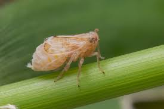
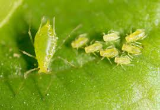

# 🌱 Plant Disease Detection using Deep Learning

**Tagline:** Fine-tuned MobileNet & ResNet models for automated pest and disease detection in crops.

---

## 📌 Description

Agricultural productivity is often threatened by pests and plant diseases, leading to reduced yields and economic losses. Manual identification of plant diseases is time-consuming and requires expert knowledge.  

This project leverages **deep learning (CNNs, Transfer Learning with MobileNet & ResNet)** to automatically classify plant diseases and pests from images. It aims to provide farmers and researchers with an **AI-powered tool** for **early detection** and **efficient intervention**, reducing reliance on chemical pesticides and increasing sustainable farming practices.

---

## 🔑 Key Features

- **Dataset Preprocessing & Augmentation** (rotation, zoom, flips, normalization).  
- **Transfer Learning** using **MobileNet** and **ResNet50** backbones.  
- **Fine-tuned Custom Layers** for improved classification.  
- **Evaluation Metrics**: Accuracy, Precision, Recall, F1-Score, ROC-AUC.  
- **Visualization Tools**: Confusion Matrix, Training Curves.  
- **Prediction Utility**: Model inference on unseen pest/disease images.  

---

## 🏗 Architecture Overview

**Pipeline:**  
```
Image Data → Preprocessing & Augmentation → Transfer Learning (MobileNet/ResNet) → Training → Evaluation → Inference
```

---

## ⚙️ Tech Stack / Tools

- **Deep Learning:** TensorFlow, Keras  
- **Data Handling:** NumPy, Pandas  
- **Visualization:** Matplotlib, Seaborn  
- **Image Processing:** OpenCV, PIL  
- **Modeling:** MobileNet, ResNet50, Custom CNN  

---

## 📂 Dataset Information

- **Source:** [Kaggle Pestopia – Indian Pests and Pesticide Dataset](https://www.kaggle.com/datasets/shruthisindhura/pestopia)  
- **Classes:** 132 pest/disease categories  
- **Format:** Image dataset organized in class-wise folders  
- **Preprocessing:**  
  - Resized to **224×224 pixels**  
  - Applied **ImageDataGenerator** for augmentation (rotations, flips, zoom, shearing).  
  - Dataset split: **95% training, 5% validation**.  

---

## 🛠 Installation & Requirements

```bash
# Clone repo
git clone https://github.com/<your-username>/plant-disease-detection.git
cd plant-disease-detection

# Create environment & install dependencies
pip install -r requirements.txt
```

**Requirements (main):**
- Python 3.8+
- TensorFlow / Keras
- scikit-learn
- OpenCV
- Matplotlib, Seaborn

---

## 🚀 Usage Instructions

### 1️⃣ Training
```bash
python train.py --model mobilenet --epochs 100
python train.py --model resnet --epochs 100
```

### 2️⃣ Evaluation
```bash
python evaluate.py --model mobilenet
```

### 3️⃣ Inference
```bash
python predict.py --model mobilenet --image sample_leaf.jpg
```

---

## 📊 Results & Performance

- **Metrics:** F1-Score, Precision, Recall, ROC-AUC.  
- **Confusion Matrix** visualizations for each model.  
- **Training Curves** (accuracy vs loss).  
- **Sample Predictions:**  

| Input Image | Predicted Class | Confidence |
|-------------|----------------|-------------|
|  | Brown Plant Hopper | 92% |
|  | Aphid | 88% |

---

## 🌍 Applications & Impact

- **Farmers:** Early detection of pest attacks.  
- **Researchers:** Automated plant pathology analysis.  
- **Agriculture Industry:** Reduced pesticide usage → sustainable farming.  

---

## ⚠️ Limitations & Future Work

- Dataset **bias** toward Indian crops (needs global generalization).  
- Real-time deployment still limited → requires **edge optimization** (TensorRT, TFLite).  
- Future: **Mobile app integration** for real-world farmer usage.  

---

## 📁 Project Structure

```
├── models/              # Trained models
├── notebooks/           # Jupyter notebooks for experiments
├── results/             # Confusion matrices, plots, sample predictions
└── README.md
```

---

## 🤝 Contributing

Contributions are welcome! Please open an **issue** or **pull request** for improvements.

---

## 📜 License

MIT License © 2025

---

## 📚 Acknowledgments / References

- [Kaggle Pestopia Dataset](https://www.kaggle.com/datasets/shruthisindhura/pestopia)  
- [MobileNet Paper](https://arxiv.org/abs/1704.04861)  
- [ResNet Paper](https://arxiv.org/abs/1512.03385)  
