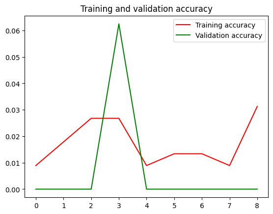
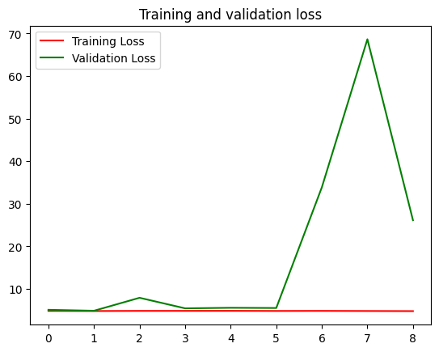
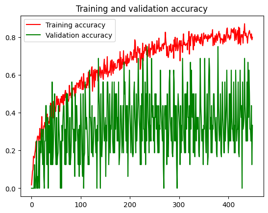
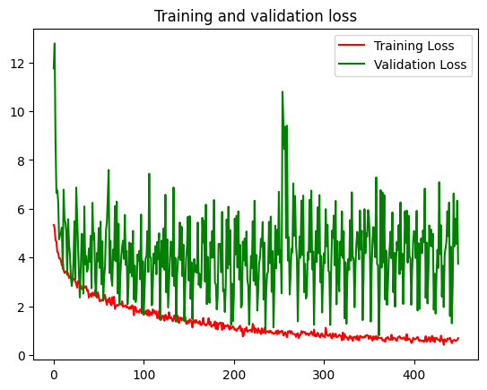
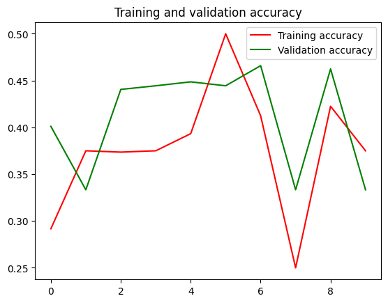
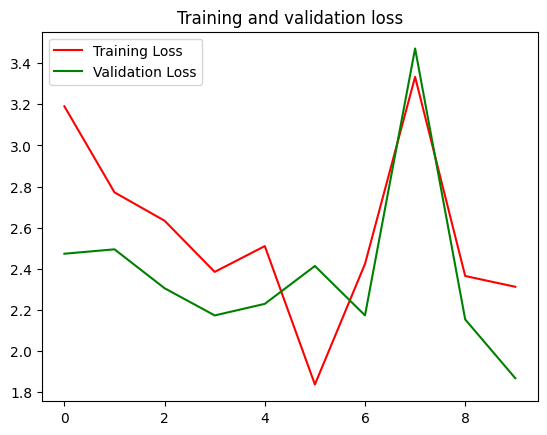

```python
import numpy as np
import pandas as pd
import matplotlib.pyplot as plt
import seaborn as sns
import cv2
import os
import glob as gb
import tensorflow as tf
from keras.models import Sequential
from keras.layers import Dense ,Flatten ,Conv2D ,MaxPooling2D ,Dropout ,BatchNormalization
from keras.optimizers import Adam
from keras.callbacks import EarlyStopping ,ReduceLROnPlateau , ModelCheckpoint
from keras.applications.mobilenet import MobileNet ,preprocess_input
```


```python
from PIL import Image
```


```python
def graph(history):
    acc = history.history['accuracy']
    val_acc = history.history['val_accuracy']
    loss = history.history['loss']
    val_loss = history.history['val_loss']

    # Ensure epochs length matches the shortest array
    epochs = range(min(len(acc), len(val_acc), len(loss), len(val_loss)))

    plt.plot(epochs, acc[:len(epochs)], 'r', label='Training accuracy')
    plt.plot(epochs, val_acc[:len(epochs)], 'g', label='Validation accuracy')
    plt.title('Training and validation accuracy')
    plt.legend()

    plt.figure()

    plt.plot(epochs, loss[:len(epochs)], 'r', label='Training Loss')
    plt.plot(epochs, val_loss[:len(epochs)], 'g', label='Validation Loss')
    plt.title('Training and validation loss')
    plt.legend()

    plt.show()

```


```python
path = "F:/personal projects/DL-Pest-Detection-Project/pest_dataset/Datasets/Pest_Dataset"


training=tf.keras.preprocessing.image.ImageDataGenerator(
    zca_epsilon=1e-06,
    rotation_range=30,
    width_shift_range=0.1,
    height_shift_range=0.1,
    shear_range=0.1,
    zoom_range=0.1,
    fill_mode="nearest",
    horizontal_flip=True,
    vertical_flip=True,
    preprocessing_function=preprocess_input,
    validation_split=0.05
).flow_from_directory(path,batch_size=16,target_size=(224,224),subset="training")

validing=tf.keras.preprocessing.image.ImageDataGenerator(
    rotation_range=30,
    width_shift_range=0.1,
    height_shift_range=0.1,
    shear_range=0.1,
    zoom_range=0.1,
    fill_mode="nearest",
    horizontal_flip=True,
    vertical_flip=True,
    preprocessing_function=preprocess_input,
    validation_split=0.05
).flow_from_directory(path,batch_size=16,target_size=(224,224),subset='validation')

testing=tf.keras.preprocessing.image.ImageDataGenerator(
    preprocessing_function=preprocess_input,
).flow_from_directory(path,batch_size=16,target_size=(224,224))

```


```python
from sklearn.metrics import classification_report, confusion_matrix, f1_score
```


```python
def predictor(test_gen, test_steps, cmcmap):
    y_pred= []
    error_list=[]
    error_pred_list = []
    y_true=test_gen.labels
    classes=list(test_gen.class_indices.keys())
    class_count=len(classes)
    errors=0
    preds=model.predict(test_gen, verbose=1)
    tests=len(preds)
    for i, p in enumerate(preds):
        pred_index=np.argmax(p)
        true_index=test_gen.labels[i]  # labels are integer values
        if pred_index != true_index: # a misclassification has occurred
            errors=errors + 1
            file=test_gen.filenames[i]
            error_list.append(file)
            error_class=classes[pred_index]
            error_pred_list.append(error_class)
        y_pred.append(pred_index)

    acc=( 1-errors/tests) * 100
    msg=f'there were {errors} errors in {tests} tests for an accuracy of {acc:6.2f}'
    print(msg)
    ypred=np.array(y_pred)
    ytrue=np.array(y_true)
    f1score=f1_score(ytrue, ypred, average='weighted')* 100
    if class_count <=30:
        cm = confusion_matrix(ytrue, ypred )
        # plot the confusion matrix
        plt.figure(figsize=(12, 8))
        sns.heatmap(cm, annot=True, vmin=0, fmt='g', cmap=cmcmap, cbar=False)
        plt.xticks(np.arange(class_count)+.5, classes, rotation=90)
        plt.yticks(np.arange(class_count)+.5, classes, rotation=0)
        plt.xlabel("Predicted")
        plt.ylabel("Actual")
        plt.title("Confusion Matrix")
        plt.show()
    clr = classification_report(y_true, y_pred, target_names=classes, digits= 4) # create classification report
    print("Classification Report:\n----------------------\n", clr)
    return errors, tests, error_list, error_pred_list, f1score
```

Resnet model


```python
input_shape_res=(224,224,3)
```


```python
import tensorflow as tf
from tensorflow.keras.applications import ResNet50
from tensorflow.keras.layers import Dense, Flatten, GlobalAveragePooling2D
from tensorflow.keras.models import Model

```


```python
#create the base pre-trained model
base_model=ResNet50(include_top=False, weights='imagenet')
```


```python
#Resnet Model 1
#add custom layers
x = base_model.output
x = GlobalAveragePooling2D()(x)
x = Dense(1024, activation='relu')(x)
predictions = Dense(132, activation='softmax')(x)

#create final model
model = Model(inputs=base_model.input, outputs=predictions)

#compile the model
model.compile(optimizer='adam', loss='categorical_crossentropy', metrics=['accuracy','Precision','Recall','AUC'])
```


```python
num_classes=132
```


```python
# Define the ResNet model
def resnet(input_shape, num_classes):
    inputs = tf.keras.layers.Input(shape=input_shape)
    x = tf.keras.layers.Conv2D(32, (3,3), padding='same')(inputs)
    x = tf.keras.layers.BatchNormalization()(x)
    x = tf.keras.layers.Activation('relu')(x)
    x = tf.keras.layers.Conv2D(64, (3,3), padding='same')(x)
    x = tf.keras.layers.BatchNormalization()(x)
    x = tf.keras.layers.Activation('relu')(x)
    x = tf.keras.layers.Conv2D(128, (3,3), padding='same')(x)
    x = tf.keras.layers.BatchNormalization()(x)
    x = tf.keras.layers.Activation('relu')(x)
    x = tf.keras.layers.GlobalAveragePooling2D()(x)
    outputs = tf.keras.layers.Dense(num_classes, activation='softmax')(x)
    model = tf.keras.Model(inputs, outputs)
    return model

# Initialize the ResNet model
model2 = resnet(input_shape_res, 9)

# Compile the model
model2.compile(optimizer='adam', loss='categorical_crossentropy', metrics=['accuracy','Precision','Recall','AUC'])

```


```python
test_steps = 16
num_epochs =10
EarlyStop=EarlyStopping(monitor='accuracy',patience=10,restore_best_weights=True)
Reduce_LR=ReduceLROnPlateau(monitor='accuracy',verbose=2,factor=0.5,min_lr=0.00001)
callback=[EarlyStop , Reduce_LR]
#model_check=ModelCheckpoint('model.hdf5',monitor='val_loss',verbose=1,save_best_only=True)
#callback=[EarlyStop , Reduce_LR,model_check]
```


```python
resnet_history=model.fit(training,validation_data=validing,epochs=num_epochs,batch_size=16,
                  steps_per_epoch=len(training) // 18,validation_steps=len(validing) // 8,
                  callbacks=callback, verbose=1)
```

    Epoch 1/10
    14/14 ━━━━━━━━━━━━━━━━━━━━ 42s 3s/step - AUC: 0.5384 - Precision: 0.0000e+00 - Recall: 0.0000e+00 - accuracy: 0.0015 - loss: 4.8396 - val_AUC: 0.4010 - val_Precision: 0.0000e+00 - val_Recall: 0.0000e+00 - val_accuracy: 0.0000e+00 - val_loss: 5.0629 - learning_rate: 0.0010
    Epoch 2/10
    14/14 ━━━━━━━━━━━━━━━━━━━━ 40s 3s/step - AUC: 0.5720 - Precision: 0.0000e+00 - Recall: 0.0000e+00 - accuracy: 0.0072 - loss: 4.7870 - val_AUC: 0.5165 - val_Precision: 0.0000e+00 - val_Recall: 0.0000e+00 - val_accuracy: 0.0000e+00 - val_loss: 4.8419 - learning_rate: 0.0010
    Epoch 3/10
    14/14 ━━━━━━━━━━━━━━━━━━━━ 42s 3s/step - AUC: 0.5421 - Precision: 0.0000e+00 - Recall: 0.0000e+00 - accuracy: 0.0120 - loss: 4.8560 - val_AUC: 0.4469 - val_Precision: 0.0000e+00 - val_Recall: 0.0000e+00 - val_accuracy: 0.0000e+00 - val_loss: 7.8950 - learning_rate: 0.0010
    Epoch 4/10
    14/14 ━━━━━━━━━━━━━━━━━━━━ 41s 3s/step - AUC: 0.6096 - Precision: 0.0000e+00 - Recall: 0.0000e+00 - accuracy: 0.0284 - loss: 4.7975 - val_AUC: 0.5035 - val_Precision: 0.0000e+00 - val_Recall: 0.0000e+00 - val_accuracy: 0.0625 - val_loss: 5.4124 - learning_rate: 0.0010
    Epoch 5/10
    14/14 ━━━━━━━━━━━━━━━━━━━━ 41s 3s/step - AUC: 0.5905 - Precision: 0.0000e+00 - Recall: 0.0000e+00 - accuracy: 0.0069 - loss: 4.8434 - val_AUC: 0.4573 - val_Precision: 0.0000e+00 - val_Recall: 0.0000e+00 - val_accuracy: 0.0000e+00 - val_loss: 5.5437 - learning_rate: 0.0010
    Epoch 6/10
    14/14 ━━━━━━━━━━━━━━━━━━━━ 41s 3s/step - AUC: 0.5896 - Precision: 0.0000e+00 - Recall: 0.0000e+00 - accuracy: 0.0126 - loss: 4.7882 - val_AUC: 0.6259 - val_Precision: 0.0000e+00 - val_Recall: 0.0000e+00 - val_accuracy: 0.0000e+00 - val_loss: 5.4916 - learning_rate: 0.0010
    Epoch 7/10
    14/14 ━━━━━━━━━━━━━━━━━━━━ 47s 3s/step - AUC: 0.5682 - Precision: 0.0000e+00 - Recall: 0.0000e+00 - accuracy: 0.0087 - loss: 4.8327 - val_AUC: 0.4924 - val_Precision: 0.0000e+00 - val_Recall: 0.0000e+00 - val_accuracy: 0.0000e+00 - val_loss: 33.8465 - learning_rate: 0.0010
    Epoch 8/10
    14/14 ━━━━━━━━━━━━━━━━━━━━ 47s 3s/step - AUC: 0.5970 - Precision: 0.0000e+00 - Recall: 0.0000e+00 - accuracy: 0.0033 - loss: 4.7752 - val_AUC: 0.4924 - val_Precision: 0.0000e+00 - val_Recall: 0.0000e+00 - val_accuracy: 0.0000e+00 - val_loss: 68.6644 - learning_rate: 0.0010
    Epoch 9/10
    14/14 ━━━━━━━━━━━━━━━━━━━━ 44s 3s/step - AUC: 0.6159 - Precision: 0.0000e+00 - Recall: 0.0000e+00 - accuracy: 0.0356 - loss: 4.7500 - val_AUC: 0.4809 - val_Precision: 0.0000e+00 - val_Recall: 0.0000e+00 - val_accuracy: 0.0000e+00 - val_loss: 26.1277 - learning_rate: 0.0010
    Epoch 10/10
    14/14 ━━━━━━━━━━━━━━━━━━━━ 44s 3s/step - AUC: 0.5823 - Precision: 0.0000e+00 - Recall: 0.0000e+00 - accuracy: 0.0297 - loss: 4.8648 - learning_rate: 0.0010
    

    c:\Python311\Lib\contextlib.py:155: UserWarning: Your input ran out of data; interrupting training. Make sure that your dataset or generator can generate at least `steps_per_epoch * epochs` batches. You may need to use the `.repeat()` function when building your dataset.
      self.gen.throw(typ, value, traceback)
    


```python
graph(resnet_history)
```


    

    


    

    


```python
errors, tests, error_list, error_pred_list, f1score = predictor(testing, test_steps,"Reds")
```

MobileNet Model


```python
mobilenet=MobileNet(include_top=False,weights='imagenet',input_shape=(224,224,3))
```

    Downloading data from https://storage.googleapis.com/tensorflow/keras-applications/mobilenet/mobilenet_1_0_224_tf_no_top.h5
    17225924/17225924 ━━━━━━━━━━━━━━━━━━━━ 31s 2us/step
    


```python
optimizer=Adam(learning_rate=0.001,beta_1=0.9,beta_2=0.99)
```


```python
EarlyStop=EarlyStopping(patience=10,restore_best_weights=True)
Reduce_LR=ReduceLROnPlateau(monitor='val_accuracy',verbose=2,factor=0.5,min_lr=0.00001)
callback=[EarlyStop , Reduce_LR]

```


```python
mobilenet.trainable=False
```


```python
model=Sequential([
    mobilenet,
    MaxPooling2D(3,2),
    Flatten(),
    Dense(128,activation='relu'),
    BatchNormalization(),
    Dense(1024,activation='relu'),
    BatchNormalization(),
    Dense(512,activation='relu'),
    BatchNormalization(),
    Dense(132,activation='softmax')
])
```


```python
model.summary()
```


<pre style="white-space:pre;overflow-x:auto;line-height:normal;font-family:Menlo,'DejaVu Sans Mono',consolas,'Courier New',monospace"><span style="font-weight: bold">Model: "sequential"</span>
</pre>


<pre style="white-space:pre;overflow-x:auto;line-height:normal;font-family:Menlo,'DejaVu Sans Mono',consolas,'Courier New',monospace">┏━━━━━━━━━━━━━━━━━━━━━━━━━━━━━━━━━┳━━━━━━━━━━━━━━━━━━━━━━━━┳━━━━━━━━━━━━━━━┓
┃<span style="font-weight: bold"> Layer (type)                    </span>┃<span style="font-weight: bold"> Output Shape           </span>┃<span style="font-weight: bold">       Param # </span>┃
┡━━━━━━━━━━━━━━━━━━━━━━━━━━━━━━━━━╇━━━━━━━━━━━━━━━━━━━━━━━━╇━━━━━━━━━━━━━━━┩
│ mobilenet_1.00_224 (<span style="color: #0087ff; text-decoration-color: #0087ff">Functional</span>) │ (<span style="color: #00d7ff; text-decoration-color: #00d7ff">None</span>, <span style="color: #00af00; text-decoration-color: #00af00">7</span>, <span style="color: #00af00; text-decoration-color: #00af00">7</span>, <span style="color: #00af00; text-decoration-color: #00af00">1024</span>)     │     <span style="color: #00af00; text-decoration-color: #00af00">3,228,864</span> │
├─────────────────────────────────┼────────────────────────┼───────────────┤
│ max_pooling2d (<span style="color: #0087ff; text-decoration-color: #0087ff">MaxPooling2D</span>)    │ (<span style="color: #00d7ff; text-decoration-color: #00d7ff">None</span>, <span style="color: #00af00; text-decoration-color: #00af00">3</span>, <span style="color: #00af00; text-decoration-color: #00af00">3</span>, <span style="color: #00af00; text-decoration-color: #00af00">1024</span>)     │             <span style="color: #00af00; text-decoration-color: #00af00">0</span> │
├─────────────────────────────────┼────────────────────────┼───────────────┤
│ flatten (<span style="color: #0087ff; text-decoration-color: #0087ff">Flatten</span>)               │ (<span style="color: #00d7ff; text-decoration-color: #00d7ff">None</span>, <span style="color: #00af00; text-decoration-color: #00af00">9216</span>)           │             <span style="color: #00af00; text-decoration-color: #00af00">0</span> │
├─────────────────────────────────┼────────────────────────┼───────────────┤
│ dense_11 (<span style="color: #0087ff; text-decoration-color: #0087ff">Dense</span>)                │ (<span style="color: #00d7ff; text-decoration-color: #00d7ff">None</span>, <span style="color: #00af00; text-decoration-color: #00af00">128</span>)            │     <span style="color: #00af00; text-decoration-color: #00af00">1,179,776</span> │
├─────────────────────────────────┼────────────────────────┼───────────────┤
│ batch_normalization_9           │ (<span style="color: #00d7ff; text-decoration-color: #00d7ff">None</span>, <span style="color: #00af00; text-decoration-color: #00af00">128</span>)            │           <span style="color: #00af00; text-decoration-color: #00af00">512</span> │
│ (<span style="color: #0087ff; text-decoration-color: #0087ff">BatchNormalization</span>)            │                        │               │
├─────────────────────────────────┼────────────────────────┼───────────────┤
│ dense_12 (<span style="color: #0087ff; text-decoration-color: #0087ff">Dense</span>)                │ (<span style="color: #00d7ff; text-decoration-color: #00d7ff">None</span>, <span style="color: #00af00; text-decoration-color: #00af00">1024</span>)           │       <span style="color: #00af00; text-decoration-color: #00af00">132,096</span> │
├─────────────────────────────────┼────────────────────────┼───────────────┤
│ batch_normalization_10          │ (<span style="color: #00d7ff; text-decoration-color: #00d7ff">None</span>, <span style="color: #00af00; text-decoration-color: #00af00">1024</span>)           │         <span style="color: #00af00; text-decoration-color: #00af00">4,096</span> │
│ (<span style="color: #0087ff; text-decoration-color: #0087ff">BatchNormalization</span>)            │                        │               │
├─────────────────────────────────┼────────────────────────┼───────────────┤
│ dense_13 (<span style="color: #0087ff; text-decoration-color: #0087ff">Dense</span>)                │ (<span style="color: #00d7ff; text-decoration-color: #00d7ff">None</span>, <span style="color: #00af00; text-decoration-color: #00af00">512</span>)            │       <span style="color: #00af00; text-decoration-color: #00af00">524,800</span> │
├─────────────────────────────────┼────────────────────────┼───────────────┤
│ batch_normalization_11          │ (<span style="color: #00d7ff; text-decoration-color: #00d7ff">None</span>, <span style="color: #00af00; text-decoration-color: #00af00">512</span>)            │         <span style="color: #00af00; text-decoration-color: #00af00">2,048</span> │
│ (<span style="color: #0087ff; text-decoration-color: #0087ff">BatchNormalization</span>)            │                        │               │
├─────────────────────────────────┼────────────────────────┼───────────────┤
│ dense_14 (<span style="color: #0087ff; text-decoration-color: #0087ff">Dense</span>)                │ (<span style="color: #00d7ff; text-decoration-color: #00d7ff">None</span>, <span style="color: #00af00; text-decoration-color: #00af00">132</span>)            │        <span style="color: #00af00; text-decoration-color: #00af00">67,716</span> │
└─────────────────────────────────┴────────────────────────┴───────────────┘
</pre>


<pre style="white-space:pre;overflow-x:auto;line-height:normal;font-family:Menlo,'DejaVu Sans Mono',consolas,'Courier New',monospace"><span style="font-weight: bold"> Total params: </span><span style="color: #00af00; text-decoration-color: #00af00">5,139,908</span> (19.61 MB)
</pre>


<pre style="white-space:pre;overflow-x:auto;line-height:normal;font-family:Menlo,'DejaVu Sans Mono',consolas,'Courier New',monospace"><span style="font-weight: bold"> Trainable params: </span><span style="color: #00af00; text-decoration-color: #00af00">1,907,716</span> (7.28 MB)
</pre>


<pre style="white-space:pre;overflow-x:auto;line-height:normal;font-family:Menlo,'DejaVu Sans Mono',consolas,'Courier New',monospace"><span style="font-weight: bold"> Non-trainable params: </span><span style="color: #00af00; text-decoration-color: #00af00">3,232,192</span> (12.33 MB)
</pre>


```python
model.compile(optimizer=optimizer,loss='categorical_crossentropy', metrics=["accuracy", "Precision", "Recall", "AUC"])
```


```python
tf.compat.v1.logging.set_verbosity(tf.compat.v1.logging.ERROR)
```


```python
history=model.fit(training,validation_data=validing,epochs=500,batch_size=16,
                  steps_per_epoch=len(training)//18,validation_steps=len(validing) // 8,
                  verbose=1)
```

    Epoch 1/500
    14/14 ━━━━━━━━━━━━━━━━━━━━ 10s 437ms/step - AUC: 0.5563 - Precision: 0.0000e+00 - Recall: 0.0000e+00 - accuracy: 0.0111 - loss: 5.3784 - val_AUC: 0.5131 - val_Precision: 0.0000e+00 - val_Recall: 0.0000e+00 - val_accuracy: 0.0000e+00 - val_loss: 11.7566
    Epoch 2/500
    14/14 ━━━━━━━━━━━━━━━━━━━━ 5s 348ms/step - AUC: 0.5624 - Precision: 0.3216 - Recall: 0.0085 - accuracy: 0.0351 - loss: 5.3163 - val_AUC: 0.5148 - val_Precision: 0.0000e+00 - val_Recall: 0.0000e+00 - val_accuracy: 0.0000e+00 - val_loss: 12.7787
    Epoch 3/500
    14/14 ━━━━━━━━━━━━━━━━━━━━ 5s 338ms/step - AUC: 0.6840 - Precision: 0.2962 - Recall: 0.0142 - accuracy: 0.0903 - loss: 4.6799 - val_AUC: 0.5199 - val_Precision: 0.0000e+00 - val_Recall: 0.0000e+00 - val_accuracy: 0.0000e+00 - val_loss: 8.7127
    Epoch 4/500
    14/14 ━━━━━━━━━━━━━━━━━━━━ 5s 361ms/step - AUC: 0.6414 - Precision: 0.0913 - Recall: 0.0036 - accuracy: 0.0711 - loss: 4.8380 - val_AUC: 0.5608 - val_Precision: 0.0000e+00 - val_Recall: 0.0000e+00 - val_accuracy: 0.0000e+00 - val_loss: 6.6523
    Epoch 5/500
    14/14 ━━━━━━━━━━━━━━━━━━━━ 5s 385ms/step - AUC: 0.7493 - Precision: 0.6303 - Recall: 0.0506 - accuracy: 0.1613 - loss: 4.2159 - val_AUC: 0.5795 - val_Precision: 0.0000e+00 - val_Recall: 0.0000e+00 - val_accuracy: 0.0000e+00 - val_loss: 6.7634
    Epoch 6/500
    14/14 ━━━━━━━━━━━━━━━━━━━━ 5s 375ms/step - AUC: 0.7543 - Precision: 0.7044 - Recall: 0.0439 - accuracy: 0.1397 - loss: 4.2721 - val_AUC: 0.6034 - val_Precision: 0.0000e+00 - val_Recall: 0.0000e+00 - val_accuracy: 0.0000e+00 - val_loss: 6.2699
    Epoch 7/500
    14/14 ━━━━━━━━━━━━━━━━━━━━ 5s 353ms/step - AUC: 0.7730 - Precision: 0.5198 - Recall: 0.0408 - accuracy: 0.1563 - loss: 4.1187 - val_AUC: 0.6959 - val_Precision: 0.0000e+00 - val_Recall: 0.0000e+00 - val_accuracy: 0.1250 - val_loss: 4.7505
    Epoch 8/500
    14/14 ━━━━━━━━━━━━━━━━━━━━ 5s 352ms/step - AUC: 0.7934 - Precision: 0.5815 - Recall: 0.0591 - accuracy: 0.1646 - loss: 4.0054 - val_AUC: 0.6912 - val_Precision: 0.0000e+00 - val_Recall: 0.0000e+00 - val_accuracy: 0.0000e+00 - val_loss: 4.9363
    Epoch 9/500
    14/14 ━━━━━━━━━━━━━━━━━━━━ 5s 348ms/step - AUC: 0.8095 - Precision: 0.7024 - Recall: 0.0640 - accuracy: 0.2216 - loss: 3.8441 - val_AUC: 0.6244 - val_Precision: 0.0000e+00 - val_Recall: 0.0000e+00 - val_accuracy: 0.0000e+00 - val_loss: 5.0014
    Epoch 10/500
    14/14 ━━━━━━━━━━━━━━━━━━━━ 4s 317ms/step - AUC: 0.8297 - Precision: 0.6544 - Recall: 0.1157 - accuracy: 0.2918 - loss: 3.6125
    Epoch 11/500
    

    c:\Python311\Lib\contextlib.py:155: UserWarning: Your input ran out of data; interrupting training. Make sure that your dataset or generator can generate at least `steps_per_epoch * epochs` batches. You may need to use the `.repeat()` function when building your dataset.
      self.gen.throw(typ, value, traceback)
    

    14/14 ━━━━━━━━━━━━━━━━━━━━ 5s 333ms/step - AUC: 0.7806 - Precision: 0.5893 - Recall: 0.0519 - accuracy: 0.1606 - loss: 4.0075 - val_AUC: 0.5817 - val_Precision: 0.0000e+00 - val_Recall: 0.0000e+00 - val_accuracy: 0.0625 - val_loss: 5.2270
    Epoch 12/500
    14/14 ━━━━━━━━━━━━━━━━━━━━ 4s 293ms/step - AUC: 0.8510 - Precision: 0.6329 - Recall: 0.0835 - accuracy: 0.2323 - loss: 3.5137 - val_AUC: 0.8917 - val_Precision: 0.0000e+00 - val_Recall: 0.0000e+00 - val_accuracy: 0.2500 - val_loss: 3.5465
    Epoch 13/500
    14/14 ━━━━━━━━━━━━━━━━━━━━ 4s 311ms/step - AUC: 0.8526 - Precision: 0.6646 - Recall: 0.1291 - accuracy: 0.2823 - loss: 3.4524 - val_AUC: 0.6841 - val_Precision: 0.0000e+00 - val_Recall: 0.0000e+00 - val_accuracy: 0.0000e+00 - val_loss: 6.7861
    Epoch 14/500
    14/14 ━━━━━━━━━━━━━━━━━━━━ 4s 313ms/step - AUC: 0.8657 - Precision: 0.5883 - Recall: 0.1021 - accuracy: 0.2679 - loss: 3.3766 - val_AUC: 0.6428 - val_Precision: 0.0000e+00 - val_Recall: 0.0000e+00 - val_accuracy: 0.0625 - val_loss: 5.5564
    Epoch 15/500
    14/14 ━━━━━━━━━━━━━━━━━━━━ 4s 324ms/step - AUC: 0.8383 - Precision: 0.7906 - Recall: 0.1357 - accuracy: 0.2779 - loss: 3.2986 - val_AUC: 0.5842 - val_Precision: 0.0000e+00 - val_Recall: 0.0000e+00 - val_accuracy: 0.0000e+00 - val_loss: 5.4408
    Epoch 16/500
    14/14 ━━━━━━━━━━━━━━━━━━━━ 5s 357ms/step - AUC: 0.8847 - Precision: 0.6534 - Recall: 0.0966 - accuracy: 0.2718 - loss: 3.1848 - val_AUC: 0.6933 - val_Precision: 0.0000e+00 - val_Recall: 0.0000e+00 - val_accuracy: 0.0625 - val_loss: 5.0530
    Epoch 17/500
    14/14 ━━━━━━━━━━━━━━━━━━━━ 4s 272ms/step - AUC: 0.8509 - Precision: 0.6453 - Recall: 0.1442 - accuracy: 0.2983 - loss: 3.3063 - val_AUC: 0.8715 - val_Precision: 0.0000e+00 - val_Recall: 0.0000e+00 - val_accuracy: 0.2500 - val_loss: 3.2886
    Epoch 18/500
    14/14 ━━━━━━━━━━━━━━━━━━━━ 5s 353ms/step - AUC: 0.8551 - Precision: 0.5372 - Recall: 0.1455 - accuracy: 0.2915 - loss: 3.2784 - val_AUC: 0.6510 - val_Precision: 0.0000e+00 - val_Recall: 0.0000e+00 - val_accuracy: 0.0000e+00 - val_loss: 5.5755
    Epoch 19/500
    14/14 ━━━━━━━━━━━━━━━━━━━━ 5s 332ms/step - AUC: 0.8764 - Precision: 0.4890 - Recall: 0.0943 - accuracy: 0.2028 - loss: 3.3921 - val_AUC: 0.7488 - val_Precision: 0.0000e+00 - val_Recall: 0.0000e+00 - val_accuracy: 0.1667 - val_loss: 4.5378
    Epoch 20/500
    14/14 ━━━━━━━━━━━━━━━━━━━━ 5s 347ms/step - AUC: 0.8867 - Precision: 0.6285 - Recall: 0.0998 - accuracy: 0.2705 - loss: 3.0069
    Epoch 21/500
    14/14 ━━━━━━━━━━━━━━━━━━━━ 5s 375ms/step - AUC: 0.8640 - Precision: 0.5343 - Recall: 0.1475 - accuracy: 0.2873 - loss: 3.0824 - val_AUC: 0.7885 - val_Precision: 0.6667 - val_Recall: 0.1250 - val_accuracy: 0.2500 - val_loss: 4.1485
    Epoch 22/500
    14/14 ━━━━━━━━━━━━━━━━━━━━ 4s 316ms/step - AUC: 0.8593 - Precision: 0.8023 - Recall: 0.2226 - accuracy: 0.3862 - loss: 3.0741 - val_AUC: 0.8494 - val_Precision: 1.0000 - val_Recall: 0.1875 - val_accuracy: 0.1875 - val_loss: 3.2192
    Epoch 23/500
    14/14 ━━━━━━━━━━━━━━━━━━━━ 5s 344ms/step - AUC: 0.8790 - Precision: 0.7354 - Recall: 0.1302 - accuracy: 0.3105 - loss: 3.0566 - val_AUC: 0.8788 - val_Precision: 0.6667 - val_Recall: 0.2500 - val_accuracy: 0.3125 - val_loss: 2.8351
    Epoch 24/500
    14/14 ━━━━━━━━━━━━━━━━━━━━ 5s 401ms/step - AUC: 0.8771 - Precision: 0.7325 - Recall: 0.1545 - accuracy: 0.2520 - loss: 3.1286 - val_AUC: 0.8963 - val_Precision: 0.6667 - val_Recall: 0.1250 - val_accuracy: 0.3125 - val_loss: 3.0888
    Epoch 25/500
    14/14 ━━━━━━━━━━━━━━━━━━━━ 6s 437ms/step - AUC: 0.8799 - Precision: 0.7395 - Recall: 0.1600 - accuracy: 0.2956 - loss: 3.0484 - val_AUC: 0.7730 - val_Precision: 1.0000 - val_Recall: 0.1250 - val_accuracy: 0.1875 - val_loss: 3.9227
    Epoch 26/500
    14/14 ━━━━━━━━━━━━━━━━━━━━ 5s 329ms/step - AUC: 0.8863 - Precision: 0.6750 - Recall: 0.1501 - accuracy: 0.2955 - loss: 2.9528 - val_AUC: 0.7069 - val_Precision: 0.0000e+00 - val_Recall: 0.0000e+00 - val_accuracy: 0.1250 - val_loss: 5.4906
    Epoch 27/500
    14/14 ━━━━━━━━━━━━━━━━━━━━ 5s 378ms/step - AUC: 0.8993 - Precision: 0.7004 - Recall: 0.1547 - accuracy: 0.3401 - loss: 2.7120 - val_AUC: 0.8491 - val_Precision: 0.7143 - val_Recall: 0.3125 - val_accuracy: 0.3125 - val_loss: 3.1229
    Epoch 28/500
    14/14 ━━━━━━━━━━━━━━━━━━━━ 5s 391ms/step - AUC: 0.8972 - Precision: 0.6448 - Recall: 0.1302 - accuracy: 0.3360 - loss: 2.9283 - val_AUC: 0.6106 - val_Precision: 0.0000e+00 - val_Recall: 0.0000e+00 - val_accuracy: 0.0625 - val_loss: 6.8722
    Epoch 29/500
    14/14 ━━━━━━━━━━━━━━━━━━━━ 5s 388ms/step - AUC: 0.8821 - Precision: 0.6985 - Recall: 0.1253 - accuracy: 0.2931 - loss: 3.0453 - val_AUC: 0.5857 - val_Precision: 0.0000e+00 - val_Recall: 0.0000e+00 - val_accuracy: 0.0000e+00 - val_loss: 5.6542
    Epoch 30/500
    14/14 ━━━━━━━━━━━━━━━━━━━━ 5s 359ms/step - AUC: 0.8834 - Precision: 0.6090 - Recall: 0.1458 - accuracy: 0.2985 - loss: 3.0818
    Epoch 31/500
    14/14 ━━━━━━━━━━━━━━━━━━━━ 6s 413ms/step - AUC: 0.8885 - Precision: 0.7070 - Recall: 0.2213 - accuracy: 0.3412 - loss: 2.8935 - val_AUC: 0.7349 - val_Precision: 0.5000 - val_Recall: 0.0625 - val_accuracy: 0.2500 - val_loss: 4.5067
    Epoch 32/500
    14/14 ━━━━━━━━━━━━━━━━━━━━ 5s 334ms/step - AUC: 0.9107 - Precision: 0.8035 - Recall: 0.2305 - accuracy: 0.3819 - loss: 2.6690 - val_AUC: 0.8694 - val_Precision: 0.5000 - val_Recall: 0.1875 - val_accuracy: 0.2500 - val_loss: 3.3263
    Epoch 33/500
    14/14 ━━━━━━━━━━━━━━━━━━━━ 5s 327ms/step - AUC: 0.9163 - Precision: 0.6257 - Recall: 0.2489 - accuracy: 0.4181 - loss: 2.5691 - val_AUC: 0.9139 - val_Precision: 0.7500 - val_Recall: 0.3750 - val_accuracy: 0.4375 - val_loss: 2.3620
    Epoch 34/500
    14/14 ━━━━━━━━━━━━━━━━━━━━ 4s 255ms/step - AUC: 0.9125 - Precision: 0.8041 - Recall: 0.1634 - accuracy: 0.3496 - loss: 2.6906 - val_AUC: 0.7853 - val_Precision: 0.6000 - val_Recall: 0.3750 - val_accuracy: 0.4375 - val_loss: 3.4883
    Epoch 35/500
    14/14 ━━━━━━━━━━━━━━━━━━━━ 4s 298ms/step - AUC: 0.9017 - Precision: 0.7011 - Recall: 0.2094 - accuracy: 0.3648 - loss: 2.6545 - val_AUC: 0.7164 - val_Precision: 0.0000e+00 - val_Recall: 0.0000e+00 - val_accuracy: 0.1250 - val_loss: 4.9744
    Epoch 36/500
    14/14 ━━━━━━━━━━━━━━━━━━━━ 4s 302ms/step - AUC: 0.8857 - Precision: 0.7549 - Recall: 0.2100 - accuracy: 0.3439 - loss: 2.8294 - val_AUC: 0.7630 - val_Precision: 0.2500 - val_Recall: 0.0625 - val_accuracy: 0.1250 - val_loss: 4.9281
    Epoch 37/500
    14/14 ━━━━━━━━━━━━━━━━━━━━ 5s 346ms/step - AUC: 0.8953 - Precision: 0.7304 - Recall: 0.2285 - accuracy: 0.3683 - loss: 2.8797 - val_AUC: 0.9210 - val_Precision: 0.8333 - val_Recall: 0.3125 - val_accuracy: 0.3750 - val_loss: 2.5240
    Epoch 38/500
    14/14 ━━━━━━━━━━━━━━━━━━━━ 5s 366ms/step - AUC: 0.9200 - Precision: 0.7267 - Recall: 0.2114 - accuracy: 0.3759 - loss: 2.6545 - val_AUC: 0.6236 - val_Precision: 0.0000e+00 - val_Recall: 0.0000e+00 - val_accuracy: 0.0000e+00 - val_loss: 6.1024
    Epoch 39/500
    14/14 ━━━━━━━━━━━━━━━━━━━━ 5s 351ms/step - AUC: 0.9139 - Precision: 0.7938 - Recall: 0.2181 - accuracy: 0.3562 - loss: 2.6100 - val_AUC: 0.8732 - val_Precision: 0.5000 - val_Recall: 0.1667 - val_accuracy: 0.3333 - val_loss: 3.7285
    Epoch 40/500
    14/14 ━━━━━━━━━━━━━━━━━━━━ 4s 321ms/step - AUC: 0.9250 - Precision: 0.7522 - Recall: 0.2498 - accuracy: 0.4285 - loss: 2.5107
    Epoch 41/500
    14/14 ━━━━━━━━━━━━━━━━━━━━ 5s 360ms/step - AUC: 0.9072 - Precision: 0.7407 - Recall: 0.2087 - accuracy: 0.3746 - loss: 2.5685 - val_AUC: 0.8060 - val_Precision: 0.2000 - val_Recall: 0.0625 - val_accuracy: 0.1875 - val_loss: 4.0726
    Epoch 42/500
    14/14 ━━━━━━━━━━━━━━━━━━━━ 4s 329ms/step - AUC: 0.9132 - Precision: 0.7177 - Recall: 0.2155 - accuracy: 0.3872 - loss: 2.5878 - val_AUC: 0.9055 - val_Precision: 0.2500 - val_Recall: 0.0625 - val_accuracy: 0.1875 - val_loss: 3.4235
    Epoch 43/500
    14/14 ━━━━━━━━━━━━━━━━━━━━ 5s 365ms/step - AUC: 0.9190 - Precision: 0.7797 - Recall: 0.3027 - accuracy: 0.4554 - loss: 2.4080 - val_AUC: 0.7987 - val_Precision: 0.5455 - val_Recall: 0.3750 - val_accuracy: 0.4375 - val_loss: 3.5664
    Epoch 44/500
    14/14 ━━━━━━━━━━━━━━━━━━━━ 6s 423ms/step - AUC: 0.9204 - Precision: 0.7651 - Recall: 0.2073 - accuracy: 0.3770 - loss: 2.5205 - val_AUC: 0.8039 - val_Precision: 0.5000 - val_Recall: 0.1250 - val_accuracy: 0.1250 - val_loss: 4.3711
    Epoch 45/500
    14/14 ━━━━━━━━━━━━━━━━━━━━ 5s 382ms/step - AUC: 0.9363 - Precision: 0.7203 - Recall: 0.2782 - accuracy: 0.3966 - loss: 2.4446 - val_AUC: 0.7819 - val_Precision: 0.4286 - val_Recall: 0.1875 - val_accuracy: 0.3750 - val_loss: 3.8394
    Epoch 46/500
    14/14 ━━━━━━━━━━━━━━━━━━━━ 5s 381ms/step - AUC: 0.9101 - Precision: 0.8555 - Recall: 0.3013 - accuracy: 0.4465 - loss: 2.4998 - val_AUC: 0.7233 - val_Precision: 0.0000e+00 - val_Recall: 0.0000e+00 - val_accuracy: 0.1250 - val_loss: 4.8925
    Epoch 47/500
    14/14 ━━━━━━━━━━━━━━━━━━━━ 5s 335ms/step - AUC: 0.8887 - Precision: 0.7528 - Recall: 0.2404 - accuracy: 0.3926 - loss: 2.7916 - val_AUC: 0.8831 - val_Precision: 0.7778 - val_Recall: 0.4375 - val_accuracy: 0.5625 - val_loss: 2.7466
    Epoch 48/500
    14/14 ━━━━━━━━━━━━━━━━━━━━ 5s 338ms/step - AUC: 0.9241 - Precision: 0.7437 - Recall: 0.2361 - accuracy: 0.4596 - loss: 2.3846 - val_AUC: 0.6626 - val_Precision: 0.0000e+00 - val_Recall: 0.0000e+00 - val_accuracy: 0.1250 - val_loss: 6.2460
    Epoch 49/500
    14/14 ━━━━━━━━━━━━━━━━━━━━ 5s 330ms/step - AUC: 0.9386 - Precision: 0.7156 - Recall: 0.2468 - accuracy: 0.4267 - loss: 2.2339 - val_AUC: 0.7022 - val_Precision: 0.5000 - val_Recall: 0.1667 - val_accuracy: 0.1667 - val_loss: 4.7610
    Epoch 50/500
    14/14 ━━━━━━━━━━━━━━━━━━━━ 5s 353ms/step - AUC: 0.8980 - Precision: 0.6566 - Recall: 0.2940 - accuracy: 0.4143 - loss: 2.6048
    Epoch 51/500
    14/14 ━━━━━━━━━━━━━━━━━━━━ 4s 319ms/step - AUC: 0.9189 - Precision: 0.8149 - Recall: 0.3675 - accuracy: 0.4584 - loss: 2.3400 - val_AUC: 0.7492 - val_Precision: 0.3333 - val_Recall: 0.1250 - val_accuracy: 0.3125 - val_loss: 5.0010
    Epoch 52/500
    14/14 ━━━━━━━━━━━━━━━━━━━━ 5s 325ms/step - AUC: 0.9231 - Precision: 0.8421 - Recall: 0.2904 - accuracy: 0.4900 - loss: 2.2800 - val_AUC: 0.8534 - val_Precision: 0.4444 - val_Recall: 0.2500 - val_accuracy: 0.4375 - val_loss: 3.0875
    Epoch 53/500
    14/14 ━━━━━━━━━━━━━━━━━━━━ 5s 329ms/step - AUC: 0.9257 - Precision: 0.7451 - Recall: 0.2424 - accuracy: 0.5085 - loss: 2.2614 - val_AUC: 0.8880 - val_Precision: 0.7500 - val_Recall: 0.3750 - val_accuracy: 0.5000 - val_loss: 2.4305
    Epoch 54/500
    14/14 ━━━━━━━━━━━━━━━━━━━━ 5s 347ms/step - AUC: 0.9242 - Precision: 0.6621 - Recall: 0.2731 - accuracy: 0.4363 - loss: 2.2315 - val_AUC: 0.7543 - val_Precision: 0.5556 - val_Recall: 0.3125 - val_accuracy: 0.3125 - val_loss: 4.1935
    Epoch 55/500
    14/14 ━━━━━━━━━━━━━━━━━━━━ 4s 313ms/step - AUC: 0.9384 - Precision: 0.8642 - Recall: 0.3289 - accuracy: 0.4433 - loss: 2.2253 - val_AUC: 0.8076 - val_Precision: 0.2857 - val_Recall: 0.1250 - val_accuracy: 0.1875 - val_loss: 3.8424
    Epoch 56/500
    14/14 ━━━━━━━━━━━━━━━━━━━━ 5s 353ms/step - AUC: 0.9355 - Precision: 0.7686 - Recall: 0.3612 - accuracy: 0.5047 - loss: 2.0298 - val_AUC: 0.7340 - val_Precision: 0.1429 - val_Recall: 0.0625 - val_accuracy: 0.1250 - val_loss: 5.2149
    Epoch 57/500
    14/14 ━━━━━━━━━━━━━━━━━━━━ 5s 338ms/step - AUC: 0.9178 - Precision: 0.5963 - Recall: 0.2489 - accuracy: 0.3806 - loss: 2.6698 - val_AUC: 0.8224 - val_Precision: 0.5000 - val_Recall: 0.3125 - val_accuracy: 0.3750 - val_loss: 3.5792
    Epoch 58/500
    14/14 ━━━━━━━━━━━━━━━━━━━━ 5s 385ms/step - AUC: 0.9352 - Precision: 0.7648 - Recall: 0.2785 - accuracy: 0.4211 - loss: 2.2817 - val_AUC: 0.7287 - val_Precision: 0.2500 - val_Recall: 0.0625 - val_accuracy: 0.1250 - val_loss: 5.4793
    Epoch 59/500
    14/14 ━━━━━━━━━━━━━━━━━━━━ 5s 330ms/step - AUC: 0.9369 - Precision: 0.6601 - Recall: 0.3179 - accuracy: 0.4295 - loss: 2.2628 - val_AUC: 0.9647 - val_Precision: 0.0000e+00 - val_Recall: 0.0000e+00 - val_accuracy: 0.1667 - val_loss: 2.9091
    Epoch 60/500
    14/14 ━━━━━━━━━━━━━━━━━━━━ 4s 304ms/step - AUC: 0.9544 - Precision: 0.7355 - Recall: 0.3186 - accuracy: 0.4868 - loss: 2.0150
    Epoch 61/500
    14/14 ━━━━━━━━━━━━━━━━━━━━ 5s 327ms/step - AUC: 0.9176 - Precision: 0.7510 - Recall: 0.2755 - accuracy: 0.4522 - loss: 2.4202 - val_AUC: 0.7113 - val_Precision: 0.5000 - val_Recall: 0.1875 - val_accuracy: 0.1875 - val_loss: 4.6650
    Epoch 62/500
    14/14 ━━━━━━━━━━━━━━━━━━━━ 4s 298ms/step - AUC: 0.9413 - Precision: 0.8416 - Recall: 0.3699 - accuracy: 0.5387 - loss: 2.0783 - val_AUC: 0.8896 - val_Precision: 0.8333 - val_Recall: 0.3125 - val_accuracy: 0.4375 - val_loss: 2.2698
    Epoch 63/500
    14/14 ━━━━━━━━━━━━━━━━━━━━ 4s 313ms/step - AUC: 0.9333 - Precision: 0.7086 - Recall: 0.2397 - accuracy: 0.4093 - loss: 2.4044 - val_AUC: 0.8279 - val_Precision: 0.4545 - val_Recall: 0.3125 - val_accuracy: 0.3125 - val_loss: 3.2148
    Epoch 64/500
    14/14 ━━━━━━━━━━━━━━━━━━━━ 4s 316ms/step - AUC: 0.9473 - Precision: 0.8024 - Recall: 0.2894 - accuracy: 0.4567 - loss: 2.1909 - val_AUC: 0.8223 - val_Precision: 0.5714 - val_Recall: 0.2500 - val_accuracy: 0.2500 - val_loss: 3.6322
    Epoch 65/500
    14/14 ━━━━━━━━━━━━━━━━━━━━ 4s 293ms/step - AUC: 0.9444 - Precision: 0.7132 - Recall: 0.2831 - accuracy: 0.4381 - loss: 2.1595 - val_AUC: 0.7059 - val_Precision: 0.2857 - val_Recall: 0.1250 - val_accuracy: 0.1875 - val_loss: 5.1086
    Epoch 66/500
    14/14 ━━━━━━━━━━━━━━━━━━━━ 4s 291ms/step - AUC: 0.9268 - Precision: 0.6399 - Recall: 0.2625 - accuracy: 0.4136 - loss: 2.3857 - val_AUC: 0.7368 - val_Precision: 0.0000e+00 - val_Recall: 0.0000e+00 - val_accuracy: 0.0000e+00 - val_loss: 5.4478
    Epoch 67/500
    14/14 ━━━━━━━━━━━━━━━━━━━━ 4s 288ms/step - AUC: 0.9269 - Precision: 0.7868 - Recall: 0.3333 - accuracy: 0.4970 - loss: 2.2556 - val_AUC: 0.7028 - val_Precision: 0.3077 - val_Recall: 0.2500 - val_accuracy: 0.2500 - val_loss: 6.4302
    Epoch 68/500
    14/14 ━━━━━━━━━━━━━━━━━━━━ 4s 253ms/step - AUC: 0.9095 - Precision: 0.6770 - Recall: 0.2585 - accuracy: 0.4387 - loss: 2.5353 - val_AUC: 0.6448 - val_Precision: 0.0000e+00 - val_Recall: 0.0000e+00 - val_accuracy: 0.0000e+00 - val_loss: 7.5907
    Epoch 69/500
    14/14 ━━━━━━━━━━━━━━━━━━━━ 4s 282ms/step - AUC: 0.9588 - Precision: 0.7722 - Recall: 0.3123 - accuracy: 0.4886 - loss: 1.8672 - val_AUC: 0.8926 - val_Precision: 0.3333 - val_Recall: 0.1667 - val_accuracy: 0.3333 - val_loss: 3.3680
    Epoch 70/500
    14/14 ━━━━━━━━━━━━━━━━━━━━ 4s 279ms/step - AUC: 0.9448 - Precision: 0.7922 - Recall: 0.4018 - accuracy: 0.5295 - loss: 1.9381
    Epoch 71/500
    14/14 ━━━━━━━━━━━━━━━━━━━━ 4s 305ms/step - AUC: 0.9449 - Precision: 0.8696 - Recall: 0.3400 - accuracy: 0.5214 - loss: 1.9617 - val_AUC: 0.7358 - val_Precision: 0.3333 - val_Recall: 0.1250 - val_accuracy: 0.2500 - val_loss: 4.6926
    Epoch 72/500
    14/14 ━━━━━━━━━━━━━━━━━━━━ 4s 270ms/step - AUC: 0.9544 - Precision: 0.6883 - Recall: 0.2946 - accuracy: 0.4671 - loss: 2.1236 - val_AUC: 0.8247 - val_Precision: 0.6000 - val_Recall: 0.3750 - val_accuracy: 0.3750 - val_loss: 3.1294
    Epoch 73/500
    14/14 ━━━━━━━━━━━━━━━━━━━━ 4s 286ms/step - AUC: 0.9445 - Precision: 0.7956 - Recall: 0.3715 - accuracy: 0.4899 - loss: 2.0798 - val_AUC: 0.8896 - val_Precision: 0.6364 - val_Recall: 0.4375 - val_accuracy: 0.4375 - val_loss: 2.8459
    Epoch 74/500
    14/14 ━━━━━━━━━━━━━━━━━━━━ 4s 296ms/step - AUC: 0.9398 - Precision: 0.6827 - Recall: 0.2871 - accuracy: 0.4373 - loss: 2.1709 - val_AUC: 0.7636 - val_Precision: 0.5556 - val_Recall: 0.3125 - val_accuracy: 0.4375 - val_loss: 4.3373
    Epoch 75/500
    14/14 ━━━━━━━━━━━━━━━━━━━━ 4s 274ms/step - AUC: 0.9470 - Precision: 0.8288 - Recall: 0.3125 - accuracy: 0.4631 - loss: 2.0347 - val_AUC: 0.8029 - val_Precision: 1.0000 - val_Recall: 0.1250 - val_accuracy: 0.2500 - val_loss: 3.9056
    Epoch 76/500
    14/14 ━━━━━━━━━━━━━━━━━━━━ 4s 261ms/step - AUC: 0.9554 - Precision: 0.7338 - Recall: 0.3532 - accuracy: 0.4474 - loss: 1.9407 - val_AUC: 0.6293 - val_Precision: 0.0000e+00 - val_Recall: 0.0000e+00 - val_accuracy: 0.1250 - val_loss: 6.1123
    Epoch 77/500
    14/14 ━━━━━━━━━━━━━━━━━━━━ 4s 285ms/step - AUC: 0.9307 - Precision: 0.7411 - Recall: 0.3423 - accuracy: 0.4957 - loss: 2.1831 - val_AUC: 0.8144 - val_Precision: 0.4545 - val_Recall: 0.3125 - val_accuracy: 0.3125 - val_loss: 3.8503
    Epoch 78/500
    14/14 ━━━━━━━━━━━━━━━━━━━━ 4s 282ms/step - AUC: 0.9534 - Precision: 0.7451 - Recall: 0.3106 - accuracy: 0.5299 - loss: 1.9415 - val_AUC: 0.6475 - val_Precision: 0.1250 - val_Recall: 0.0625 - val_accuracy: 0.1250 - val_loss: 6.2971
    Epoch 79/500
    14/14 ━━━━━━━━━━━━━━━━━━━━ 4s 277ms/step - AUC: 0.9588 - Precision: 0.7766 - Recall: 0.3563 - accuracy: 0.4857 - loss: 1.8896 - val_AUC: 0.9733 - val_Precision: 0.6667 - val_Recall: 0.3333 - val_accuracy: 0.5000 - val_loss: 2.5328
    Epoch 80/500
    14/14 ━━━━━━━━━━━━━━━━━━━━ 4s 274ms/step - AUC: 0.9501 - Precision: 0.7512 - Recall: 0.2965 - accuracy: 0.4826 - loss: 2.1762
    Epoch 81/500
    14/14 ━━━━━━━━━━━━━━━━━━━━ 4s 284ms/step - AUC: 0.9403 - Precision: 0.8330 - Recall: 0.3435 - accuracy: 0.5228 - loss: 2.0052 - val_AUC: 0.7156 - val_Precision: 0.3333 - val_Recall: 0.1875 - val_accuracy: 0.1875 - val_loss: 5.3875
    Epoch 82/500
    14/14 ━━━━━━━━━━━━━━━━━━━━ 4s 275ms/step - AUC: 0.9475 - Precision: 0.6677 - Recall: 0.2670 - accuracy: 0.4189 - loss: 2.0759 - val_AUC: 0.9571 - val_Precision: 0.4615 - val_Recall: 0.3750 - val_accuracy: 0.5000 - val_loss: 2.0925
    Epoch 83/500
    14/14 ━━━━━━━━━━━━━━━━━━━━ 4s 304ms/step - AUC: 0.9285 - Precision: 0.7529 - Recall: 0.3437 - accuracy: 0.5211 - loss: 2.1623 - val_AUC: 0.8552 - val_Precision: 0.7143 - val_Recall: 0.3125 - val_accuracy: 0.4375 - val_loss: 3.2814
    Epoch 84/500
    14/14 ━━━━━━━━━━━━━━━━━━━━ 4s 287ms/step - AUC: 0.9541 - Precision: 0.7232 - Recall: 0.3481 - accuracy: 0.5016 - loss: 1.9182 - val_AUC: 0.7921 - val_Precision: 0.7143 - val_Recall: 0.3125 - val_accuracy: 0.3125 - val_loss: 4.0206
    Epoch 85/500
    14/14 ━━━━━━━━━━━━━━━━━━━━ 3s 241ms/step - AUC: 0.9515 - Precision: 0.8768 - Recall: 0.3286 - accuracy: 0.5289 - loss: 1.8925 - val_AUC: 0.7770 - val_Precision: 0.3333 - val_Recall: 0.1875 - val_accuracy: 0.1875 - val_loss: 4.4646
    Epoch 86/500
    14/14 ━━━━━━━━━━━━━━━━━━━━ 4s 284ms/step - AUC: 0.9377 - Precision: 0.7654 - Recall: 0.3741 - accuracy: 0.5392 - loss: 1.9765 - val_AUC: 0.8051 - val_Precision: 0.2500 - val_Recall: 0.1250 - val_accuracy: 0.1250 - val_loss: 4.6879
    Epoch 87/500
    14/14 ━━━━━━━━━━━━━━━━━━━━ 4s 324ms/step - AUC: 0.9397 - Precision: 0.7337 - Recall: 0.3576 - accuracy: 0.5010 - loss: 2.0583 - val_AUC: 0.8874 - val_Precision: 0.5000 - val_Recall: 0.3125 - val_accuracy: 0.3750 - val_loss: 3.9417
    Epoch 88/500
    14/14 ━━━━━━━━━━━━━━━━━━━━ 4s 300ms/step - AUC: 0.9356 - Precision: 0.7474 - Recall: 0.4229 - accuracy: 0.5705 - loss: 1.9076 - val_AUC: 0.6770 - val_Precision: 0.0000e+00 - val_Recall: 0.0000e+00 - val_accuracy: 0.1250 - val_loss: 5.7484
    Epoch 89/500
    14/14 ━━━━━━━━━━━━━━━━━━━━ 4s 294ms/step - AUC: 0.9522 - Precision: 0.7174 - Recall: 0.3013 - accuracy: 0.4580 - loss: 2.0564 - val_AUC: 0.8088 - val_Precision: 0.3333 - val_Recall: 0.1667 - val_accuracy: 0.1667 - val_loss: 3.7018
    Epoch 90/500
    14/14 ━━━━━━━━━━━━━━━━━━━━ 4s 283ms/step - AUC: 0.9639 - Precision: 0.7773 - Recall: 0.3791 - accuracy: 0.5226 - loss: 1.6417
    Epoch 91/500
    14/14 ━━━━━━━━━━━━━━━━━━━━ 4s 320ms/step - AUC: 0.9498 - Precision: 0.7053 - Recall: 0.3199 - accuracy: 0.4540 - loss: 2.0954 - val_AUC: 0.8178 - val_Precision: 0.3000 - val_Recall: 0.1875 - val_accuracy: 0.2500 - val_loss: 4.2806
    Epoch 92/500
    14/14 ━━━━━━━━━━━━━━━━━━━━ 4s 287ms/step - AUC: 0.9584 - Precision: 0.7244 - Recall: 0.3379 - accuracy: 0.5361 - loss: 1.9028 - val_AUC: 0.8926 - val_Precision: 0.7000 - val_Recall: 0.4375 - val_accuracy: 0.5625 - val_loss: 2.0869
    Epoch 93/500
    14/14 ━━━━━━━━━━━━━━━━━━━━ 4s 292ms/step - AUC: 0.9416 - Precision: 0.8491 - Recall: 0.3917 - accuracy: 0.5549 - loss: 1.8680 - val_AUC: 0.8614 - val_Precision: 0.6000 - val_Recall: 0.3750 - val_accuracy: 0.5000 - val_loss: 2.8192
    Epoch 94/500
    14/14 ━━━━━━━━━━━━━━━━━━━━ 4s 292ms/step - AUC: 0.9603 - Precision: 0.8189 - Recall: 0.4014 - accuracy: 0.5487 - loss: 1.7708 - val_AUC: 0.7912 - val_Precision: 0.5556 - val_Recall: 0.3125 - val_accuracy: 0.3125 - val_loss: 4.6214
    Epoch 95/500
    14/14 ━━━━━━━━━━━━━━━━━━━━ 4s 306ms/step - AUC: 0.9627 - Precision: 0.8573 - Recall: 0.4247 - accuracy: 0.5947 - loss: 1.5506 - val_AUC: 0.8730 - val_Precision: 0.5000 - val_Recall: 0.1875 - val_accuracy: 0.3125 - val_loss: 3.3781
    Epoch 96/500
    14/14 ━━━━━━━━━━━━━━━━━━━━ 4s 281ms/step - AUC: 0.9759 - Precision: 0.7769 - Recall: 0.4220 - accuracy: 0.5551 - loss: 1.6195 - val_AUC: 0.7732 - val_Precision: 0.3750 - val_Recall: 0.1875 - val_accuracy: 0.1875 - val_loss: 4.5729
    Epoch 97/500
    14/14 ━━━━━━━━━━━━━━━━━━━━ 4s 282ms/step - AUC: 0.9536 - Precision: 0.8347 - Recall: 0.3899 - accuracy: 0.5633 - loss: 1.8874 - val_AUC: 0.9038 - val_Precision: 0.5000 - val_Recall: 0.1875 - val_accuracy: 0.3125 - val_loss: 3.2314
    Epoch 98/500
    14/14 ━━━━━━━━━━━━━━━━━━━━ 4s 274ms/step - AUC: 0.9524 - Precision: 0.7395 - Recall: 0.3858 - accuracy: 0.5669 - loss: 1.7618 - val_AUC: 0.7819 - val_Precision: 0.2000 - val_Recall: 0.0625 - val_accuracy: 0.0625 - val_loss: 5.0961
    Epoch 99/500
    14/14 ━━━━━━━━━━━━━━━━━━━━ 4s 275ms/step - AUC: 0.9675 - Precision: 0.8207 - Recall: 0.4408 - accuracy: 0.5888 - loss: 1.6265 - val_AUC: 0.9740 - val_Precision: 0.5000 - val_Recall: 0.1667 - val_accuracy: 0.5000 - val_loss: 2.2858
    Epoch 100/500
    14/14 ━━━━━━━━━━━━━━━━━━━━ 4s 282ms/step - AUC: 0.9501 - Precision: 0.7761 - Recall: 0.3740 - accuracy: 0.5505 - loss: 1.9025
    Epoch 101/500
    14/14 ━━━━━━━━━━━━━━━━━━━━ 4s 298ms/step - AUC: 0.9713 - Precision: 0.7729 - Recall: 0.4431 - accuracy: 0.5963 - loss: 1.5350 - val_AUC: 0.8491 - val_Precision: 0.3333 - val_Recall: 0.1875 - val_accuracy: 0.2500 - val_loss: 3.6786
    Epoch 102/500
    14/14 ━━━━━━━━━━━━━━━━━━━━ 3s 229ms/step - AUC: 0.9502 - Precision: 0.8242 - Recall: 0.3699 - accuracy: 0.6054 - loss: 1.8000 - val_AUC: 0.9545 - val_Precision: 0.7778 - val_Recall: 0.4375 - val_accuracy: 0.4375 - val_loss: 2.1790
    Epoch 103/500
    14/14 ━━━━━━━━━━━━━━━━━━━━ 4s 298ms/step - AUC: 0.9734 - Precision: 0.8237 - Recall: 0.4347 - accuracy: 0.6001 - loss: 1.6344 - val_AUC: 0.8921 - val_Precision: 0.6000 - val_Recall: 0.3750 - val_accuracy: 0.4375 - val_loss: 2.5280
    Epoch 104/500
    14/14 ━━━━━━━━━━━━━━━━━━━━ 4s 298ms/step - AUC: 0.9723 - Precision: 0.7742 - Recall: 0.4107 - accuracy: 0.5279 - loss: 1.8195 - val_AUC: 0.7798 - val_Precision: 0.7143 - val_Recall: 0.3125 - val_accuracy: 0.3125 - val_loss: 4.1274
    Epoch 105/500
    14/14 ━━━━━━━━━━━━━━━━━━━━ 4s 292ms/step - AUC: 0.9614 - Precision: 0.7347 - Recall: 0.4408 - accuracy: 0.5386 - loss: 1.7869 - val_AUC: 0.8053 - val_Precision: 0.5000 - val_Recall: 0.1875 - val_accuracy: 0.2500 - val_loss: 3.8726
    Epoch 106/500
    14/14 ━━━━━━━━━━━━━━━━━━━━ 4s 281ms/step - AUC: 0.9487 - Precision: 0.6621 - Recall: 0.3358 - accuracy: 0.5173 - loss: 1.9862 - val_AUC: 0.7550 - val_Precision: 0.5000 - val_Recall: 0.0625 - val_accuracy: 0.1250 - val_loss: 4.2728
    Epoch 107/500
    14/14 ━━━━━━━━━━━━━━━━━━━━ 4s 287ms/step - AUC: 0.9691 - Precision: 0.8382 - Recall: 0.4928 - accuracy: 0.6046 - loss: 1.5775 - val_AUC: 0.8557 - val_Precision: 0.5556 - val_Recall: 0.3125 - val_accuracy: 0.3125 - val_loss: 3.1112
    Epoch 108/500
    14/14 ━━━━━━━━━━━━━━━━━━━━ 4s 305ms/step - AUC: 0.9472 - Precision: 0.8035 - Recall: 0.4412 - accuracy: 0.5608 - loss: 1.7546 - val_AUC: 0.6796 - val_Precision: 0.0000e+00 - val_Recall: 0.0000e+00 - val_accuracy: 0.0625 - val_loss: 5.7662
    Epoch 109/500
    14/14 ━━━━━━━━━━━━━━━━━━━━ 4s 280ms/step - AUC: 0.9852 - Precision: 0.7179 - Recall: 0.3325 - accuracy: 0.5041 - loss: 1.5759 - val_AUC: 0.9892 - val_Precision: 0.6667 - val_Recall: 0.3333 - val_accuracy: 0.3333 - val_loss: 1.7729
    Epoch 110/500
    14/14 ━━━━━━━━━━━━━━━━━━━━ 4s 297ms/step - AUC: 0.9774 - Precision: 0.7872 - Recall: 0.4233 - accuracy: 0.5688 - loss: 1.5705
    Epoch 111/500
    14/14 ━━━━━━━━━━━━━━━━━━━━ 4s 318ms/step - AUC: 0.9543 - Precision: 0.7483 - Recall: 0.3468 - accuracy: 0.5129 - loss: 1.8910 - val_AUC: 0.8498 - val_Precision: 0.2857 - val_Recall: 0.1250 - val_accuracy: 0.1250 - val_loss: 3.8529
    Epoch 112/500
    14/14 ━━━━━━━━━━━━━━━━━━━━ 4s 296ms/step - AUC: 0.9761 - Precision: 0.8089 - Recall: 0.4391 - accuracy: 0.5661 - loss: 1.6026 - val_AUC: 0.9888 - val_Precision: 0.7500 - val_Recall: 0.3750 - val_accuracy: 0.5000 - val_loss: 1.6552
    Epoch 113/500
    14/14 ━━━━━━━━━━━━━━━━━━━━ 4s 301ms/step - AUC: 0.9566 - Precision: 0.7539 - Recall: 0.3584 - accuracy: 0.5072 - loss: 1.8569 - val_AUC: 0.9042 - val_Precision: 0.7143 - val_Recall: 0.3125 - val_accuracy: 0.3750 - val_loss: 2.8352
    Epoch 114/500
    14/14 ━━━━━━━━━━━━━━━━━━━━ 5s 346ms/step - AUC: 0.9546 - Precision: 0.8873 - Recall: 0.4458 - accuracy: 0.5479 - loss: 1.7920 - val_AUC: 0.8346 - val_Precision: 0.5000 - val_Recall: 0.1875 - val_accuracy: 0.2500 - val_loss: 3.9468
    Epoch 115/500
    14/14 ━━━━━━━━━━━━━━━━━━━━ 4s 313ms/step - AUC: 0.9501 - Precision: 0.7197 - Recall: 0.3834 - accuracy: 0.4995 - loss: 1.9913 - val_AUC: 0.8148 - val_Precision: 0.4000 - val_Recall: 0.1250 - val_accuracy: 0.1250 - val_loss: 4.0599
    Epoch 116/500
    14/14 ━━━━━━━━━━━━━━━━━━━━ 5s 336ms/step - AUC: 0.9627 - Precision: 0.7973 - Recall: 0.4814 - accuracy: 0.5753 - loss: 1.5477 - val_AUC: 0.6291 - val_Precision: 0.0000e+00 - val_Recall: 0.0000e+00 - val_accuracy: 0.0625 - val_loss: 5.0853
    Epoch 117/500
    14/14 ━━━━━━━━━━━━━━━━━━━━ 5s 334ms/step - AUC: 0.9799 - Precision: 0.7783 - Recall: 0.3843 - accuracy: 0.6036 - loss: 1.4480 - val_AUC: 0.8255 - val_Precision: 0.7500 - val_Recall: 0.3750 - val_accuracy: 0.5000 - val_loss: 3.4089
    Epoch 118/500
    14/14 ━━━━━━━━━━━━━━━━━━━━ 5s 329ms/step - AUC: 0.9583 - Precision: 0.7082 - Recall: 0.3743 - accuracy: 0.5239 - loss: 1.7653 - val_AUC: 0.6327 - val_Precision: 0.0000e+00 - val_Recall: 0.0000e+00 - val_accuracy: 0.0000e+00 - val_loss: 7.4388
    Epoch 119/500
    14/14 ━━━━━━━━━━━━━━━━━━━━ 5s 337ms/step - AUC: 0.9847 - Precision: 0.8288 - Recall: 0.4325 - accuracy: 0.5688 - loss: 1.4598 - val_AUC: 0.7926 - val_Precision: 0.0000e+00 - val_Recall: 0.0000e+00 - val_accuracy: 0.1667 - val_loss: 4.0234
    Epoch 120/500
    14/14 ━━━━━━━━━━━━━━━━━━━━ 5s 352ms/step - AUC: 0.9847 - Precision: 0.8459 - Recall: 0.4467 - accuracy: 0.6288 - loss: 1.4132
    Epoch 121/500
    14/14 ━━━━━━━━━━━━━━━━━━━━ 5s 326ms/step - AUC: 0.9645 - Precision: 0.7430 - Recall: 0.4080 - accuracy: 0.5412 - loss: 1.5926 - val_AUC: 0.7369 - val_Precision: 0.5000 - val_Recall: 0.0625 - val_accuracy: 0.1875 - val_loss: 3.9928
    Epoch 122/500
    14/14 ━━━━━━━━━━━━━━━━━━━━ 5s 328ms/step - AUC: 0.9533 - Precision: 0.7726 - Recall: 0.4190 - accuracy: 0.5567 - loss: 1.7909 - val_AUC: 0.9524 - val_Precision: 0.7778 - val_Recall: 0.4375 - val_accuracy: 0.5625 - val_loss: 2.0459
    Epoch 123/500
    14/14 ━━━━━━━━━━━━━━━━━━━━ 4s 318ms/step - AUC: 0.9764 - Precision: 0.8155 - Recall: 0.4149 - accuracy: 0.6150 - loss: 1.5640 - val_AUC: 0.8629 - val_Precision: 0.5000 - val_Recall: 0.4375 - val_accuracy: 0.4375 - val_loss: 2.8146
    Epoch 124/500
    14/14 ━━━━━━━━━━━━━━━━━━━━ 5s 348ms/step - AUC: 0.9694 - Precision: 0.7914 - Recall: 0.4454 - accuracy: 0.5943 - loss: 1.5746 - val_AUC: 0.8144 - val_Precision: 0.3333 - val_Recall: 0.1875 - val_accuracy: 0.3125 - val_loss: 4.1703
    Epoch 125/500
    14/14 ━━━━━━━━━━━━━━━━━━━━ 5s 371ms/step - AUC: 0.9772 - Precision: 0.7241 - Recall: 0.4152 - accuracy: 0.4913 - loss: 1.5451 - val_AUC: 0.7200 - val_Precision: 0.6667 - val_Recall: 0.3750 - val_accuracy: 0.3750 - val_loss: 3.7577
    Epoch 126/500
    14/14 ━━━━━━━━━━━━━━━━━━━━ 5s 353ms/step - AUC: 0.9793 - Precision: 0.8366 - Recall: 0.4679 - accuracy: 0.5887 - loss: 1.3914 - val_AUC: 0.7842 - val_Precision: 0.4000 - val_Recall: 0.1250 - val_accuracy: 0.3125 - val_loss: 4.4720
    Epoch 127/500
    14/14 ━━━━━━━━━━━━━━━━━━━━ 5s 343ms/step - AUC: 0.9602 - Precision: 0.7715 - Recall: 0.4526 - accuracy: 0.5670 - loss: 1.6390 - val_AUC: 0.8550 - val_Precision: 0.5714 - val_Recall: 0.2500 - val_accuracy: 0.2500 - val_loss: 3.3126
    Epoch 128/500
    14/14 ━━━━━━━━━━━━━━━━━━━━ 4s 322ms/step - AUC: 0.9614 - Precision: 0.7513 - Recall: 0.4487 - accuracy: 0.5724 - loss: 1.6616 - val_AUC: 0.8146 - val_Precision: 0.2000 - val_Recall: 0.1250 - val_accuracy: 0.1250 - val_loss: 4.6437
    Epoch 129/500
    14/14 ━━━━━━━━━━━━━━━━━━━━ 4s 305ms/step - AUC: 0.9733 - Precision: 0.7585 - Recall: 0.4044 - accuracy: 0.5565 - loss: 1.6444 - val_AUC: 0.8905 - val_Precision: 0.0000e+00 - val_Recall: 0.0000e+00 - val_accuracy: 0.1667 - val_loss: 3.9312
    Epoch 130/500
    14/14 ━━━━━━━━━━━━━━━━━━━━ 5s 336ms/step - AUC: 0.9719 - Precision: 0.8888 - Recall: 0.4930 - accuracy: 0.6358 - loss: 1.4594
    Epoch 131/500
    14/14 ━━━━━━━━━━━━━━━━━━━━ 5s 327ms/step - AUC: 0.9821 - Precision: 0.7463 - Recall: 0.4467 - accuracy: 0.5517 - loss: 1.5326 - val_AUC: 0.7463 - val_Precision: 0.0909 - val_Recall: 0.0625 - val_accuracy: 0.1250 - val_loss: 4.9957
    Epoch 132/500
    14/14 ━━━━━━━━━━━━━━━━━━━━ 4s 309ms/step - AUC: 0.9772 - Precision: 0.7913 - Recall: 0.4573 - accuracy: 0.5955 - loss: 1.5076 - val_AUC: 0.9917 - val_Precision: 0.6923 - val_Recall: 0.5625 - val_accuracy: 0.6250 - val_loss: 1.4617
    Epoch 133/500
    14/14 ━━━━━━━━━━━━━━━━━━━━ 4s 308ms/step - AUC: 0.9681 - Precision: 0.8201 - Recall: 0.4930 - accuracy: 0.6189 - loss: 1.3775 - val_AUC: 0.8599 - val_Precision: 0.6000 - val_Recall: 0.3750 - val_accuracy: 0.3750 - val_loss: 3.8954
    Epoch 134/500
    14/14 ━━━━━━━━━━━━━━━━━━━━ 4s 319ms/step - AUC: 0.9835 - Precision: 0.8148 - Recall: 0.4643 - accuracy: 0.5931 - loss: 1.4397 - val_AUC: 0.7943 - val_Precision: 0.5000 - val_Recall: 0.3125 - val_accuracy: 0.3750 - val_loss: 4.6996
    Epoch 135/500
    14/14 ━━━━━━━━━━━━━━━━━━━━ 4s 317ms/step - AUC: 0.9651 - Precision: 0.8481 - Recall: 0.5654 - accuracy: 0.6712 - loss: 1.4036 - val_AUC: 0.8119 - val_Precision: 0.4444 - val_Recall: 0.2500 - val_accuracy: 0.3125 - val_loss: 3.6122
    Epoch 136/500
    14/14 ━━━━━━━━━━━━━━━━━━━━ 4s 285ms/step - AUC: 0.9664 - Precision: 0.7794 - Recall: 0.4198 - accuracy: 0.5525 - loss: 1.5626 - val_AUC: 0.8030 - val_Precision: 0.2500 - val_Recall: 0.1250 - val_accuracy: 0.1875 - val_loss: 5.1999
    Epoch 137/500
    14/14 ━━━━━━━━━━━━━━━━━━━━ 4s 301ms/step - AUC: 0.9844 - Precision: 0.8026 - Recall: 0.4838 - accuracy: 0.6320 - loss: 1.3110 - val_AUC: 0.8541 - val_Precision: 0.8571 - val_Recall: 0.3750 - val_accuracy: 0.4375 - val_loss: 3.4984
    Epoch 138/500
    14/14 ━━━━━━━━━━━━━━━━━━━━ 4s 320ms/step - AUC: 0.9580 - Precision: 0.7710 - Recall: 0.4396 - accuracy: 0.5608 - loss: 1.6928 - val_AUC: 0.6686 - val_Precision: 0.1111 - val_Recall: 0.0625 - val_accuracy: 0.1875 - val_loss: 6.5761
    Epoch 139/500
    14/14 ━━━━━━━━━━━━━━━━━━━━ 5s 327ms/step - AUC: 0.9689 - Precision: 0.7467 - Recall: 0.5067 - accuracy: 0.6323 - loss: 1.3623 - val_AUC: 0.9789 - val_Precision: 0.2500 - val_Recall: 0.1667 - val_accuracy: 0.1667 - val_loss: 2.5763
    Epoch 140/500
    14/14 ━━━━━━━━━━━━━━━━━━━━ 5s 358ms/step - AUC: 0.9691 - Precision: 0.8347 - Recall: 0.5632 - accuracy: 0.6557 - loss: 1.3115
    Epoch 141/500
    14/14 ━━━━━━━━━━━━━━━━━━━━ 5s 347ms/step - AUC: 0.9660 - Precision: 0.7966 - Recall: 0.4956 - accuracy: 0.6194 - loss: 1.5278 - val_AUC: 0.7195 - val_Precision: 0.3750 - val_Recall: 0.1875 - val_accuracy: 0.2500 - val_loss: 4.7520
    Epoch 142/500
    14/14 ━━━━━━━━━━━━━━━━━━━━ 4s 304ms/step - AUC: 0.9695 - Precision: 0.7303 - Recall: 0.4021 - accuracy: 0.5942 - loss: 1.5629 - val_AUC: 0.9864 - val_Precision: 0.5556 - val_Recall: 0.3125 - val_accuracy: 0.3750 - val_loss: 1.9547
    Epoch 143/500
    14/14 ━━━━━━━━━━━━━━━━━━━━ 4s 329ms/step - AUC: 0.9579 - Precision: 0.7744 - Recall: 0.5102 - accuracy: 0.5762 - loss: 1.5214 - val_AUC: 0.8938 - val_Precision: 0.4545 - val_Recall: 0.3125 - val_accuracy: 0.3750 - val_loss: 2.9440
    Epoch 144/500
    14/14 ━━━━━━━━━━━━━━━━━━━━ 4s 316ms/step - AUC: 0.9687 - Precision: 0.7876 - Recall: 0.5029 - accuracy: 0.6595 - loss: 1.5062 - val_AUC: 0.7556 - val_Precision: 0.5455 - val_Recall: 0.3750 - val_accuracy: 0.3750 - val_loss: 3.9125
    Epoch 145/500
    14/14 ━━━━━━━━━━━━━━━━━━━━ 4s 313ms/step - AUC: 0.9713 - Precision: 0.8575 - Recall: 0.5423 - accuracy: 0.6687 - loss: 1.3289 - val_AUC: 0.7518 - val_Precision: 0.3000 - val_Recall: 0.1875 - val_accuracy: 0.2500 - val_loss: 4.6574
    Epoch 146/500
    14/14 ━━━━━━━━━━━━━━━━━━━━ 4s 307ms/step - AUC: 0.9849 - Precision: 0.8344 - Recall: 0.4552 - accuracy: 0.6251 - loss: 1.3286 - val_AUC: 0.8111 - val_Precision: 0.3750 - val_Recall: 0.1875 - val_accuracy: 0.1875 - val_loss: 4.5320
    Epoch 147/500
    14/14 ━━━━━━━━━━━━━━━━━━━━ 4s 287ms/step - AUC: 0.9788 - Precision: 0.8052 - Recall: 0.4863 - accuracy: 0.5975 - loss: 1.4026 - val_AUC: 0.9066 - val_Precision: 0.3333 - val_Recall: 0.1250 - val_accuracy: 0.3125 - val_loss: 3.2318
    Epoch 148/500
    14/14 ━━━━━━━━━━━━━━━━━━━━ 5s 331ms/step - AUC: 0.9888 - Precision: 0.8193 - Recall: 0.5085 - accuracy: 0.6458 - loss: 1.2391 - val_AUC: 0.6418 - val_Precision: 0.0000e+00 - val_Recall: 0.0000e+00 - val_accuracy: 0.0000e+00 - val_loss: 6.8761
    Epoch 149/500
    14/14 ━━━━━━━━━━━━━━━━━━━━ 4s 298ms/step - AUC: 0.9769 - Precision: 0.8662 - Recall: 0.5675 - accuracy: 0.6927 - loss: 1.2821 - val_AUC: 0.8912 - val_Precision: 0.5000 - val_Recall: 0.1667 - val_accuracy: 0.3333 - val_loss: 2.8375
    Epoch 150/500
    14/14 ━━━━━━━━━━━━━━━━━━━━ 4s 287ms/step - AUC: 0.9745 - Precision: 0.7544 - Recall: 0.4828 - accuracy: 0.6014 - loss: 1.3319
    Epoch 151/500
    14/14 ━━━━━━━━━━━━━━━━━━━━ 4s 326ms/step - AUC: 0.9525 - Precision: 0.7844 - Recall: 0.4944 - accuracy: 0.6183 - loss: 1.5456 - val_AUC: 0.7431 - val_Precision: 0.3333 - val_Recall: 0.1875 - val_accuracy: 0.2500 - val_loss: 3.9907
    Epoch 152/500
    14/14 ━━━━━━━━━━━━━━━━━━━━ 5s 341ms/step - AUC: 0.9678 - Precision: 0.7748 - Recall: 0.4512 - accuracy: 0.6144 - loss: 1.5411 - val_AUC: 0.9601 - val_Precision: 0.7000 - val_Recall: 0.4375 - val_accuracy: 0.6875 - val_loss: 1.3850
    Epoch 153/500
    14/14 ━━━━━━━━━━━━━━━━━━━━ 4s 302ms/step - AUC: 0.9697 - Precision: 0.7640 - Recall: 0.4933 - accuracy: 0.6270 - loss: 1.4374 - val_AUC: 0.8293 - val_Precision: 0.7000 - val_Recall: 0.4375 - val_accuracy: 0.5000 - val_loss: 3.2980
    Epoch 154/500
    14/14 ━━━━━━━━━━━━━━━━━━━━ 5s 326ms/step - AUC: 0.9879 - Precision: 0.8596 - Recall: 0.4981 - accuracy: 0.6322 - loss: 1.2546 - val_AUC: 0.7995 - val_Precision: 0.7000 - val_Recall: 0.4375 - val_accuracy: 0.4375 - val_loss: 3.9227
    Epoch 155/500
    14/14 ━━━━━━━━━━━━━━━━━━━━ 5s 332ms/step - AUC: 0.9827 - Precision: 0.8464 - Recall: 0.5381 - accuracy: 0.6645 - loss: 1.1482 - val_AUC: 0.7840 - val_Precision: 0.4286 - val_Recall: 0.1875 - val_accuracy: 0.2500 - val_loss: 4.0818
    Epoch 156/500
    14/14 ━━━━━━━━━━━━━━━━━━━━ 5s 345ms/step - AUC: 0.9832 - Precision: 0.7539 - Recall: 0.4534 - accuracy: 0.5625 - loss: 1.4707 - val_AUC: 0.7039 - val_Precision: 0.0000e+00 - val_Recall: 0.0000e+00 - val_accuracy: 0.0000e+00 - val_loss: 5.4420
    Epoch 157/500
    14/14 ━━━━━━━━━━━━━━━━━━━━ 4s 322ms/step - AUC: 0.9823 - Precision: 0.8502 - Recall: 0.4979 - accuracy: 0.6039 - loss: 1.2521 - val_AUC: 0.7675 - val_Precision: 0.5714 - val_Recall: 0.5000 - val_accuracy: 0.5000 - val_loss: 3.8915
    Epoch 158/500
    14/14 ━━━━━━━━━━━━━━━━━━━━ 4s 306ms/step - AUC: 0.9707 - Precision: 0.7845 - Recall: 0.5053 - accuracy: 0.6187 - loss: 1.3868 - val_AUC: 0.7398 - val_Precision: 0.3333 - val_Recall: 0.1250 - val_accuracy: 0.1875 - val_loss: 5.2647
    Epoch 159/500
    14/14 ━━━━━━━━━━━━━━━━━━━━ 4s 296ms/step - AUC: 0.9696 - Precision: 0.7857 - Recall: 0.4710 - accuracy: 0.6437 - loss: 1.3680 - val_AUC: 0.8855 - val_Precision: 0.0000e+00 - val_Recall: 0.0000e+00 - val_accuracy: 0.1667 - val_loss: 3.2362
    Epoch 160/500
    14/14 ━━━━━━━━━━━━━━━━━━━━ 4s 308ms/step - AUC: 0.9752 - Precision: 0.7380 - Recall: 0.4389 - accuracy: 0.6122 - loss: 1.4014
    Epoch 161/500
    14/14 ━━━━━━━━━━━━━━━━━━━━ 4s 314ms/step - AUC: 0.9785 - Precision: 0.8003 - Recall: 0.5137 - accuracy: 0.6547 - loss: 1.2943 - val_AUC: 0.7912 - val_Precision: 0.2857 - val_Recall: 0.1250 - val_accuracy: 0.2500 - val_loss: 4.5336
    Epoch 162/500
    14/14 ━━━━━━━━━━━━━━━━━━━━ 4s 310ms/step - AUC: 0.9729 - Precision: 0.7908 - Recall: 0.5276 - accuracy: 0.6767 - loss: 1.2061 - val_AUC: 0.9637 - val_Precision: 0.7500 - val_Recall: 0.5625 - val_accuracy: 0.5625 - val_loss: 1.3960
    Epoch 163/500
    14/14 ━━━━━━━━━━━━━━━━━━━━ 5s 342ms/step - AUC: 0.9711 - Precision: 0.6929 - Recall: 0.4523 - accuracy: 0.5393 - loss: 1.5378 - val_AUC: 0.8632 - val_Precision: 0.7500 - val_Recall: 0.5625 - val_accuracy: 0.5625 - val_loss: 2.8217
    Epoch 164/500
    14/14 ━━━━━━━━━━━━━━━━━━━━ 4s 311ms/step - AUC: 0.9766 - Precision: 0.8342 - Recall: 0.5199 - accuracy: 0.6804 - loss: 1.2604 - val_AUC: 0.8131 - val_Precision: 0.4444 - val_Recall: 0.2500 - val_accuracy: 0.3125 - val_loss: 3.9670
    Epoch 165/500
    14/14 ━━━━━━━━━━━━━━━━━━━━ 5s 329ms/step - AUC: 0.9752 - Precision: 0.8227 - Recall: 0.4832 - accuracy: 0.6522 - loss: 1.4178 - val_AUC: 0.8088 - val_Precision: 0.4286 - val_Recall: 0.1875 - val_accuracy: 0.2500 - val_loss: 4.4695
    Epoch 166/500
    14/14 ━━━━━━━━━━━━━━━━━━━━ 5s 342ms/step - AUC: 0.9739 - Precision: 0.7484 - Recall: 0.4902 - accuracy: 0.6027 - loss: 1.4181 - val_AUC: 0.7099 - val_Precision: 0.5000 - val_Recall: 0.1875 - val_accuracy: 0.3125 - val_loss: 5.6721
    Epoch 167/500
    14/14 ━━━━━━━━━━━━━━━━━━━━ 5s 339ms/step - AUC: 0.9438 - Precision: 0.7987 - Recall: 0.5025 - accuracy: 0.5776 - loss: 1.7850 - val_AUC: 0.8272 - val_Precision: 0.7143 - val_Recall: 0.3125 - val_accuracy: 0.3750 - val_loss: 3.0592
    Epoch 168/500
    14/14 ━━━━━━━━━━━━━━━━━━━━ 5s 340ms/step - AUC: 0.9807 - Precision: 0.8366 - Recall: 0.5346 - accuracy: 0.6733 - loss: 1.2665 - val_AUC: 0.7130 - val_Precision: 0.1667 - val_Recall: 0.0625 - val_accuracy: 0.0625 - val_loss: 5.7001
    Epoch 169/500
    14/14 ━━━━━━━━━━━━━━━━━━━━ 5s 329ms/step - AUC: 0.9891 - Precision: 0.7526 - Recall: 0.4864 - accuracy: 0.6110 - loss: 1.3028 - val_AUC: 0.9028 - val_Precision: 0.5000 - val_Recall: 0.1667 - val_accuracy: 0.3333 - val_loss: 2.3077
    Epoch 170/500
    14/14 ━━━━━━━━━━━━━━━━━━━━ 4s 289ms/step - AUC: 0.9848 - Precision: 0.9008 - Recall: 0.5433 - accuracy: 0.6486 - loss: 1.1677
    Epoch 171/500
    14/14 ━━━━━━━━━━━━━━━━━━━━ 6s 406ms/step - AUC: 0.9760 - Precision: 0.8651 - Recall: 0.5809 - accuracy: 0.6946 - loss: 1.1740 - val_AUC: 0.8186 - val_Precision: 0.3333 - val_Recall: 0.1875 - val_accuracy: 0.2500 - val_loss: 3.8040
    Epoch 172/500
    14/14 ━━━━━━━━━━━━━━━━━━━━ 5s 332ms/step - AUC: 0.9843 - Precision: 0.8052 - Recall: 0.5663 - accuracy: 0.6728 - loss: 1.1697 - val_AUC: 0.9613 - val_Precision: 0.6667 - val_Recall: 0.5000 - val_accuracy: 0.5625 - val_loss: 1.4829
    Epoch 173/500
    14/14 ━━━━━━━━━━━━━━━━━━━━ 5s 350ms/step - AUC: 0.9639 - Precision: 0.7486 - Recall: 0.4621 - accuracy: 0.5969 - loss: 1.5193 - val_AUC: 0.8957 - val_Precision: 0.6667 - val_Recall: 0.5000 - val_accuracy: 0.5625 - val_loss: 3.1412
    Epoch 174/500
    14/14 ━━━━━━━━━━━━━━━━━━━━ 5s 341ms/step - AUC: 0.9806 - Precision: 0.8686 - Recall: 0.5714 - accuracy: 0.6567 - loss: 1.1171 - val_AUC: 0.7948 - val_Precision: 0.6667 - val_Recall: 0.3750 - val_accuracy: 0.4375 - val_loss: 3.9414
    Epoch 175/500
    14/14 ━━━━━━━━━━━━━━━━━━━━ 5s 341ms/step - AUC: 0.9803 - Precision: 0.8962 - Recall: 0.5138 - accuracy: 0.6544 - loss: 1.2915 - val_AUC: 0.8089 - val_Precision: 0.5000 - val_Recall: 0.1250 - val_accuracy: 0.1250 - val_loss: 3.4086
    Epoch 176/500
    14/14 ━━━━━━━━━━━━━━━━━━━━ 5s 384ms/step - AUC: 0.9889 - Precision: 0.8830 - Recall: 0.5557 - accuracy: 0.6840 - loss: 1.1387 - val_AUC: 0.8510 - val_Precision: 0.5000 - val_Recall: 0.1250 - val_accuracy: 0.2500 - val_loss: 3.6777
    Epoch 177/500
    14/14 ━━━━━━━━━━━━━━━━━━━━ 5s 369ms/step - AUC: 0.9806 - Precision: 0.8386 - Recall: 0.5142 - accuracy: 0.6669 - loss: 1.2426 - val_AUC: 0.7702 - val_Precision: 0.7273 - val_Recall: 0.5000 - val_accuracy: 0.5000 - val_loss: 3.3707
    Epoch 178/500
    14/14 ━━━━━━━━━━━━━━━━━━━━ 5s 356ms/step - AUC: 0.9848 - Precision: 0.8214 - Recall: 0.5364 - accuracy: 0.6557 - loss: 1.3307 - val_AUC: 0.7451 - val_Precision: 0.2500 - val_Recall: 0.1250 - val_accuracy: 0.1875 - val_loss: 5.4397
    Epoch 179/500
    14/14 ━━━━━━━━━━━━━━━━━━━━ 4s 295ms/step - AUC: 0.9815 - Precision: 0.8287 - Recall: 0.5366 - accuracy: 0.6839 - loss: 1.1996 - val_AUC: 0.9759 - val_Precision: 0.4000 - val_Recall: 0.3333 - val_accuracy: 0.3333 - val_loss: 2.8796
    Epoch 180/500
    14/14 ━━━━━━━━━━━━━━━━━━━━ 5s 335ms/step - AUC: 0.9754 - Precision: 0.8544 - Recall: 0.5478 - accuracy: 0.6363 - loss: 1.2851
    Epoch 181/500
    14/14 ━━━━━━━━━━━━━━━━━━━━ 5s 344ms/step - AUC: 0.9956 - Precision: 0.8598 - Recall: 0.5995 - accuracy: 0.7327 - loss: 0.9759 - val_AUC: 0.8849 - val_Precision: 0.6667 - val_Recall: 0.2500 - val_accuracy: 0.3125 - val_loss: 3.3352
    Epoch 182/500
    14/14 ━━━━━━━━━━━━━━━━━━━━ 5s 329ms/step - AUC: 0.9606 - Precision: 0.7937 - Recall: 0.4520 - accuracy: 0.6030 - loss: 1.5329 - val_AUC: 0.8891 - val_Precision: 0.7000 - val_Recall: 0.4375 - val_accuracy: 0.4375 - val_loss: 2.7714
    Epoch 183/500
    14/14 ━━━━━━━━━━━━━━━━━━━━ 5s 348ms/step - AUC: 0.9880 - Precision: 0.8054 - Recall: 0.5693 - accuracy: 0.6780 - loss: 1.1530 - val_AUC: 0.8338 - val_Precision: 0.7500 - val_Recall: 0.5625 - val_accuracy: 0.5625 - val_loss: 3.0853
    Epoch 184/500
    14/14 ━━━━━━━━━━━━━━━━━━━━ 5s 340ms/step - AUC: 0.9823 - Precision: 0.8016 - Recall: 0.5192 - accuracy: 0.6483 - loss: 1.2516 - val_AUC: 0.7662 - val_Precision: 0.3636 - val_Recall: 0.2500 - val_accuracy: 0.2500 - val_loss: 5.6321
    Epoch 185/500
    14/14 ━━━━━━━━━━━━━━━━━━━━ 5s 348ms/step - AUC: 0.9803 - Precision: 0.7669 - Recall: 0.4601 - accuracy: 0.6112 - loss: 1.3170 - val_AUC: 0.7553 - val_Precision: 0.5000 - val_Recall: 0.1875 - val_accuracy: 0.1875 - val_loss: 4.6180
    Epoch 186/500
    14/14 ━━━━━━━━━━━━━━━━━━━━ 5s 374ms/step - AUC: 0.9840 - Precision: 0.8867 - Recall: 0.5619 - accuracy: 0.7030 - loss: 1.1489 - val_AUC: 0.6856 - val_Precision: 0.1667 - val_Recall: 0.1250 - val_accuracy: 0.1875 - val_loss: 5.5096
    Epoch 187/500
    14/14 ━━━━━━━━━━━━━━━━━━━━ 4s 316ms/step - AUC: 0.9750 - Precision: 0.8454 - Recall: 0.5588 - accuracy: 0.6519 - loss: 1.3630 - val_AUC: 0.8332 - val_Precision: 0.8000 - val_Recall: 0.5000 - val_accuracy: 0.5625 - val_loss: 3.0172
    Epoch 188/500
    14/14 ━━━━━━━━━━━━━━━━━━━━ 5s 329ms/step - AUC: 0.9846 - Precision: 0.8141 - Recall: 0.6109 - accuracy: 0.7503 - loss: 1.0079 - val_AUC: 0.6975 - val_Precision: 0.2500 - val_Recall: 0.1875 - val_accuracy: 0.1875 - val_loss: 6.1713
    Epoch 189/500
    14/14 ━━━━━━━━━━━━━━━━━━━━ 5s 362ms/step - AUC: 0.9725 - Precision: 0.7413 - Recall: 0.5226 - accuracy: 0.6273 - loss: 1.3603 - val_AUC: 0.9074 - val_Precision: 0.5000 - val_Recall: 0.3333 - val_accuracy: 0.5000 - val_loss: 2.0906
    Epoch 190/500
    14/14 ━━━━━━━━━━━━━━━━━━━━ 6s 416ms/step - AUC: 0.9858 - Precision: 0.8155 - Recall: 0.5396 - accuracy: 0.6612 - loss: 1.1310
    Epoch 191/500
    14/14 ━━━━━━━━━━━━━━━━━━━━ 6s 420ms/step - AUC: 0.9897 - Precision: 0.8402 - Recall: 0.6085 - accuracy: 0.7017 - loss: 1.0577 - val_AUC: 0.8521 - val_Precision: 0.3333 - val_Recall: 0.1875 - val_accuracy: 0.3125 - val_loss: 4.0294
    Epoch 192/500
    14/14 ━━━━━━━━━━━━━━━━━━━━ 5s 360ms/step - AUC: 0.9725 - Precision: 0.8556 - Recall: 0.5154 - accuracy: 0.6290 - loss: 1.3855 - val_AUC: 0.8930 - val_Precision: 0.8000 - val_Recall: 0.5000 - val_accuracy: 0.5000 - val_loss: 2.5496
    Epoch 193/500
    14/14 ━━━━━━━━━━━━━━━━━━━━ 5s 335ms/step - AUC: 0.9763 - Precision: 0.7835 - Recall: 0.5179 - accuracy: 0.6574 - loss: 1.2370 - val_AUC: 0.8967 - val_Precision: 0.7273 - val_Recall: 0.5000 - val_accuracy: 0.5000 - val_loss: 2.1468
    Epoch 194/500
    14/14 ━━━━━━━━━━━━━━━━━━━━ 5s 332ms/step - AUC: 0.9822 - Precision: 0.8085 - Recall: 0.5526 - accuracy: 0.6548 - loss: 1.2027 - val_AUC: 0.7637 - val_Precision: 0.3333 - val_Recall: 0.2500 - val_accuracy: 0.2500 - val_loss: 4.6304
    Epoch 195/500
    14/14 ━━━━━━━━━━━━━━━━━━━━ 4s 327ms/step - AUC: 0.9906 - Precision: 0.8200 - Recall: 0.5506 - accuracy: 0.6670 - loss: 1.1132 - val_AUC: 0.7269 - val_Precision: 0.4545 - val_Recall: 0.3125 - val_accuracy: 0.3750 - val_loss: 3.9968
    Epoch 196/500
    14/14 ━━━━━━━━━━━━━━━━━━━━ 5s 391ms/step - AUC: 0.9925 - Precision: 0.8451 - Recall: 0.6129 - accuracy: 0.7105 - loss: 1.0271 - val_AUC: 0.7201 - val_Precision: 0.5000 - val_Recall: 0.1875 - val_accuracy: 0.2500 - val_loss: 5.0936
    Epoch 197/500
    14/14 ━━━━━━━━━━━━━━━━━━━━ 5s 368ms/step - AUC: 0.9849 - Precision: 0.8279 - Recall: 0.5997 - accuracy: 0.7005 - loss: 1.0936 - val_AUC: 0.8315 - val_Precision: 0.6667 - val_Recall: 0.3750 - val_accuracy: 0.5625 - val_loss: 3.9988
    Epoch 198/500
    14/14 ━━━━━━━━━━━━━━━━━━━━ 5s 332ms/step - AUC: 0.9872 - Precision: 0.8120 - Recall: 0.5709 - accuracy: 0.6868 - loss: 1.0748 - val_AUC: 0.6617 - val_Precision: 0.1111 - val_Recall: 0.0625 - val_accuracy: 0.1250 - val_loss: 6.3629
    Epoch 199/500
    14/14 ━━━━━━━━━━━━━━━━━━━━ 5s 342ms/step - AUC: 0.9867 - Precision: 0.7862 - Recall: 0.5568 - accuracy: 0.6897 - loss: 1.0837 - val_AUC: 0.8874 - val_Precision: 1.0000 - val_Recall: 0.1667 - val_accuracy: 0.1667 - val_loss: 2.9576
    Epoch 200/500
    14/14 ━━━━━━━━━━━━━━━━━━━━ 5s 343ms/step - AUC: 0.9862 - Precision: 0.8370 - Recall: 0.5569 - accuracy: 0.6617 - loss: 1.1779
    Epoch 201/500
    14/14 ━━━━━━━━━━━━━━━━━━━━ 5s 392ms/step - AUC: 0.9851 - Precision: 0.7924 - Recall: 0.5659 - accuracy: 0.6944 - loss: 1.0808 - val_AUC: 0.8876 - val_Precision: 0.4286 - val_Recall: 0.1875 - val_accuracy: 0.2500 - val_loss: 2.9125
    Epoch 202/500
    14/14 ━━━━━━━━━━━━━━━━━━━━ 4s 325ms/step - AUC: 0.9843 - Precision: 0.8739 - Recall: 0.5656 - accuracy: 0.6911 - loss: 1.1473 - val_AUC: 0.9571 - val_Precision: 0.7778 - val_Recall: 0.4375 - val_accuracy: 0.4375 - val_loss: 1.8769
    Epoch 203/500
    14/14 ━━━━━━━━━━━━━━━━━━━━ 5s 325ms/step - AUC: 0.9881 - Precision: 0.8366 - Recall: 0.5643 - accuracy: 0.7145 - loss: 1.0420 - val_AUC: 0.9251 - val_Precision: 0.6667 - val_Recall: 0.3750 - val_accuracy: 0.4375 - val_loss: 2.3411
    Epoch 204/500
    14/14 ━━━━━━━━━━━━━━━━━━━━ 5s 349ms/step - AUC: 0.9855 - Precision: 0.8738 - Recall: 0.6254 - accuracy: 0.7382 - loss: 0.9305 - val_AUC: 0.7593 - val_Precision: 0.4167 - val_Recall: 0.3125 - val_accuracy: 0.3125 - val_loss: 4.5561
    Epoch 205/500
    14/14 ━━━━━━━━━━━━━━━━━━━━ 6s 399ms/step - AUC: 0.9830 - Precision: 0.8100 - Recall: 0.5458 - accuracy: 0.6457 - loss: 1.2419 - val_AUC: 0.8167 - val_Precision: 0.2857 - val_Recall: 0.1250 - val_accuracy: 0.1875 - val_loss: 4.5675
    Epoch 206/500
    14/14 ━━━━━━━━━━━━━━━━━━━━ 6s 400ms/step - AUC: 0.9938 - Precision: 0.8326 - Recall: 0.5654 - accuracy: 0.7059 - loss: 1.0719 - val_AUC: 0.7442 - val_Precision: 0.3750 - val_Recall: 0.1875 - val_accuracy: 0.2500 - val_loss: 4.5545
    Epoch 207/500
    14/14 ━━━━━━━━━━━━━━━━━━━━ 6s 449ms/step - AUC: 0.9809 - Precision: 0.8389 - Recall: 0.5866 - accuracy: 0.6945 - loss: 1.0940 - val_AUC: 0.8284 - val_Precision: 0.5000 - val_Recall: 0.3125 - val_accuracy: 0.4375 - val_loss: 3.3979
    Epoch 208/500
    14/14 ━━━━━━━━━━━━━━━━━━━━ 6s 399ms/step - AUC: 0.9819 - Precision: 0.7986 - Recall: 0.5786 - accuracy: 0.6763 - loss: 1.2002 - val_AUC: 0.6590 - val_Precision: 0.1111 - val_Recall: 0.0625 - val_accuracy: 0.1875 - val_loss: 5.8749
    Epoch 209/500
    14/14 ━━━━━━━━━━━━━━━━━━━━ 5s 386ms/step - AUC: 0.9781 - Precision: 0.8338 - Recall: 0.5812 - accuracy: 0.6757 - loss: 1.0819 - val_AUC: 0.8996 - val_Precision: 1.0000 - val_Recall: 0.5000 - val_accuracy: 0.6667 - val_loss: 2.6250
    Epoch 210/500
    14/14 ━━━━━━━━━━━━━━━━━━━━ 5s 326ms/step - AUC: 0.9741 - Precision: 0.7728 - Recall: 0.5692 - accuracy: 0.6644 - loss: 1.1584
    Epoch 211/500
    14/14 ━━━━━━━━━━━━━━━━━━━━ 5s 331ms/step - AUC: 0.9905 - Precision: 0.8518 - Recall: 0.6239 - accuracy: 0.7356 - loss: 0.8866 - val_AUC: 0.8935 - val_Precision: 0.5833 - val_Recall: 0.4375 - val_accuracy: 0.5000 - val_loss: 2.6958
    Epoch 212/500
    14/14 ━━━━━━━━━━━━━━━━━━━━ 4s 292ms/step - AUC: 0.9947 - Precision: 0.9131 - Recall: 0.7135 - accuracy: 0.8018 - loss: 0.7447 - val_AUC: 0.9606 - val_Precision: 0.7500 - val_Recall: 0.5625 - val_accuracy: 0.5625 - val_loss: 1.7689
    Epoch 213/500
    14/14 ━━━━━━━━━━━━━━━━━━━━ 4s 299ms/step - AUC: 0.9788 - Precision: 0.8364 - Recall: 0.5499 - accuracy: 0.6366 - loss: 1.2425 - val_AUC: 0.8669 - val_Precision: 0.3846 - val_Recall: 0.3125 - val_accuracy: 0.3750 - val_loss: 2.8218
    Epoch 214/500
    14/14 ━━━━━━━━━━━━━━━━━━━━ 4s 306ms/step - AUC: 0.9914 - Precision: 0.8380 - Recall: 0.5942 - accuracy: 0.7259 - loss: 0.9924 - val_AUC: 0.7941 - val_Precision: 0.3636 - val_Recall: 0.2500 - val_accuracy: 0.2500 - val_loss: 5.5620
    Epoch 215/500
    14/14 ━━━━━━━━━━━━━━━━━━━━ 5s 330ms/step - AUC: 0.9819 - Precision: 0.7883 - Recall: 0.5738 - accuracy: 0.6548 - loss: 1.2067 - val_AUC: 0.8428 - val_Precision: 0.8571 - val_Recall: 0.3750 - val_accuracy: 0.4375 - val_loss: 3.5505
    Epoch 216/500
    14/14 ━━━━━━━━━━━━━━━━━━━━ 5s 333ms/step - AUC: 0.9934 - Precision: 0.8874 - Recall: 0.6240 - accuracy: 0.7453 - loss: 0.9175 - val_AUC: 0.7185 - val_Precision: 0.2500 - val_Recall: 0.1250 - val_accuracy: 0.1875 - val_loss: 6.0869
    Epoch 217/500
    14/14 ━━━━━━━━━━━━━━━━━━━━ 5s 355ms/step - AUC: 0.9815 - Precision: 0.8110 - Recall: 0.6162 - accuracy: 0.7483 - loss: 0.9678 - val_AUC: 0.7988 - val_Precision: 0.5455 - val_Recall: 0.3750 - val_accuracy: 0.4375 - val_loss: 3.7152
    Epoch 218/500
    14/14 ━━━━━━━━━━━━━━━━━━━━ 5s 330ms/step - AUC: 0.9907 - Precision: 0.8587 - Recall: 0.6328 - accuracy: 0.7620 - loss: 0.9420 - val_AUC: 0.7810 - val_Precision: 0.0000e+00 - val_Recall: 0.0000e+00 - val_accuracy: 0.0625 - val_loss: 5.1258
    Epoch 219/500
    14/14 ━━━━━━━━━━━━━━━━━━━━ 4s 324ms/step - AUC: 0.9863 - Precision: 0.8711 - Recall: 0.6383 - accuracy: 0.7273 - loss: 0.9600 - val_AUC: 0.9947 - val_Precision: 0.5000 - val_Recall: 0.3333 - val_accuracy: 0.3333 - val_loss: 1.2455
    Epoch 220/500
    14/14 ━━━━━━━━━━━━━━━━━━━━ 5s 362ms/step - AUC: 0.9848 - Precision: 0.8304 - Recall: 0.6442 - accuracy: 0.7323 - loss: 0.9559
    Epoch 221/500
    14/14 ━━━━━━━━━━━━━━━━━━━━ 5s 337ms/step - AUC: 0.9907 - Precision: 0.8885 - Recall: 0.6416 - accuracy: 0.7682 - loss: 0.8550 - val_AUC: 0.8892 - val_Precision: 0.5000 - val_Recall: 0.1875 - val_accuracy: 0.4375 - val_loss: 2.9285
    Epoch 222/500
    14/14 ━━━━━━━━━━━━━━━━━━━━ 5s 386ms/step - AUC: 0.9768 - Precision: 0.7805 - Recall: 0.5201 - accuracy: 0.5952 - loss: 1.3808 - val_AUC: 0.9634 - val_Precision: 0.7500 - val_Recall: 0.5625 - val_accuracy: 0.6250 - val_loss: 1.3933
    Epoch 223/500
    14/14 ━━━━━━━━━━━━━━━━━━━━ 5s 351ms/step - AUC: 0.9859 - Precision: 0.7982 - Recall: 0.5528 - accuracy: 0.6814 - loss: 1.0794 - val_AUC: 0.8978 - val_Precision: 0.7000 - val_Recall: 0.4375 - val_accuracy: 0.4375 - val_loss: 2.4416
    Epoch 224/500
    14/14 ━━━━━━━━━━━━━━━━━━━━ 6s 423ms/step - AUC: 0.9861 - Precision: 0.8120 - Recall: 0.6010 - accuracy: 0.6675 - loss: 1.0189 - val_AUC: 0.7311 - val_Precision: 0.4545 - val_Recall: 0.3125 - val_accuracy: 0.3125 - val_loss: 5.5986
    Epoch 225/500
    14/14 ━━━━━━━━━━━━━━━━━━━━ 6s 422ms/step - AUC: 0.9845 - Precision: 0.8752 - Recall: 0.6415 - accuracy: 0.7719 - loss: 0.8396 - val_AUC: 0.8838 - val_Precision: 0.2000 - val_Recall: 0.1250 - val_accuracy: 0.1875 - val_loss: 4.1345
    Epoch 226/500
    14/14 ━━━━━━━━━━━━━━━━━━━━ 5s 359ms/step - AUC: 0.9852 - Precision: 0.8174 - Recall: 0.5944 - accuracy: 0.6718 - loss: 1.0025 - val_AUC: 0.7584 - val_Precision: 0.3846 - val_Recall: 0.3125 - val_accuracy: 0.3125 - val_loss: 5.7153
    Epoch 227/500
    14/14 ━━━━━━━━━━━━━━━━━━━━ 6s 424ms/step - AUC: 0.9856 - Precision: 0.9003 - Recall: 0.7013 - accuracy: 0.8202 - loss: 0.7751 - val_AUC: 0.8280 - val_Precision: 0.7000 - val_Recall: 0.4375 - val_accuracy: 0.4375 - val_loss: 3.5936
    Epoch 228/500
    14/14 ━━━━━━━━━━━━━━━━━━━━ 5s 364ms/step - AUC: 0.9820 - Precision: 0.8339 - Recall: 0.5797 - accuracy: 0.6858 - loss: 1.0462 - val_AUC: 0.6603 - val_Precision: 0.1818 - val_Recall: 0.1250 - val_accuracy: 0.1875 - val_loss: 5.8940
    Epoch 229/500
    14/14 ━━━━━━━━━━━━━━━━━━━━ 4s 308ms/step - AUC: 0.9829 - Precision: 0.8780 - Recall: 0.6164 - accuracy: 0.6914 - loss: 1.0624 - val_AUC: 0.8926 - val_Precision: 0.2500 - val_Recall: 0.1667 - val_accuracy: 0.1667 - val_loss: 3.0978
    Epoch 230/500
    14/14 ━━━━━━━━━━━━━━━━━━━━ 5s 340ms/step - AUC: 0.9916 - Precision: 0.8630 - Recall: 0.6428 - accuracy: 0.7526 - loss: 0.8704
    Epoch 231/500
    14/14 ━━━━━━━━━━━━━━━━━━━━ 5s 387ms/step - AUC: 0.9847 - Precision: 0.8981 - Recall: 0.6457 - accuracy: 0.7368 - loss: 0.9480 - val_AUC: 0.7246 - val_Precision: 0.2000 - val_Recall: 0.1250 - val_accuracy: 0.1875 - val_loss: 4.5165
    Epoch 232/500
    14/14 ━━━━━━━━━━━━━━━━━━━━ 5s 331ms/step - AUC: 0.9838 - Precision: 0.7447 - Recall: 0.5653 - accuracy: 0.6877 - loss: 1.2414 - val_AUC: 0.9266 - val_Precision: 0.6667 - val_Recall: 0.5000 - val_accuracy: 0.5000 - val_loss: 1.9555
    Epoch 233/500
    14/14 ━━━━━━━━━━━━━━━━━━━━ 5s 354ms/step - AUC: 0.9786 - Precision: 0.8942 - Recall: 0.6661 - accuracy: 0.7623 - loss: 0.9904 - val_AUC: 0.9285 - val_Precision: 0.8182 - val_Recall: 0.5625 - val_accuracy: 0.5625 - val_loss: 2.0421
    Epoch 234/500
    14/14 ━━━━━━━━━━━━━━━━━━━━ 4s 304ms/step - AUC: 0.9858 - Precision: 0.8543 - Recall: 0.5911 - accuracy: 0.7611 - loss: 0.9258 - val_AUC: 0.7296 - val_Precision: 0.6000 - val_Recall: 0.3750 - val_accuracy: 0.3750 - val_loss: 4.6583
    Epoch 235/500
    14/14 ━━━━━━━━━━━━━━━━━━━━ 4s 299ms/step - AUC: 0.9783 - Precision: 0.7936 - Recall: 0.5948 - accuracy: 0.6655 - loss: 1.2198 - val_AUC: 0.8272 - val_Precision: 0.4167 - val_Recall: 0.3125 - val_accuracy: 0.3125 - val_loss: 3.8856
    Epoch 236/500
    14/14 ━━━━━━━━━━━━━━━━━━━━ 4s 318ms/step - AUC: 0.9968 - Precision: 0.8461 - Recall: 0.6422 - accuracy: 0.7155 - loss: 0.8565 - val_AUC: 0.7543 - val_Precision: 0.4286 - val_Recall: 0.1875 - val_accuracy: 0.1875 - val_loss: 4.7831
    Epoch 237/500
    14/14 ━━━━━━━━━━━━━━━━━━━━ 4s 303ms/step - AUC: 0.9821 - Precision: 0.8712 - Recall: 0.6499 - accuracy: 0.7370 - loss: 1.0233 - val_AUC: 0.8650 - val_Precision: 0.6667 - val_Recall: 0.5000 - val_accuracy: 0.5000 - val_loss: 3.6687
    Epoch 238/500
    14/14 ━━━━━━━━━━━━━━━━━━━━ 3s 247ms/step - AUC: 0.9819 - Precision: 0.8289 - Recall: 0.5954 - accuracy: 0.7087 - loss: 0.9691 - val_AUC: 0.7325 - val_Precision: 0.3636 - val_Recall: 0.2500 - val_accuracy: 0.2500 - val_loss: 5.0726
    Epoch 239/500
    14/14 ━━━━━━━━━━━━━━━━━━━━ 5s 334ms/step - AUC: 0.9891 - Precision: 0.7987 - Recall: 0.6167 - accuracy: 0.7458 - loss: 0.9626 - val_AUC: 0.8910 - val_Precision: 0.3333 - val_Recall: 0.1667 - val_accuracy: 0.3333 - val_loss: 3.0945
    Epoch 240/500
    14/14 ━━━━━━━━━━━━━━━━━━━━ 4s 303ms/step - AUC: 0.9763 - Precision: 0.8570 - Recall: 0.6821 - accuracy: 0.7484 - loss: 0.9694
    Epoch 241/500
    14/14 ━━━━━━━━━━━━━━━━━━━━ 4s 311ms/step - AUC: 0.9761 - Precision: 0.8706 - Recall: 0.6291 - accuracy: 0.7200 - loss: 1.0174 - val_AUC: 0.8899 - val_Precision: 0.6364 - val_Recall: 0.4375 - val_accuracy: 0.4375 - val_loss: 2.8454
    Epoch 242/500
    14/14 ━━━━━━━━━━━━━━━━━━━━ 5s 333ms/step - AUC: 0.9826 - Precision: 0.8225 - Recall: 0.6227 - accuracy: 0.6852 - loss: 1.0093 - val_AUC: 0.9930 - val_Precision: 0.8333 - val_Recall: 0.6250 - val_accuracy: 0.6875 - val_loss: 1.2501
    Epoch 243/500
    14/14 ━━━━━━━━━━━━━━━━━━━━ 4s 300ms/step - AUC: 0.9920 - Precision: 0.7840 - Recall: 0.5810 - accuracy: 0.7084 - loss: 0.9896 - val_AUC: 0.9236 - val_Precision: 0.6154 - val_Recall: 0.5000 - val_accuracy: 0.5000 - val_loss: 2.7954
    Epoch 244/500
    14/14 ━━━━━━━━━━━━━━━━━━━━ 4s 299ms/step - AUC: 0.9893 - Precision: 0.8422 - Recall: 0.6615 - accuracy: 0.7166 - loss: 0.9918 - val_AUC: 0.7891 - val_Precision: 0.6667 - val_Recall: 0.3750 - val_accuracy: 0.3750 - val_loss: 4.0683
    Epoch 245/500
    14/14 ━━━━━━━━━━━━━━━━━━━━ 4s 304ms/step - AUC: 0.9957 - Precision: 0.8636 - Recall: 0.6249 - accuracy: 0.7105 - loss: 0.8682 - val_AUC: 0.8252 - val_Precision: 0.5000 - val_Recall: 0.3125 - val_accuracy: 0.3125 - val_loss: 3.5770
    Epoch 246/500
    14/14 ━━━━━━━━━━━━━━━━━━━━ 4s 302ms/step - AUC: 0.9871 - Precision: 0.8491 - Recall: 0.6639 - accuracy: 0.7634 - loss: 0.9757 - val_AUC: 0.7758 - val_Precision: 0.2857 - val_Recall: 0.1250 - val_accuracy: 0.1250 - val_loss: 5.4922
    Epoch 247/500
    14/14 ━━━━━━━━━━━━━━━━━━━━ 4s 291ms/step - AUC: 0.9692 - Precision: 0.8381 - Recall: 0.6190 - accuracy: 0.7374 - loss: 1.0314 - val_AUC: 0.8942 - val_Precision: 0.6364 - val_Recall: 0.4375 - val_accuracy: 0.4375 - val_loss: 3.0450
    Epoch 248/500
    14/14 ━━━━━━━━━━━━━━━━━━━━ 4s 320ms/step - AUC: 0.9882 - Precision: 0.7983 - Recall: 0.6373 - accuracy: 0.6808 - loss: 1.0084 - val_AUC: 0.6950 - val_Precision: 0.1818 - val_Recall: 0.1250 - val_accuracy: 0.1250 - val_loss: 6.3315
    Epoch 249/500
    14/14 ━━━━━━━━━━━━━━━━━━━━ 4s 308ms/step - AUC: 0.9882 - Precision: 0.7954 - Recall: 0.5885 - accuracy: 0.7092 - loss: 0.9714 - val_AUC: 0.8251 - val_Precision: 0.5000 - val_Recall: 0.5000 - val_accuracy: 0.5000 - val_loss: 2.8811
    Epoch 250/500
    14/14 ━━━━━━━━━━━━━━━━━━━━ 4s 274ms/step - AUC: 0.9842 - Precision: 0.7552 - Recall: 0.5852 - accuracy: 0.7353 - loss: 1.0133
    Epoch 251/500
    14/14 ━━━━━━━━━━━━━━━━━━━━ 4s 293ms/step - AUC: 0.9912 - Precision: 0.8205 - Recall: 0.6343 - accuracy: 0.7396 - loss: 0.9379 - val_AUC: 0.8221 - val_Precision: 0.5000 - val_Recall: 0.2500 - val_accuracy: 0.2500 - val_loss: 4.1039
    Epoch 252/500
    14/14 ━━━━━━━━━━━━━━━━━━━━ 4s 304ms/step - AUC: 0.9873 - Precision: 0.8727 - Recall: 0.6635 - accuracy: 0.7207 - loss: 0.9646 - val_AUC: 0.8995 - val_Precision: 0.8333 - val_Recall: 0.6250 - val_accuracy: 0.6875 - val_loss: 1.8271
    Epoch 253/500
    14/14 ━━━━━━━━━━━━━━━━━━━━ 5s 386ms/step - AUC: 0.9847 - Precision: 0.8400 - Recall: 0.6204 - accuracy: 0.7269 - loss: 0.9694 - val_AUC: 0.9293 - val_Precision: 0.8333 - val_Recall: 0.6250 - val_accuracy: 0.6250 - val_loss: 2.6013
    Epoch 254/500
    14/14 ━━━━━━━━━━━━━━━━━━━━ 4s 286ms/step - AUC: 0.9916 - Precision: 0.8644 - Recall: 0.6599 - accuracy: 0.7130 - loss: 0.9237 - val_AUC: 0.8613 - val_Precision: 0.4545 - val_Recall: 0.3125 - val_accuracy: 0.3125 - val_loss: 3.7311
    Epoch 255/500
    14/14 ━━━━━━━━━━━━━━━━━━━━ 4s 296ms/step - AUC: 0.9869 - Precision: 0.7781 - Recall: 0.5833 - accuracy: 0.7575 - loss: 1.0320 - val_AUC: 0.8187 - val_Precision: 0.5714 - val_Recall: 0.2500 - val_accuracy: 0.3125 - val_loss: 3.9971
    Epoch 256/500
    14/14 ━━━━━━━━━━━━━━━━━━━━ 4s 292ms/step - AUC: 0.9839 - Precision: 0.9350 - Recall: 0.7200 - accuracy: 0.8115 - loss: 0.7791 - val_AUC: 0.7517 - val_Precision: 0.2857 - val_Recall: 0.1250 - val_accuracy: 0.1875 - val_loss: 4.7705
    Epoch 257/500
    14/14 ━━━━━━━━━━━━━━━━━━━━ 5s 343ms/step - AUC: 0.9893 - Precision: 0.8372 - Recall: 0.7053 - accuracy: 0.7469 - loss: 0.8239 - val_AUC: 0.8023 - val_Precision: 0.6923 - val_Recall: 0.5625 - val_accuracy: 0.5625 - val_loss: 4.4518
    Epoch 258/500
    14/14 ━━━━━━━━━━━━━━━━━━━━ 5s 328ms/step - AUC: 0.9837 - Precision: 0.8898 - Recall: 0.7202 - accuracy: 0.7938 - loss: 0.7836 - val_AUC: 0.7131 - val_Precision: 0.2222 - val_Recall: 0.1250 - val_accuracy: 0.1250 - val_loss: 5.4586
    Epoch 259/500
    14/14 ━━━━━━━━━━━━━━━━━━━━ 4s 306ms/step - AUC: 0.9930 - Precision: 0.8774 - Recall: 0.7184 - accuracy: 0.8014 - loss: 0.7524 - val_AUC: 0.9026 - val_Precision: 0.6667 - val_Recall: 0.3333 - val_accuracy: 0.5000 - val_loss: 2.2801
    Epoch 260/500
    14/14 ━━━━━━━━━━━━━━━━━━━━ 5s 328ms/step - AUC: 0.9924 - Precision: 0.9191 - Recall: 0.6899 - accuracy: 0.7734 - loss: 0.7674
    Epoch 261/500
    14/14 ━━━━━━━━━━━━━━━━━━━━ 5s 385ms/step - AUC: 0.9791 - Precision: 0.8836 - Recall: 0.6669 - accuracy: 0.7173 - loss: 0.9656 - val_AUC: 0.8276 - val_Precision: 0.2857 - val_Recall: 0.2500 - val_accuracy: 0.2500 - val_loss: 4.6122
    Epoch 262/500
    14/14 ━━━━━━━━━━━━━━━━━━━━ 5s 343ms/step - AUC: 0.9795 - Precision: 0.8537 - Recall: 0.6611 - accuracy: 0.7703 - loss: 0.9572 - val_AUC: 0.9961 - val_Precision: 0.9167 - val_Recall: 0.6875 - val_accuracy: 0.7500 - val_loss: 1.0330
    Epoch 263/500
    14/14 ━━━━━━━━━━━━━━━━━━━━ 5s 352ms/step - AUC: 0.9696 - Precision: 0.7870 - Recall: 0.6400 - accuracy: 0.6988 - loss: 1.1774 - val_AUC: 0.8634 - val_Precision: 0.7778 - val_Recall: 0.4375 - val_accuracy: 0.5625 - val_loss: 2.6998
    Epoch 264/500
    14/14 ━━━━━━━━━━━━━━━━━━━━ 5s 338ms/step - AUC: 0.9912 - Precision: 0.8204 - Recall: 0.6075 - accuracy: 0.7321 - loss: 0.9658 - val_AUC: 0.8555 - val_Precision: 0.6667 - val_Recall: 0.3750 - val_accuracy: 0.3750 - val_loss: 3.3396
    Epoch 265/500
    14/14 ━━━━━━━━━━━━━━━━━━━━ 4s 326ms/step - AUC: 0.9749 - Precision: 0.8377 - Recall: 0.6670 - accuracy: 0.7187 - loss: 1.0293 - val_AUC: 0.8492 - val_Precision: 0.5000 - val_Recall: 0.3125 - val_accuracy: 0.3125 - val_loss: 3.4142
    Epoch 266/500
    14/14 ━━━━━━━━━━━━━━━━━━━━ 5s 355ms/step - AUC: 0.9890 - Precision: 0.9115 - Recall: 0.6708 - accuracy: 0.7569 - loss: 0.9203 - val_AUC: 0.6225 - val_Precision: 0.2857 - val_Recall: 0.1250 - val_accuracy: 0.1875 - val_loss: 5.4667
    Epoch 267/500
    14/14 ━━━━━━━━━━━━━━━━━━━━ 5s 350ms/step - AUC: 0.9948 - Precision: 0.8974 - Recall: 0.6865 - accuracy: 0.8190 - loss: 0.7222 - val_AUC: 0.8032 - val_Precision: 0.8000 - val_Recall: 0.5000 - val_accuracy: 0.5000 - val_loss: 3.7762
    Epoch 268/500
    14/14 ━━━━━━━━━━━━━━━━━━━━ 5s 336ms/step - AUC: 0.9865 - Precision: 0.8093 - Recall: 0.6299 - accuracy: 0.7257 - loss: 0.9141 - val_AUC: 0.7257 - val_Precision: 0.3636 - val_Recall: 0.2500 - val_accuracy: 0.2500 - val_loss: 5.6834
    Epoch 269/500
    14/14 ━━━━━━━━━━━━━━━━━━━━ 5s 333ms/step - AUC: 0.9921 - Precision: 0.8658 - Recall: 0.6781 - accuracy: 0.7778 - loss: 0.8089 - val_AUC: 0.9026 - val_Precision: 0.2000 - val_Recall: 0.1667 - val_accuracy: 0.3333 - val_loss: 2.5981
    Epoch 270/500
    14/14 ━━━━━━━━━━━━━━━━━━━━ 4s 320ms/step - AUC: 0.9913 - Precision: 0.8918 - Recall: 0.7260 - accuracy: 0.7864 - loss: 0.7681
    Epoch 271/500
    14/14 ━━━━━━━━━━━━━━━━━━━━ 5s 363ms/step - AUC: 0.9952 - Precision: 0.8798 - Recall: 0.6860 - accuracy: 0.7625 - loss: 0.8523 - val_AUC: 0.8500 - val_Precision: 0.4444 - val_Recall: 0.2500 - val_accuracy: 0.2500 - val_loss: 4.2685
    Epoch 272/500
    14/14 ━━━━━━━━━━━━━━━━━━━━ 4s 263ms/step - AUC: 0.9874 - Precision: 0.8699 - Recall: 0.6770 - accuracy: 0.7729 - loss: 0.8328 - val_AUC: 0.9645 - val_Precision: 0.7692 - val_Recall: 0.6250 - val_accuracy: 0.6875 - val_loss: 1.1404
    Epoch 273/500
    14/14 ━━━━━━━━━━━━━━━━━━━━ 5s 315ms/step - AUC: 0.9858 - Precision: 0.9199 - Recall: 0.6763 - accuracy: 0.8075 - loss: 0.8145 - val_AUC: 0.8970 - val_Precision: 0.5833 - val_Recall: 0.4375 - val_accuracy: 0.4375 - val_loss: 2.8810
    Epoch 274/500
    14/14 ━━━━━━━━━━━━━━━━━━━━ 5s 361ms/step - AUC: 0.9801 - Precision: 0.8724 - Recall: 0.6753 - accuracy: 0.7790 - loss: 0.8701 - val_AUC: 0.7344 - val_Precision: 0.4286 - val_Recall: 0.3750 - val_accuracy: 0.3750 - val_loss: 5.3122
    Epoch 275/500
    14/14 ━━━━━━━━━━━━━━━━━━━━ 4s 318ms/step - AUC: 0.9870 - Precision: 0.8683 - Recall: 0.6557 - accuracy: 0.7434 - loss: 0.8493 - val_AUC: 0.7891 - val_Precision: 0.5714 - val_Recall: 0.2500 - val_accuracy: 0.4375 - val_loss: 3.5608
    Epoch 276/500
    14/14 ━━━━━━━━━━━━━━━━━━━━ 5s 333ms/step - AUC: 0.9830 - Precision: 0.7838 - Recall: 0.5962 - accuracy: 0.6586 - loss: 1.0773 - val_AUC: 0.7237 - val_Precision: 0.3636 - val_Recall: 0.2500 - val_accuracy: 0.2500 - val_loss: 5.1392
    Epoch 277/500
    14/14 ━━━━━━━━━━━━━━━━━━━━ 5s 389ms/step - AUC: 0.9866 - Precision: 0.8733 - Recall: 0.6986 - accuracy: 0.7768 - loss: 0.7658 - val_AUC: 0.7951 - val_Precision: 0.5455 - val_Recall: 0.3750 - val_accuracy: 0.3750 - val_loss: 4.1244
    Epoch 278/500
    14/14 ━━━━━━━━━━━━━━━━━━━━ 5s 375ms/step - AUC: 0.9809 - Precision: 0.7594 - Recall: 0.6322 - accuracy: 0.6876 - loss: 1.0273 - val_AUC: 0.6671 - val_Precision: 0.1818 - val_Recall: 0.1250 - val_accuracy: 0.1875 - val_loss: 6.6975
    Epoch 279/500
    14/14 ━━━━━━━━━━━━━━━━━━━━ 5s 328ms/step - AUC: 0.9828 - Precision: 0.8865 - Recall: 0.6373 - accuracy: 0.6967 - loss: 0.9619 - val_AUC: 0.8229 - val_Precision: 0.6000 - val_Recall: 0.5000 - val_accuracy: 0.5000 - val_loss: 3.7960
    Epoch 280/500
    14/14 ━━━━━━━━━━━━━━━━━━━━ 4s 301ms/step - AUC: 0.9932 - Precision: 0.7692 - Recall: 0.6111 - accuracy: 0.7019 - loss: 0.9889
    Epoch 281/500
    14/14 ━━━━━━━━━━━━━━━━━━━━ 4s 312ms/step - AUC: 0.9820 - Precision: 0.8201 - Recall: 0.6100 - accuracy: 0.6936 - loss: 1.0226 - val_AUC: 0.8546 - val_Precision: 0.5000 - val_Recall: 0.2500 - val_accuracy: 0.3750 - val_loss: 4.2915
    Epoch 282/500
    14/14 ━━━━━━━━━━━━━━━━━━━━ 4s 299ms/step - AUC: 0.9943 - Precision: 0.8164 - Recall: 0.6812 - accuracy: 0.7340 - loss: 0.8010 - val_AUC: 0.8949 - val_Precision: 0.6667 - val_Recall: 0.5000 - val_accuracy: 0.5000 - val_loss: 2.5330
    Epoch 283/500
    14/14 ━━━━━━━━━━━━━━━━━━━━ 4s 311ms/step - AUC: 0.9813 - Precision: 0.8046 - Recall: 0.6150 - accuracy: 0.6801 - loss: 1.0120 - val_AUC: 0.7423 - val_Precision: 0.3571 - val_Recall: 0.3125 - val_accuracy: 0.3125 - val_loss: 10.8008
    Epoch 284/500
    14/14 ━━━━━━━━━━━━━━━━━━━━ 4s 328ms/step - AUC: 0.9873 - Precision: 0.8591 - Recall: 0.6612 - accuracy: 0.7647 - loss: 0.7924 - val_AUC: 0.7122 - val_Precision: 0.4667 - val_Recall: 0.4375 - val_accuracy: 0.4375 - val_loss: 9.5422
    Epoch 285/500
    14/14 ━━━━━━━━━━━━━━━━━━━━ 5s 363ms/step - AUC: 0.9922 - Precision: 0.8387 - Recall: 0.6766 - accuracy: 0.7399 - loss: 0.8403 - val_AUC: 0.6100 - val_Precision: 0.2308 - val_Recall: 0.1875 - val_accuracy: 0.2500 - val_loss: 8.4539
    Epoch 286/500
    14/14 ━━━━━━━━━━━━━━━━━━━━ 5s 352ms/step - AUC: 0.9914 - Precision: 0.8401 - Recall: 0.6771 - accuracy: 0.7268 - loss: 0.8536 - val_AUC: 0.6758 - val_Precision: 0.2000 - val_Recall: 0.1875 - val_accuracy: 0.1875 - val_loss: 9.3690
    Epoch 287/500
    14/14 ━━━━━━━━━━━━━━━━━━━━ 5s 328ms/step - AUC: 0.9855 - Precision: 0.7770 - Recall: 0.5936 - accuracy: 0.7009 - loss: 0.9846 - val_AUC: 0.7734 - val_Precision: 0.4667 - val_Recall: 0.4375 - val_accuracy: 0.4375 - val_loss: 4.8046
    Epoch 288/500
    14/14 ━━━━━━━━━━━━━━━━━━━━ 5s 402ms/step - AUC: 0.9904 - Precision: 0.8368 - Recall: 0.6684 - accuracy: 0.7664 - loss: 0.8844 - val_AUC: 0.6377 - val_Precision: 0.2727 - val_Recall: 0.1875 - val_accuracy: 0.1875 - val_loss: 9.4108
    Epoch 289/500
    14/14 ━━━━━━━━━━━━━━━━━━━━ 4s 294ms/step - AUC: 0.9930 - Precision: 0.9079 - Recall: 0.6808 - accuracy: 0.7868 - loss: 0.7091 - val_AUC: 0.8237 - val_Precision: 0.4000 - val_Recall: 0.3333 - val_accuracy: 0.3333 - val_loss: 3.8800
    Epoch 290/500
    14/14 ━━━━━━━━━━━━━━━━━━━━ 5s 335ms/step - AUC: 0.9866 - Precision: 0.7770 - Recall: 0.6053 - accuracy: 0.6628 - loss: 1.0646
    Epoch 291/500
    14/14 ━━━━━━━━━━━━━━━━━━━━ 6s 428ms/step - AUC: 0.9949 - Precision: 0.8972 - Recall: 0.7088 - accuracy: 0.8313 - loss: 0.6408 - val_AUC: 0.7946 - val_Precision: 0.3846 - val_Recall: 0.3125 - val_accuracy: 0.3125 - val_loss: 4.8504
    Epoch 292/500
    14/14 ━━━━━━━━━━━━━━━━━━━━ 5s 332ms/step - AUC: 0.9931 - Precision: 0.8960 - Recall: 0.7194 - accuracy: 0.7815 - loss: 0.7276 - val_AUC: 0.8702 - val_Precision: 0.5714 - val_Recall: 0.5000 - val_accuracy: 0.6250 - val_loss: 2.4837
    Epoch 293/500
    14/14 ━━━━━━━━━━━━━━━━━━━━ 5s 329ms/step - AUC: 0.9866 - Precision: 0.9372 - Recall: 0.7396 - accuracy: 0.8054 - loss: 0.7335 - val_AUC: 0.8972 - val_Precision: 0.5455 - val_Recall: 0.3750 - val_accuracy: 0.4375 - val_loss: 3.3143
    Epoch 294/500
    14/14 ━━━━━━━━━━━━━━━━━━━━ 5s 344ms/step - AUC: 0.9874 - Precision: 0.8674 - Recall: 0.6866 - accuracy: 0.7698 - loss: 0.8078 - val_AUC: 0.7291 - val_Precision: 0.6000 - val_Recall: 0.3750 - val_accuracy: 0.3750 - val_loss: 4.3705
    Epoch 295/500
    14/14 ━━━━━━━━━━━━━━━━━━━━ 5s 346ms/step - AUC: 0.9774 - Precision: 0.8427 - Recall: 0.6834 - accuracy: 0.7278 - loss: 0.8906 - val_AUC: 0.7609 - val_Precision: 0.3636 - val_Recall: 0.2500 - val_accuracy: 0.3125 - val_loss: 4.2119
    Epoch 296/500
    14/14 ━━━━━━━━━━━━━━━━━━━━ 4s 323ms/step - AUC: 0.9894 - Precision: 0.8840 - Recall: 0.7540 - accuracy: 0.7907 - loss: 0.7328 - val_AUC: 0.6394 - val_Precision: 0.3077 - val_Recall: 0.2500 - val_accuracy: 0.2500 - val_loss: 7.0432
    Epoch 297/500
    14/14 ━━━━━━━━━━━━━━━━━━━━ 4s 316ms/step - AUC: 0.9895 - Precision: 0.8979 - Recall: 0.6909 - accuracy: 0.8018 - loss: 0.7076 - val_AUC: 0.8036 - val_Precision: 0.5000 - val_Recall: 0.4375 - val_accuracy: 0.4375 - val_loss: 4.8941
    Epoch 298/500
    14/14 ━━━━━━━━━━━━━━━━━━━━ 4s 309ms/step - AUC: 0.9886 - Precision: 0.8291 - Recall: 0.6224 - accuracy: 0.7333 - loss: 0.8756 - val_AUC: 0.6371 - val_Precision: 0.1538 - val_Recall: 0.1250 - val_accuracy: 0.1250 - val_loss: 6.5249
    Epoch 299/500
    14/14 ━━━━━━━━━━━━━━━━━━━━ 5s 340ms/step - AUC: 0.9919 - Precision: 0.8642 - Recall: 0.6913 - accuracy: 0.7593 - loss: 0.8472 - val_AUC: 0.8984 - val_Precision: 0.0000e+00 - val_Recall: 0.0000e+00 - val_accuracy: 0.0000e+00 - val_loss: 4.5316
    Epoch 300/500
    14/14 ━━━━━━━━━━━━━━━━━━━━ 5s 363ms/step - AUC: 0.9923 - Precision: 0.8804 - Recall: 0.7099 - accuracy: 0.7589 - loss: 0.6869
    Epoch 301/500
    14/14 ━━━━━━━━━━━━━━━━━━━━ 5s 385ms/step - AUC: 0.9954 - Precision: 0.9224 - Recall: 0.7345 - accuracy: 0.7878 - loss: 0.6985 - val_AUC: 0.8572 - val_Precision: 0.5455 - val_Recall: 0.3750 - val_accuracy: 0.3750 - val_loss: 3.9461
    Epoch 302/500
    14/14 ━━━━━━━━━━━━━━━━━━━━ 5s 355ms/step - AUC: 0.9966 - Precision: 0.8734 - Recall: 0.7139 - accuracy: 0.7958 - loss: 0.7411 - val_AUC: 0.9323 - val_Precision: 0.5833 - val_Recall: 0.4375 - val_accuracy: 0.4375 - val_loss: 1.3870
    Epoch 303/500
    14/14 ━━━━━━━━━━━━━━━━━━━━ 5s 372ms/step - AUC: 0.9796 - Precision: 0.7664 - Recall: 0.6313 - accuracy: 0.6882 - loss: 1.1056 - val_AUC: 0.8644 - val_Precision: 0.5455 - val_Recall: 0.3750 - val_accuracy: 0.4375 - val_loss: 3.5609
    Epoch 304/500
    14/14 ━━━━━━━━━━━━━━━━━━━━ 5s 370ms/step - AUC: 0.9878 - Precision: 0.8491 - Recall: 0.6226 - accuracy: 0.7377 - loss: 0.9255 - val_AUC: 0.7917 - val_Precision: 0.4545 - val_Recall: 0.3125 - val_accuracy: 0.3125 - val_loss: 4.8663
    Epoch 305/500
    14/14 ━━━━━━━━━━━━━━━━━━━━ 6s 441ms/step - AUC: 0.9788 - Precision: 0.8543 - Recall: 0.6790 - accuracy: 0.7527 - loss: 0.9072 - val_AUC: 0.7984 - val_Precision: 0.5455 - val_Recall: 0.3750 - val_accuracy: 0.4375 - val_loss: 3.9936
    Epoch 306/500
    14/14 ━━━━━━━━━━━━━━━━━━━━ 4s 320ms/step - AUC: 0.9935 - Precision: 0.8397 - Recall: 0.6548 - accuracy: 0.7193 - loss: 0.8667 - val_AUC: 0.6988 - val_Precision: 0.1538 - val_Recall: 0.1250 - val_accuracy: 0.1250 - val_loss: 6.3387
    Epoch 307/500
    14/14 ━━━━━━━━━━━━━━━━━━━━ 6s 404ms/step - AUC: 0.9919 - Precision: 0.8470 - Recall: 0.7181 - accuracy: 0.7557 - loss: 0.7763 - val_AUC: 0.8033 - val_Precision: 0.5385 - val_Recall: 0.4375 - val_accuracy: 0.5000 - val_loss: 4.1100
    Epoch 308/500
    14/14 ━━━━━━━━━━━━━━━━━━━━ 6s 415ms/step - AUC: 0.9890 - Precision: 0.8178 - Recall: 0.6783 - accuracy: 0.7155 - loss: 0.7436 - val_AUC: 0.6956 - val_Precision: 0.4286 - val_Recall: 0.1875 - val_accuracy: 0.1875 - val_loss: 6.5451
    Epoch 309/500
    14/14 ━━━━━━━━━━━━━━━━━━━━ 5s 386ms/step - AUC: 0.9882 - Precision: 0.8528 - Recall: 0.6845 - accuracy: 0.7709 - loss: 0.8010 - val_AUC: 0.8957 - val_Precision: 0.5000 - val_Recall: 0.1667 - val_accuracy: 0.1667 - val_loss: 2.5833
    Epoch 310/500
    14/14 ━━━━━━━━━━━━━━━━━━━━ 5s 353ms/step - AUC: 0.9904 - Precision: 0.9222 - Recall: 0.7748 - accuracy: 0.8380 - loss: 0.6153
    Epoch 311/500
    14/14 ━━━━━━━━━━━━━━━━━━━━ 5s 372ms/step - AUC: 0.9852 - Precision: 0.8756 - Recall: 0.7004 - accuracy: 0.7816 - loss: 0.8215 - val_AUC: 0.8617 - val_Precision: 0.4444 - val_Recall: 0.2500 - val_accuracy: 0.3125 - val_loss: 3.7539
    Epoch 312/500
    14/14 ━━━━━━━━━━━━━━━━━━━━ 5s 369ms/step - AUC: 0.9967 - Precision: 0.8711 - Recall: 0.7043 - accuracy: 0.7965 - loss: 0.6676 - val_AUC: 0.9553 - val_Precision: 0.8000 - val_Recall: 0.5000 - val_accuracy: 0.5625 - val_loss: 2.3188
    Epoch 313/500
    14/14 ━━━━━━━━━━━━━━━━━━━━ 5s 345ms/step - AUC: 0.9920 - Precision: 0.8471 - Recall: 0.6345 - accuracy: 0.7287 - loss: 0.8731 - val_AUC: 0.8660 - val_Precision: 0.7692 - val_Recall: 0.6250 - val_accuracy: 0.6250 - val_loss: 2.4515
    Epoch 314/500
    14/14 ━━━━━━━━━━━━━━━━━━━━ 4s 315ms/step - AUC: 0.9846 - Precision: 0.8356 - Recall: 0.6756 - accuracy: 0.7340 - loss: 0.8276 - val_AUC: 0.8273 - val_Precision: 0.6000 - val_Recall: 0.3750 - val_accuracy: 0.3750 - val_loss: 4.2253
    Epoch 315/500
    14/14 ━━━━━━━━━━━━━━━━━━━━ 4s 312ms/step - AUC: 0.9965 - Precision: 0.8348 - Recall: 0.6785 - accuracy: 0.7417 - loss: 0.7196 - val_AUC: 0.8485 - val_Precision: 0.4444 - val_Recall: 0.2500 - val_accuracy: 0.3125 - val_loss: 3.9109
    Epoch 316/500
    14/14 ━━━━━━━━━━━━━━━━━━━━ 4s 305ms/step - AUC: 0.9910 - Precision: 0.8681 - Recall: 0.6657 - accuracy: 0.7569 - loss: 0.7913 - val_AUC: 0.6631 - val_Precision: 0.2727 - val_Recall: 0.1875 - val_accuracy: 0.2500 - val_loss: 6.3657
    Epoch 317/500
    14/14 ━━━━━━━━━━━━━━━━━━━━ 4s 313ms/step - AUC: 0.9972 - Precision: 0.8919 - Recall: 0.7001 - accuracy: 0.7924 - loss: 0.7459 - val_AUC: 0.7987 - val_Precision: 0.5000 - val_Recall: 0.3125 - val_accuracy: 0.3750 - val_loss: 4.2282
    Epoch 318/500
    14/14 ━━━━━━━━━━━━━━━━━━━━ 4s 313ms/step - AUC: 0.9931 - Precision: 0.8455 - Recall: 0.7227 - accuracy: 0.7554 - loss: 0.7912 - val_AUC: 0.6548 - val_Precision: 0.4286 - val_Recall: 0.1875 - val_accuracy: 0.1875 - val_loss: 6.7472
    Epoch 319/500
    14/14 ━━━━━━━━━━━━━━━━━━━━ 4s 296ms/step - AUC: 0.9872 - Precision: 0.8812 - Recall: 0.7079 - accuracy: 0.7953 - loss: 0.7303 - val_AUC: 0.8057 - val_Precision: 0.5000 - val_Recall: 0.1667 - val_accuracy: 0.1667 - val_loss: 3.5193
    Epoch 320/500
    14/14 ━━━━━━━━━━━━━━━━━━━━ 4s 280ms/step - AUC: 0.9937 - Precision: 0.8644 - Recall: 0.6992 - accuracy: 0.7794 - loss: 0.7166
    Epoch 321/500
    14/14 ━━━━━━━━━━━━━━━━━━━━ 4s 311ms/step - AUC: 0.9894 - Precision: 0.9152 - Recall: 0.8265 - accuracy: 0.8564 - loss: 0.5397 - val_AUC: 0.7955 - val_Precision: 0.4000 - val_Recall: 0.2500 - val_accuracy: 0.2500 - val_loss: 4.2519
    Epoch 322/500
    14/14 ━━━━━━━━━━━━━━━━━━━━ 4s 295ms/step - AUC: 0.9887 - Precision: 0.7946 - Recall: 0.6641 - accuracy: 0.7233 - loss: 0.9174 - val_AUC: 0.9645 - val_Precision: 0.7500 - val_Recall: 0.5625 - val_accuracy: 0.6250 - val_loss: 1.2450
    Epoch 323/500
    14/14 ━━━━━━━━━━━━━━━━━━━━ 4s 262ms/step - AUC: 0.9838 - Precision: 0.8722 - Recall: 0.6771 - accuracy: 0.7399 - loss: 0.8246 - val_AUC: 0.8663 - val_Precision: 0.5714 - val_Recall: 0.5000 - val_accuracy: 0.5625 - val_loss: 3.5550
    Epoch 324/500
    14/14 ━━━━━━━━━━━━━━━━━━━━ 4s 304ms/step - AUC: 0.9852 - Precision: 0.8412 - Recall: 0.6881 - accuracy: 0.7509 - loss: 0.8971 - val_AUC: 0.8555 - val_Precision: 0.3636 - val_Recall: 0.2500 - val_accuracy: 0.2500 - val_loss: 5.0844
    Epoch 325/500
    14/14 ━━━━━━━━━━━━━━━━━━━━ 4s 316ms/step - AUC: 0.9971 - Precision: 0.8461 - Recall: 0.7046 - accuracy: 0.7692 - loss: 0.7986 - val_AUC: 0.8271 - val_Precision: 0.6000 - val_Recall: 0.3750 - val_accuracy: 0.4375 - val_loss: 3.8162
    Epoch 326/500
    14/14 ━━━━━━━━━━━━━━━━━━━━ 4s 308ms/step - AUC: 0.9845 - Precision: 0.9005 - Recall: 0.7957 - accuracy: 0.8636 - loss: 0.6731 - val_AUC: 0.6657 - val_Precision: 0.3333 - val_Recall: 0.2500 - val_accuracy: 0.2500 - val_loss: 6.0633
    Epoch 327/500
    14/14 ━━━━━━━━━━━━━━━━━━━━ 4s 301ms/step - AUC: 0.9917 - Precision: 0.8884 - Recall: 0.7635 - accuracy: 0.8440 - loss: 0.6241 - val_AUC: 0.8335 - val_Precision: 0.5385 - val_Recall: 0.4375 - val_accuracy: 0.4375 - val_loss: 4.1813
    Epoch 328/500
    14/14 ━━━━━━━━━━━━━━━━━━━━ 4s 303ms/step - AUC: 0.9932 - Precision: 0.8621 - Recall: 0.7243 - accuracy: 0.7675 - loss: 0.7130 - val_AUC: 0.6592 - val_Precision: 0.1667 - val_Recall: 0.1250 - val_accuracy: 0.1250 - val_loss: 6.5636
    Epoch 329/500
    14/14 ━━━━━━━━━━━━━━━━━━━━ 4s 301ms/step - AUC: 0.9950 - Precision: 0.8346 - Recall: 0.6932 - accuracy: 0.7487 - loss: 0.7608 - val_AUC: 0.9765 - val_Precision: 0.0000e+00 - val_Recall: 0.0000e+00 - val_accuracy: 0.0000e+00 - val_loss: 2.9926
    Epoch 330/500
    14/14 ━━━━━━━━━━━━━━━━━━━━ 4s 302ms/step - AUC: 0.9879 - Precision: 0.8016 - Recall: 0.6212 - accuracy: 0.6966 - loss: 0.8321
    Epoch 331/500
    14/14 ━━━━━━━━━━━━━━━━━━━━ 5s 338ms/step - AUC: 0.9911 - Precision: 0.8520 - Recall: 0.7072 - accuracy: 0.7998 - loss: 0.7336 - val_AUC: 0.7980 - val_Precision: 0.5000 - val_Recall: 0.3750 - val_accuracy: 0.3750 - val_loss: 4.0719
    Epoch 332/500
    14/14 ━━━━━━━━━━━━━━━━━━━━ 4s 318ms/step - AUC: 0.9933 - Precision: 0.8699 - Recall: 0.6903 - accuracy: 0.7489 - loss: 0.7880 - val_AUC: 0.9613 - val_Precision: 0.7000 - val_Recall: 0.4375 - val_accuracy: 0.5000 - val_loss: 1.7504
    Epoch 333/500
    14/14 ━━━━━━━━━━━━━━━━━━━━ 4s 316ms/step - AUC: 0.9929 - Precision: 0.8733 - Recall: 0.7277 - accuracy: 0.8092 - loss: 0.6303 - val_AUC: 0.8959 - val_Precision: 0.5000 - val_Recall: 0.4375 - val_accuracy: 0.4375 - val_loss: 3.2228
    Epoch 334/500
    14/14 ━━━━━━━━━━━━━━━━━━━━ 4s 305ms/step - AUC: 0.9766 - Precision: 0.8851 - Recall: 0.7295 - accuracy: 0.7747 - loss: 0.8175 - val_AUC: 0.8235 - val_Precision: 0.5455 - val_Recall: 0.3750 - val_accuracy: 0.3750 - val_loss: 4.1762
    Epoch 335/500
    14/14 ━━━━━━━━━━━━━━━━━━━━ 4s 297ms/step - AUC: 0.9864 - Precision: 0.8095 - Recall: 0.6546 - accuracy: 0.7631 - loss: 0.8443 - val_AUC: 0.8532 - val_Precision: 0.5000 - val_Recall: 0.2500 - val_accuracy: 0.3125 - val_loss: 3.7727
    Epoch 336/500
    14/14 ━━━━━━━━━━━━━━━━━━━━ 4s 299ms/step - AUC: 0.9937 - Precision: 0.8621 - Recall: 0.7003 - accuracy: 0.7665 - loss: 0.7018 - val_AUC: 0.6903 - val_Precision: 0.0909 - val_Recall: 0.0625 - val_accuracy: 0.1250 - val_loss: 5.9878
    Epoch 337/500
    14/14 ━━━━━━━━━━━━━━━━━━━━ 4s 309ms/step - AUC: 0.9876 - Precision: 0.8682 - Recall: 0.7643 - accuracy: 0.8065 - loss: 0.6525 - val_AUC: 0.8037 - val_Precision: 0.5000 - val_Recall: 0.3750 - val_accuracy: 0.4375 - val_loss: 4.4695
    Epoch 338/500
    14/14 ━━━━━━━━━━━━━━━━━━━━ 4s 315ms/step - AUC: 0.9871 - Precision: 0.8509 - Recall: 0.7130 - accuracy: 0.7795 - loss: 0.7647 - val_AUC: 0.6639 - val_Precision: 0.2500 - val_Recall: 0.1875 - val_accuracy: 0.1875 - val_loss: 5.3442
    Epoch 339/500
    14/14 ━━━━━━━━━━━━━━━━━━━━ 4s 301ms/step - AUC: 0.9953 - Precision: 0.8418 - Recall: 0.6796 - accuracy: 0.7770 - loss: 0.7574 - val_AUC: 0.8207 - val_Precision: 0.6667 - val_Recall: 0.3333 - val_accuracy: 0.3333 - val_loss: 3.4614
    Epoch 340/500
    14/14 ━━━━━━━━━━━━━━━━━━━━ 4s 253ms/step - AUC: 0.9896 - Precision: 0.8824 - Recall: 0.7614 - accuracy: 0.8010 - loss: 0.6564
    Epoch 341/500
    14/14 ━━━━━━━━━━━━━━━━━━━━ 4s 315ms/step - AUC: 0.9807 - Precision: 0.9032 - Recall: 0.7407 - accuracy: 0.7858 - loss: 0.8389 - val_AUC: 0.8584 - val_Precision: 0.3750 - val_Recall: 0.1875 - val_accuracy: 0.2500 - val_loss: 3.4004
    Epoch 342/500
    14/14 ━━━━━━━━━━━━━━━━━━━━ 4s 291ms/step - AUC: 0.9827 - Precision: 0.8754 - Recall: 0.6886 - accuracy: 0.7663 - loss: 0.8202 - val_AUC: 0.9950 - val_Precision: 0.7857 - val_Recall: 0.6875 - val_accuracy: 0.6875 - val_loss: 1.2408
    Epoch 343/500
    14/14 ━━━━━━━━━━━━━━━━━━━━ 4s 302ms/step - AUC: 0.9867 - Precision: 0.8406 - Recall: 0.6850 - accuracy: 0.7547 - loss: 0.8402 - val_AUC: 0.9290 - val_Precision: 0.5385 - val_Recall: 0.4375 - val_accuracy: 0.5000 - val_loss: 3.4176
    Epoch 344/500
    14/14 ━━━━━━━━━━━━━━━━━━━━ 4s 315ms/step - AUC: 0.9948 - Precision: 0.8897 - Recall: 0.7322 - accuracy: 0.8140 - loss: 0.7099 - val_AUC: 0.7956 - val_Precision: 0.4545 - val_Recall: 0.3125 - val_accuracy: 0.3125 - val_loss: 5.1003
    Epoch 345/500
    14/14 ━━━━━━━━━━━━━━━━━━━━ 4s 304ms/step - AUC: 0.9964 - Precision: 0.8651 - Recall: 0.7214 - accuracy: 0.7599 - loss: 0.7162 - val_AUC: 0.7657 - val_Precision: 0.3636 - val_Recall: 0.2500 - val_accuracy: 0.2500 - val_loss: 4.8072
    Epoch 346/500
    14/14 ━━━━━━━━━━━━━━━━━━━━ 4s 310ms/step - AUC: 0.9952 - Precision: 0.8620 - Recall: 0.7035 - accuracy: 0.7857 - loss: 0.8162 - val_AUC: 0.6656 - val_Precision: 0.2727 - val_Recall: 0.1875 - val_accuracy: 0.1875 - val_loss: 5.7209
    Epoch 347/500
    14/14 ━━━━━━━━━━━━━━━━━━━━ 4s 302ms/step - AUC: 0.9960 - Precision: 0.8902 - Recall: 0.7823 - accuracy: 0.8396 - loss: 0.6158 - val_AUC: 0.8328 - val_Precision: 0.6667 - val_Recall: 0.5000 - val_accuracy: 0.5000 - val_loss: 3.6827
    Epoch 348/500
    14/14 ━━━━━━━━━━━━━━━━━━━━ 4s 313ms/step - AUC: 0.9799 - Precision: 0.8593 - Recall: 0.7338 - accuracy: 0.7959 - loss: 0.7890 - val_AUC: 0.7230 - val_Precision: 0.2308 - val_Recall: 0.1875 - val_accuracy: 0.1875 - val_loss: 6.3262
    Epoch 349/500
    14/14 ━━━━━━━━━━━━━━━━━━━━ 4s 296ms/step - AUC: 0.9944 - Precision: 0.8787 - Recall: 0.7325 - accuracy: 0.8054 - loss: 0.6677 - val_AUC: 0.9066 - val_Precision: 0.5000 - val_Recall: 0.3333 - val_accuracy: 0.5000 - val_loss: 2.0864
    Epoch 350/500
    14/14 ━━━━━━━━━━━━━━━━━━━━ 4s 282ms/step - AUC: 0.9922 - Precision: 0.8050 - Recall: 0.6605 - accuracy: 0.7193 - loss: 0.7870
    Epoch 351/500
    14/14 ━━━━━━━━━━━━━━━━━━━━ 4s 312ms/step - AUC: 0.9844 - Precision: 0.8609 - Recall: 0.7522 - accuracy: 0.8013 - loss: 0.7755 - val_AUC: 0.8008 - val_Precision: 0.3846 - val_Recall: 0.3125 - val_accuracy: 0.3125 - val_loss: 4.6788
    Epoch 352/500
    14/14 ━━━━━━━━━━━━━━━━━━━━ 4s 298ms/step - AUC: 0.9860 - Precision: 0.8610 - Recall: 0.7209 - accuracy: 0.7861 - loss: 0.8144 - val_AUC: 0.8371 - val_Precision: 0.5000 - val_Recall: 0.3750 - val_accuracy: 0.5000 - val_loss: 3.2840
    Epoch 353/500
    14/14 ━━━━━━━━━━━━━━━━━━━━ 4s 307ms/step - AUC: 0.9930 - Precision: 0.8578 - Recall: 0.7653 - accuracy: 0.8088 - loss: 0.6316 - val_AUC: 0.8969 - val_Precision: 0.6667 - val_Recall: 0.5000 - val_accuracy: 0.5625 - val_loss: 2.6184
    Epoch 354/500
    14/14 ━━━━━━━━━━━━━━━━━━━━ 4s 305ms/step - AUC: 0.9963 - Precision: 0.8932 - Recall: 0.7291 - accuracy: 0.7914 - loss: 0.6954 - val_AUC: 0.7938 - val_Precision: 0.4545 - val_Recall: 0.3125 - val_accuracy: 0.3750 - val_loss: 4.6491
    Epoch 355/500
    14/14 ━━━━━━━━━━━━━━━━━━━━ 4s 309ms/step - AUC: 0.9960 - Precision: 0.9344 - Recall: 0.7548 - accuracy: 0.8092 - loss: 0.5977 - val_AUC: 0.7883 - val_Precision: 0.6667 - val_Recall: 0.3750 - val_accuracy: 0.3750 - val_loss: 4.0824
    Epoch 356/500
    14/14 ━━━━━━━━━━━━━━━━━━━━ 4s 310ms/step - AUC: 0.9882 - Precision: 0.8226 - Recall: 0.6817 - accuracy: 0.7355 - loss: 0.8583 - val_AUC: 0.7586 - val_Precision: 0.2500 - val_Recall: 0.1875 - val_accuracy: 0.1875 - val_loss: 5.8961
    Epoch 357/500
    14/14 ━━━━━━━━━━━━━━━━━━━━ 4s 251ms/step - AUC: 0.9923 - Precision: 0.8623 - Recall: 0.7396 - accuracy: 0.7843 - loss: 0.6281 - val_AUC: 0.8040 - val_Precision: 0.5000 - val_Recall: 0.4375 - val_accuracy: 0.4375 - val_loss: 3.9896
    Epoch 358/500
    14/14 ━━━━━━━━━━━━━━━━━━━━ 4s 317ms/step - AUC: 0.9933 - Precision: 0.8116 - Recall: 0.6984 - accuracy: 0.7650 - loss: 0.7992 - val_AUC: 0.7262 - val_Precision: 0.1538 - val_Recall: 0.1250 - val_accuracy: 0.1250 - val_loss: 5.0764
    Epoch 359/500
    14/14 ━━━━━━━━━━━━━━━━━━━━ 4s 298ms/step - AUC: 0.9869 - Precision: 0.8387 - Recall: 0.6794 - accuracy: 0.7579 - loss: 0.7993 - val_AUC: 0.9118 - val_Precision: 0.6667 - val_Recall: 0.6667 - val_accuracy: 0.6667 - val_loss: 1.5090
    Epoch 360/500
    14/14 ━━━━━━━━━━━━━━━━━━━━ 4s 297ms/step - AUC: 0.9970 - Precision: 0.8421 - Recall: 0.7299 - accuracy: 0.8005 - loss: 0.5523
    Epoch 361/500
    14/14 ━━━━━━━━━━━━━━━━━━━━ 4s 321ms/step - AUC: 0.9910 - Precision: 0.8563 - Recall: 0.7292 - accuracy: 0.8157 - loss: 0.6563 - val_AUC: 0.8283 - val_Precision: 0.4545 - val_Recall: 0.3125 - val_accuracy: 0.3125 - val_loss: 3.8091
    Epoch 362/500
    14/14 ━━━━━━━━━━━━━━━━━━━━ 4s 304ms/step - AUC: 0.9848 - Precision: 0.8700 - Recall: 0.7250 - accuracy: 0.7880 - loss: 0.7185 - val_AUC: 0.9936 - val_Precision: 0.7692 - val_Recall: 0.6250 - val_accuracy: 0.6250 - val_loss: 1.2877
    Epoch 363/500
    14/14 ━━━━━━━━━━━━━━━━━━━━ 5s 332ms/step - AUC: 0.9887 - Precision: 0.9155 - Recall: 0.7437 - accuracy: 0.8203 - loss: 0.6966 - val_AUC: 0.8662 - val_Precision: 0.5000 - val_Recall: 0.4375 - val_accuracy: 0.4375 - val_loss: 3.1973
    Epoch 364/500
    14/14 ━━━━━━━━━━━━━━━━━━━━ 4s 294ms/step - AUC: 0.9970 - Precision: 0.8635 - Recall: 0.7030 - accuracy: 0.7619 - loss: 0.8118 - val_AUC: 0.8211 - val_Precision: 0.5000 - val_Recall: 0.3125 - val_accuracy: 0.3750 - val_loss: 3.9448
    Epoch 365/500
    14/14 ━━━━━━━━━━━━━━━━━━━━ 4s 308ms/step - AUC: 0.9909 - Precision: 0.8828 - Recall: 0.7727 - accuracy: 0.8304 - loss: 0.5801 - val_AUC: 0.8288 - val_Precision: 0.5556 - val_Recall: 0.3125 - val_accuracy: 0.5000 - val_loss: 3.4990
    Epoch 366/500
    14/14 ━━━━━━━━━━━━━━━━━━━━ 4s 316ms/step - AUC: 0.9937 - Precision: 0.8792 - Recall: 0.7571 - accuracy: 0.8298 - loss: 0.5566 - val_AUC: 0.7285 - val_Precision: 0.3000 - val_Recall: 0.1875 - val_accuracy: 0.1875 - val_loss: 5.5332
    Epoch 367/500
    14/14 ━━━━━━━━━━━━━━━━━━━━ 4s 314ms/step - AUC: 0.9971 - Precision: 0.9343 - Recall: 0.7540 - accuracy: 0.8013 - loss: 0.6205 - val_AUC: 0.8045 - val_Precision: 0.5333 - val_Recall: 0.5000 - val_accuracy: 0.5000 - val_loss: 3.8756
    Epoch 368/500
    14/14 ━━━━━━━━━━━━━━━━━━━━ 4s 316ms/step - AUC: 0.9986 - Precision: 0.8673 - Recall: 0.7632 - accuracy: 0.8181 - loss: 0.5586 - val_AUC: 0.6670 - val_Precision: 0.3077 - val_Recall: 0.2500 - val_accuracy: 0.2500 - val_loss: 6.6741
    Epoch 369/500
    14/14 ━━━━━━━━━━━━━━━━━━━━ 4s 299ms/step - AUC: 0.9968 - Precision: 0.8912 - Recall: 0.7635 - accuracy: 0.8505 - loss: 0.5065 - val_AUC: 0.7307 - val_Precision: 0.2500 - val_Recall: 0.1667 - val_accuracy: 0.1667 - val_loss: 4.0612
    Epoch 370/500
    14/14 ━━━━━━━━━━━━━━━━━━━━ 4s 291ms/step - AUC: 0.9976 - Precision: 0.8050 - Recall: 0.6458 - accuracy: 0.7049 - loss: 0.8077
    Epoch 371/500
    14/14 ━━━━━━━━━━━━━━━━━━━━ 4s 315ms/step - AUC: 0.9866 - Precision: 0.8934 - Recall: 0.7232 - accuracy: 0.8083 - loss: 0.6803 - val_AUC: 0.7679 - val_Precision: 0.6000 - val_Recall: 0.3750 - val_accuracy: 0.3750 - val_loss: 3.9209
    Epoch 372/500
    14/14 ━━━━━━━━━━━━━━━━━━━━ 4s 287ms/step - AUC: 0.9934 - Precision: 0.8654 - Recall: 0.7159 - accuracy: 0.7972 - loss: 0.7435 - val_AUC: 0.9597 - val_Precision: 0.7273 - val_Recall: 0.5000 - val_accuracy: 0.5000 - val_loss: 1.9642
    Epoch 373/500
    14/14 ━━━━━━━━━━━━━━━━━━━━ 4s 301ms/step - AUC: 0.9932 - Precision: 0.8052 - Recall: 0.6761 - accuracy: 0.7438 - loss: 0.7272 - val_AUC: 0.8597 - val_Precision: 0.3333 - val_Recall: 0.2500 - val_accuracy: 0.2500 - val_loss: 3.6642
    Epoch 374/500
    14/14 ━━━━━━━━━━━━━━━━━━━━ 4s 268ms/step - AUC: 0.9941 - Precision: 0.8747 - Recall: 0.7672 - accuracy: 0.8357 - loss: 0.5720 - val_AUC: 0.7957 - val_Precision: 0.4545 - val_Recall: 0.3125 - val_accuracy: 0.3750 - val_loss: 4.5352
    Epoch 375/500
    14/14 ━━━━━━━━━━━━━━━━━━━━ 4s 308ms/step - AUC: 0.9917 - Precision: 0.8622 - Recall: 0.7586 - accuracy: 0.8013 - loss: 0.6602 - val_AUC: 0.7357 - val_Precision: 0.4167 - val_Recall: 0.3125 - val_accuracy: 0.3125 - val_loss: 5.0554
    Epoch 376/500
    14/14 ━━━━━━━━━━━━━━━━━━━━ 4s 305ms/step - AUC: 0.9834 - Precision: 0.8817 - Recall: 0.7015 - accuracy: 0.7773 - loss: 0.8961 - val_AUC: 0.8273 - val_Precision: 0.4615 - val_Recall: 0.3750 - val_accuracy: 0.3750 - val_loss: 4.6515
    Epoch 377/500
    14/14 ━━━━━━━━━━━━━━━━━━━━ 4s 307ms/step - AUC: 0.9918 - Precision: 0.9003 - Recall: 0.7699 - accuracy: 0.8126 - loss: 0.5934 - val_AUC: 0.7993 - val_Precision: 0.5455 - val_Recall: 0.3750 - val_accuracy: 0.3750 - val_loss: 3.9285
    Epoch 378/500
    14/14 ━━━━━━━━━━━━━━━━━━━━ 4s 317ms/step - AUC: 0.9852 - Precision: 0.8673 - Recall: 0.7831 - accuracy: 0.8292 - loss: 0.7052 - val_AUC: 0.7292 - val_Precision: 0.1538 - val_Recall: 0.1250 - val_accuracy: 0.1875 - val_loss: 5.9325
    Epoch 379/500
    14/14 ━━━━━━━━━━━━━━━━━━━━ 4s 306ms/step - AUC: 0.9948 - Precision: 0.8632 - Recall: 0.7355 - accuracy: 0.8015 - loss: 0.6380 - val_AUC: 0.7323 - val_Precision: 0.2500 - val_Recall: 0.1667 - val_accuracy: 0.1667 - val_loss: 4.3299
    Epoch 380/500
    14/14 ━━━━━━━━━━━━━━━━━━━━ 4s 293ms/step - AUC: 0.9935 - Precision: 0.8952 - Recall: 0.7514 - accuracy: 0.8191 - loss: 0.6748
    Epoch 381/500
    14/14 ━━━━━━━━━━━━━━━━━━━━ 5s 333ms/step - AUC: 0.9979 - Precision: 0.8519 - Recall: 0.7488 - accuracy: 0.7967 - loss: 0.7095 - val_AUC: 0.7598 - val_Precision: 0.5556 - val_Recall: 0.3125 - val_accuracy: 0.3125 - val_loss: 5.1035
    Epoch 382/500
    14/14 ━━━━━━━━━━━━━━━━━━━━ 4s 318ms/step - AUC: 0.9951 - Precision: 0.9044 - Recall: 0.8042 - accuracy: 0.8604 - loss: 0.5435 - val_AUC: 0.9653 - val_Precision: 0.6923 - val_Recall: 0.5625 - val_accuracy: 0.6875 - val_loss: 1.4349
    Epoch 383/500
    14/14 ━━━━━━━━━━━━━━━━━━━━ 4s 305ms/step - AUC: 0.9914 - Precision: 0.8605 - Recall: 0.7599 - accuracy: 0.8028 - loss: 0.6626 - val_AUC: 0.8009 - val_Precision: 0.5833 - val_Recall: 0.4375 - val_accuracy: 0.4375 - val_loss: 3.1977
    Epoch 384/500
    14/14 ━━━━━━━━━━━━━━━━━━━━ 4s 320ms/step - AUC: 0.9860 - Precision: 0.8878 - Recall: 0.7950 - accuracy: 0.8535 - loss: 0.6446 - val_AUC: 0.7347 - val_Precision: 0.3846 - val_Recall: 0.3125 - val_accuracy: 0.3750 - val_loss: 5.9886
    Epoch 385/500
    14/14 ━━━━━━━━━━━━━━━━━━━━ 4s 312ms/step - AUC: 0.9964 - Precision: 0.8276 - Recall: 0.6904 - accuracy: 0.7434 - loss: 0.8786 - val_AUC: 0.8251 - val_Precision: 0.5000 - val_Recall: 0.2500 - val_accuracy: 0.2500 - val_loss: 4.1732
    Epoch 386/500
    14/14 ━━━━━━━━━━━━━━━━━━━━ 4s 301ms/step - AUC: 0.9878 - Precision: 0.8391 - Recall: 0.7324 - accuracy: 0.7787 - loss: 0.7115 - val_AUC: 0.7580 - val_Precision: 0.2500 - val_Recall: 0.1875 - val_accuracy: 0.2500 - val_loss: 4.9956
    Epoch 387/500
    14/14 ━━━━━━━━━━━━━━━━━━━━ 4s 300ms/step - AUC: 0.9933 - Precision: 0.8793 - Recall: 0.7498 - accuracy: 0.8015 - loss: 0.6772 - val_AUC: 0.8018 - val_Precision: 0.3846 - val_Recall: 0.3125 - val_accuracy: 0.3125 - val_loss: 4.8693
    Epoch 388/500
    14/14 ━━━━━━━━━━━━━━━━━━━━ 4s 302ms/step - AUC: 0.9910 - Precision: 0.8967 - Recall: 0.7679 - accuracy: 0.8036 - loss: 0.6578 - val_AUC: 0.6646 - val_Precision: 0.1818 - val_Recall: 0.1250 - val_accuracy: 0.1250 - val_loss: 5.9456
    Epoch 389/500
    14/14 ━━━━━━━━━━━━━━━━━━━━ 4s 294ms/step - AUC: 0.9936 - Precision: 0.8855 - Recall: 0.7049 - accuracy: 0.8107 - loss: 0.6731 - val_AUC: 0.6533 - val_Precision: 0.2500 - val_Recall: 0.1667 - val_accuracy: 0.3333 - val_loss: 5.6580
    Epoch 390/500
    14/14 ━━━━━━━━━━━━━━━━━━━━ 4s 300ms/step - AUC: 0.9907 - Precision: 0.8727 - Recall: 0.6820 - accuracy: 0.7691 - loss: 0.7144
    Epoch 391/500
    14/14 ━━━━━━━━━━━━━━━━━━━━ 4s 272ms/step - AUC: 0.9952 - Precision: 0.8906 - Recall: 0.7351 - accuracy: 0.8105 - loss: 0.5498 - val_AUC: 0.8270 - val_Precision: 0.4167 - val_Recall: 0.3125 - val_accuracy: 0.3125 - val_loss: 4.5611
    Epoch 392/500
    14/14 ━━━━━━━━━━━━━━━━━━━━ 4s 317ms/step - AUC: 0.9930 - Precision: 0.9132 - Recall: 0.8194 - accuracy: 0.8424 - loss: 0.5592 - val_AUC: 0.9336 - val_Precision: 0.7692 - val_Recall: 0.6250 - val_accuracy: 0.6875 - val_loss: 1.3766
    Epoch 393/500
    14/14 ━━━━━━━━━━━━━━━━━━━━ 4s 297ms/step - AUC: 0.9859 - Precision: 0.8072 - Recall: 0.6904 - accuracy: 0.7586 - loss: 0.8728 - val_AUC: 0.8993 - val_Precision: 0.5000 - val_Recall: 0.4375 - val_accuracy: 0.4375 - val_loss: 3.5629
    Epoch 394/500
    14/14 ━━━━━━━━━━━━━━━━━━━━ 4s 318ms/step - AUC: 0.9869 - Precision: 0.8791 - Recall: 0.7822 - accuracy: 0.8112 - loss: 0.6456 - val_AUC: 0.7316 - val_Precision: 0.3636 - val_Recall: 0.2500 - val_accuracy: 0.2500 - val_loss: 4.7797
    Epoch 395/500
    14/14 ━━━━━━━━━━━━━━━━━━━━ 4s 308ms/step - AUC: 0.9884 - Precision: 0.8699 - Recall: 0.7545 - accuracy: 0.8075 - loss: 0.6783 - val_AUC: 0.6954 - val_Precision: 0.2727 - val_Recall: 0.1875 - val_accuracy: 0.1875 - val_loss: 5.2508
    Epoch 396/500
    14/14 ━━━━━━━━━━━━━━━━━━━━ 4s 316ms/step - AUC: 0.9934 - Precision: 0.8520 - Recall: 0.6989 - accuracy: 0.7513 - loss: 0.7080 - val_AUC: 0.7583 - val_Precision: 0.4286 - val_Recall: 0.1875 - val_accuracy: 0.3750 - val_loss: 4.7181
    Epoch 397/500
    14/14 ━━━━━━━━━━━━━━━━━━━━ 4s 306ms/step - AUC: 0.9897 - Precision: 0.8573 - Recall: 0.7441 - accuracy: 0.8091 - loss: 0.7163 - val_AUC: 0.8006 - val_Precision: 0.7273 - val_Recall: 0.5000 - val_accuracy: 0.5000 - val_loss: 4.0165
    Epoch 398/500
    14/14 ━━━━━━━━━━━━━━━━━━━━ 4s 321ms/step - AUC: 0.9979 - Precision: 0.9105 - Recall: 0.7873 - accuracy: 0.8449 - loss: 0.4897 - val_AUC: 0.6672 - val_Precision: 0.1538 - val_Recall: 0.1250 - val_accuracy: 0.1250 - val_loss: 7.2899
    Epoch 399/500
    14/14 ━━━━━━━━━━━━━━━━━━━━ 4s 298ms/step - AUC: 0.9968 - Precision: 0.9319 - Recall: 0.7820 - accuracy: 0.8590 - loss: 0.5085 - val_AUC: 0.8974 - val_Precision: 0.2500 - val_Recall: 0.1667 - val_accuracy: 0.1667 - val_loss: 3.7321
    Epoch 400/500
    14/14 ━━━━━━━━━━━━━━━━━━━━ 4s 289ms/step - AUC: 0.9825 - Precision: 0.8106 - Recall: 0.6955 - accuracy: 0.7688 - loss: 0.8385
    Epoch 401/500
    14/14 ━━━━━━━━━━━━━━━━━━━━ 4s 306ms/step - AUC: 0.9952 - Precision: 0.8989 - Recall: 0.7924 - accuracy: 0.8425 - loss: 0.5381 - val_AUC: 0.8949 - val_Precision: 0.9000 - val_Recall: 0.5625 - val_accuracy: 0.5625 - val_loss: 3.6901
    Epoch 402/500
    14/14 ━━━━━━━━━━━━━━━━━━━━ 4s 323ms/step - AUC: 0.9880 - Precision: 0.8531 - Recall: 0.7302 - accuracy: 0.7838 - loss: 0.7191 - val_AUC: 0.9976 - val_Precision: 0.7857 - val_Recall: 0.6875 - val_accuracy: 0.6875 - val_loss: 0.8017
    Epoch 403/500
    14/14 ━━━━━━━━━━━━━━━━━━━━ 4s 319ms/step - AUC: 0.9889 - Precision: 0.8536 - Recall: 0.7315 - accuracy: 0.7890 - loss: 0.6918 - val_AUC: 0.8367 - val_Precision: 0.6923 - val_Recall: 0.5625 - val_accuracy: 0.6250 - val_loss: 2.5018
    Epoch 404/500
    14/14 ━━━━━━━━━━━━━━━━━━━━ 4s 308ms/step - AUC: 0.9897 - Precision: 0.8537 - Recall: 0.6919 - accuracy: 0.7615 - loss: 0.7472 - val_AUC: 0.7021 - val_Precision: 0.4545 - val_Recall: 0.3125 - val_accuracy: 0.3125 - val_loss: 6.7679
    Epoch 405/500
    14/14 ━━━━━━━━━━━━━━━━━━━━ 4s 315ms/step - AUC: 0.9767 - Precision: 0.8871 - Recall: 0.7320 - accuracy: 0.8124 - loss: 0.7687 - val_AUC: 0.9208 - val_Precision: 0.6000 - val_Recall: 0.3750 - val_accuracy: 0.3750 - val_loss: 3.5896
    Epoch 406/500
    14/14 ━━━━━━━━━━━━━━━━━━━━ 4s 315ms/step - AUC: 0.9912 - Precision: 0.9016 - Recall: 0.7059 - accuracy: 0.7900 - loss: 0.6855 - val_AUC: 0.7000 - val_Precision: 0.2500 - val_Recall: 0.1875 - val_accuracy: 0.1875 - val_loss: 6.6715
    Epoch 407/500
    14/14 ━━━━━━━━━━━━━━━━━━━━ 4s 308ms/step - AUC: 0.9915 - Precision: 0.9374 - Recall: 0.7879 - accuracy: 0.8727 - loss: 0.4976 - val_AUC: 0.8294 - val_Precision: 0.4545 - val_Recall: 0.3125 - val_accuracy: 0.4375 - val_loss: 3.7983
    Epoch 408/500
    14/14 ━━━━━━━━━━━━━━━━━━━━ 4s 256ms/step - AUC: 0.9909 - Precision: 0.8531 - Recall: 0.7561 - accuracy: 0.8179 - loss: 0.6882 - val_AUC: 0.6994 - val_Precision: 0.2500 - val_Recall: 0.1875 - val_accuracy: 0.1875 - val_loss: 6.5629
    Epoch 409/500
    14/14 ━━━━━━━━━━━━━━━━━━━━ 4s 290ms/step - AUC: 0.9943 - Precision: 0.8562 - Recall: 0.7502 - accuracy: 0.7834 - loss: 0.6706 - val_AUC: 0.9091 - val_Precision: 0.2500 - val_Recall: 0.1667 - val_accuracy: 0.3333 - val_loss: 2.2789
    Epoch 410/500
    14/14 ━━━━━━━━━━━━━━━━━━━━ 4s 298ms/step - AUC: 0.9962 - Precision: 0.9132 - Recall: 0.7620 - accuracy: 0.8248 - loss: 0.5687
    Epoch 411/500
    14/14 ━━━━━━━━━━━━━━━━━━━━ 4s 315ms/step - AUC: 0.9945 - Precision: 0.8580 - Recall: 0.7337 - accuracy: 0.8072 - loss: 0.6836 - val_AUC: 0.8259 - val_Precision: 0.4167 - val_Recall: 0.3125 - val_accuracy: 0.3125 - val_loss: 4.2906
    Epoch 412/500
    14/14 ━━━━━━━━━━━━━━━━━━━━ 4s 302ms/step - AUC: 0.9938 - Precision: 0.9013 - Recall: 0.7712 - accuracy: 0.8567 - loss: 0.5358 - val_AUC: 0.9615 - val_Precision: 0.6667 - val_Recall: 0.5000 - val_accuracy: 0.5000 - val_loss: 2.0659
    Epoch 413/500
    14/14 ━━━━━━━━━━━━━━━━━━━━ 4s 301ms/step - AUC: 0.9885 - Precision: 0.8660 - Recall: 0.7897 - accuracy: 0.8283 - loss: 0.6712 - val_AUC: 0.8666 - val_Precision: 0.5714 - val_Recall: 0.5000 - val_accuracy: 0.5000 - val_loss: 2.7925
    Epoch 414/500
    14/14 ━━━━━━━━━━━━━━━━━━━━ 4s 309ms/step - AUC: 0.9904 - Precision: 0.8522 - Recall: 0.7044 - accuracy: 0.7736 - loss: 0.8034 - val_AUC: 0.8315 - val_Precision: 0.4286 - val_Recall: 0.3750 - val_accuracy: 0.3750 - val_loss: 3.8896
    Epoch 415/500
    14/14 ━━━━━━━━━━━━━━━━━━━━ 4s 303ms/step - AUC: 0.9981 - Precision: 0.8565 - Recall: 0.7470 - accuracy: 0.7895 - loss: 0.5004 - val_AUC: 0.8264 - val_Precision: 0.3333 - val_Recall: 0.2500 - val_accuracy: 0.3125 - val_loss: 4.4216
    Epoch 416/500
    14/14 ━━━━━━━━━━━━━━━━━━━━ 4s 292ms/step - AUC: 0.9884 - Precision: 0.8632 - Recall: 0.7664 - accuracy: 0.8385 - loss: 0.6371 - val_AUC: 0.7278 - val_Precision: 0.3077 - val_Recall: 0.2500 - val_accuracy: 0.2500 - val_loss: 5.0655
    Epoch 417/500
    14/14 ━━━━━━━━━━━━━━━━━━━━ 4s 311ms/step - AUC: 0.9921 - Precision: 0.8729 - Recall: 0.7241 - accuracy: 0.7825 - loss: 0.6817 - val_AUC: 0.8001 - val_Precision: 0.4286 - val_Recall: 0.3750 - val_accuracy: 0.3750 - val_loss: 3.9712
    Epoch 418/500
    14/14 ━━━━━━━━━━━━━━━━━━━━ 4s 302ms/step - AUC: 0.9889 - Precision: 0.8851 - Recall: 0.7735 - accuracy: 0.8246 - loss: 0.6981 - val_AUC: 0.6653 - val_Precision: 0.1667 - val_Recall: 0.1250 - val_accuracy: 0.1875 - val_loss: 5.8541
    Epoch 419/500
    14/14 ━━━━━━━━━━━━━━━━━━━━ 4s 292ms/step - AUC: 0.9964 - Precision: 0.8609 - Recall: 0.7306 - accuracy: 0.8331 - loss: 0.5324 - val_AUC: 0.9844 - val_Precision: 0.3333 - val_Recall: 0.1667 - val_accuracy: 0.1667 - val_loss: 2.5841
    Epoch 420/500
    14/14 ━━━━━━━━━━━━━━━━━━━━ 5s 339ms/step - AUC: 0.9984 - Precision: 0.9004 - Recall: 0.7949 - accuracy: 0.8608 - loss: 0.5892
    Epoch 421/500
    14/14 ━━━━━━━━━━━━━━━━━━━━ 5s 358ms/step - AUC: 0.9870 - Precision: 0.7971 - Recall: 0.7172 - accuracy: 0.7552 - loss: 0.8452 - val_AUC: 0.8633 - val_Precision: 0.4167 - val_Recall: 0.3125 - val_accuracy: 0.3750 - val_loss: 4.2033
    Epoch 422/500
    14/14 ━━━━━━━━━━━━━━━━━━━━ 5s 330ms/step - AUC: 0.9905 - Precision: 0.8928 - Recall: 0.8110 - accuracy: 0.8432 - loss: 0.6360 - val_AUC: 0.9005 - val_Precision: 0.8333 - val_Recall: 0.6250 - val_accuracy: 0.7500 - val_loss: 1.9883
    Epoch 423/500
    14/14 ━━━━━━━━━━━━━━━━━━━━ 4s 324ms/step - AUC: 0.9903 - Precision: 0.8757 - Recall: 0.7441 - accuracy: 0.7590 - loss: 0.7159 - val_AUC: 0.8325 - val_Precision: 0.4615 - val_Recall: 0.3750 - val_accuracy: 0.4375 - val_loss: 3.8185
    Epoch 424/500
    14/14 ━━━━━━━━━━━━━━━━━━━━ 4s 320ms/step - AUC: 0.9983 - Precision: 0.8684 - Recall: 0.7616 - accuracy: 0.8253 - loss: 0.6383 - val_AUC: 0.7927 - val_Precision: 0.4545 - val_Recall: 0.3125 - val_accuracy: 0.3125 - val_loss: 4.6445
    Epoch 425/500
    14/14 ━━━━━━━━━━━━━━━━━━━━ 4s 269ms/step - AUC: 0.9946 - Precision: 0.8856 - Recall: 0.7865 - accuracy: 0.8118 - loss: 0.6145 - val_AUC: 0.7891 - val_Precision: 0.3750 - val_Recall: 0.1875 - val_accuracy: 0.2500 - val_loss: 4.3110
    Epoch 426/500
    14/14 ━━━━━━━━━━━━━━━━━━━━ 5s 321ms/step - AUC: 0.9963 - Precision: 0.8490 - Recall: 0.7128 - accuracy: 0.7761 - loss: 0.5863 - val_AUC: 0.7642 - val_Precision: 0.4000 - val_Recall: 0.2500 - val_accuracy: 0.3125 - val_loss: 5.3355
    Epoch 427/500
    14/14 ━━━━━━━━━━━━━━━━━━━━ 4s 312ms/step - AUC: 0.9900 - Precision: 0.8762 - Recall: 0.7664 - accuracy: 0.8437 - loss: 0.6559 - val_AUC: 0.8347 - val_Precision: 0.6667 - val_Recall: 0.5000 - val_accuracy: 0.5000 - val_loss: 3.3222
    Epoch 428/500
    14/14 ━━━━━━━━━━━━━━━━━━━━ 4s 316ms/step - AUC: 0.9939 - Precision: 0.9023 - Recall: 0.7598 - accuracy: 0.7976 - loss: 0.5913 - val_AUC: 0.6950 - val_Precision: 0.3000 - val_Recall: 0.1875 - val_accuracy: 0.1875 - val_loss: 6.2633
    Epoch 429/500
    14/14 ━━━━━━━━━━━━━━━━━━━━ 4s 320ms/step - AUC: 0.9914 - Precision: 0.9020 - Recall: 0.7932 - accuracy: 0.8217 - loss: 0.5647 - val_AUC: 0.9012 - val_Precision: 0.2000 - val_Recall: 0.1667 - val_accuracy: 0.1667 - val_loss: 3.5173
    Epoch 430/500
    14/14 ━━━━━━━━━━━━━━━━━━━━ 4s 309ms/step - AUC: 0.9982 - Precision: 0.8514 - Recall: 0.7575 - accuracy: 0.8019 - loss: 0.5828
    Epoch 431/500
    14/14 ━━━━━━━━━━━━━━━━━━━━ 4s 322ms/step - AUC: 0.9921 - Precision: 0.8234 - Recall: 0.6757 - accuracy: 0.7614 - loss: 0.7700 - val_AUC: 0.8331 - val_Precision: 0.3846 - val_Recall: 0.3125 - val_accuracy: 0.3750 - val_loss: 4.1603
    Epoch 432/500
    14/14 ━━━━━━━━━━━━━━━━━━━━ 4s 306ms/step - AUC: 0.9883 - Precision: 0.9118 - Recall: 0.8125 - accuracy: 0.8481 - loss: 0.5913 - val_AUC: 0.8979 - val_Precision: 0.5714 - val_Recall: 0.5000 - val_accuracy: 0.5625 - val_loss: 2.0967
    Epoch 433/500
    14/14 ━━━━━━━━━━━━━━━━━━━━ 6s 406ms/step - AUC: 0.9896 - Precision: 0.8842 - Recall: 0.7849 - accuracy: 0.8639 - loss: 0.5689 - val_AUC: 0.8602 - val_Precision: 0.5000 - val_Recall: 0.3750 - val_accuracy: 0.3750 - val_loss: 3.6935
    Epoch 434/500
    14/14 ━━━━━━━━━━━━━━━━━━━━ 5s 342ms/step - AUC: 0.9994 - Precision: 0.9348 - Recall: 0.8211 - accuracy: 0.8733 - loss: 0.4170 - val_AUC: 0.6708 - val_Precision: 0.4167 - val_Recall: 0.3125 - val_accuracy: 0.3125 - val_loss: 5.9016
    Epoch 435/500
    14/14 ━━━━━━━━━━━━━━━━━━━━ 5s 348ms/step - AUC: 0.9881 - Precision: 0.8519 - Recall: 0.7549 - accuracy: 0.8214 - loss: 0.6834 - val_AUC: 0.8126 - val_Precision: 0.3000 - val_Recall: 0.1875 - val_accuracy: 0.1875 - val_loss: 4.6054
    Epoch 436/500
    14/14 ━━━━━━━━━━━━━━━━━━━━ 5s 355ms/step - AUC: 0.9988 - Precision: 0.8994 - Recall: 0.7897 - accuracy: 0.8274 - loss: 0.5647 - val_AUC: 0.7868 - val_Precision: 0.1667 - val_Recall: 0.1250 - val_accuracy: 0.1875 - val_loss: 5.9298
    Epoch 437/500
    14/14 ━━━━━━━━━━━━━━━━━━━━ 5s 380ms/step - AUC: 0.9971 - Precision: 0.8863 - Recall: 0.7662 - accuracy: 0.8353 - loss: 0.5807 - val_AUC: 0.8059 - val_Precision: 0.6429 - val_Recall: 0.5625 - val_accuracy: 0.5625 - val_loss: 3.7916
    Epoch 438/500
    14/14 ━━━━━━━━━━━━━━━━━━━━ 5s 348ms/step - AUC: 0.9925 - Precision: 0.8370 - Recall: 0.7007 - accuracy: 0.8050 - loss: 0.6766 - val_AUC: 0.6939 - val_Precision: 0.2500 - val_Recall: 0.1875 - val_accuracy: 0.2500 - val_loss: 5.7169
    Epoch 439/500
    14/14 ━━━━━━━━━━━━━━━━━━━━ 5s 341ms/step - AUC: 0.9899 - Precision: 0.8965 - Recall: 0.7448 - accuracy: 0.8183 - loss: 0.6267 - val_AUC: 0.7276 - val_Precision: 0.5000 - val_Recall: 0.3333 - val_accuracy: 0.3333 - val_loss: 4.0672
    Epoch 440/500
    14/14 ━━━━━━━━━━━━━━━━━━━━ 4s 317ms/step - AUC: 0.9942 - Precision: 0.8621 - Recall: 0.7230 - accuracy: 0.7772 - loss: 0.6843
    Epoch 441/500
    14/14 ━━━━━━━━━━━━━━━━━━━━ 5s 361ms/step - AUC: 0.9790 - Precision: 0.8864 - Recall: 0.8064 - accuracy: 0.8388 - loss: 0.6171 - val_AUC: 0.8231 - val_Precision: 0.5000 - val_Recall: 0.3750 - val_accuracy: 0.4375 - val_loss: 3.9678
    Epoch 442/500
    14/14 ━━━━━━━━━━━━━━━━━━━━ 4s 286ms/step - AUC: 0.9873 - Precision: 0.8899 - Recall: 0.7844 - accuracy: 0.8281 - loss: 0.6249 - val_AUC: 0.9328 - val_Precision: 0.6667 - val_Recall: 0.6250 - val_accuracy: 0.6250 - val_loss: 2.0656
    Epoch 443/500
    14/14 ━━━━━━━━━━━━━━━━━━━━ 5s 358ms/step - AUC: 0.9992 - Precision: 0.8945 - Recall: 0.7778 - accuracy: 0.8349 - loss: 0.4636 - val_AUC: 0.8661 - val_Precision: 0.4000 - val_Recall: 0.3750 - val_accuracy: 0.3750 - val_loss: 3.5238
    Epoch 444/500
    14/14 ━━━━━━━━━━━━━━━━━━━━ 5s 366ms/step - AUC: 0.9938 - Precision: 0.8995 - Recall: 0.7315 - accuracy: 0.8164 - loss: 0.6670 - val_AUC: 0.7646 - val_Precision: 0.4545 - val_Recall: 0.3125 - val_accuracy: 0.3125 - val_loss: 4.5872
    Epoch 445/500
    14/14 ━━━━━━━━━━━━━━━━━━━━ 5s 361ms/step - AUC: 0.9960 - Precision: 0.8984 - Recall: 0.8033 - accuracy: 0.8196 - loss: 0.5645 - val_AUC: 0.7329 - val_Precision: 0.1818 - val_Recall: 0.1250 - val_accuracy: 0.1875 - val_loss: 5.0901
    Epoch 446/500
    14/14 ━━━━━━━━━━━━━━━━━━━━ 4s 318ms/step - AUC: 0.9936 - Precision: 0.8983 - Recall: 0.7691 - accuracy: 0.8141 - loss: 0.6047 - val_AUC: 0.8242 - val_Precision: 0.3000 - val_Recall: 0.1875 - val_accuracy: 0.2500 - val_loss: 4.9911
    Epoch 447/500
    14/14 ━━━━━━━━━━━━━━━━━━━━ 5s 331ms/step - AUC: 0.9974 - Precision: 0.8520 - Recall: 0.7757 - accuracy: 0.8296 - loss: 0.5451 - val_AUC: 0.8656 - val_Precision: 0.5714 - val_Recall: 0.5000 - val_accuracy: 0.5000 - val_loss: 3.9783
    Epoch 448/500
    14/14 ━━━━━━━━━━━━━━━━━━━━ 4s 326ms/step - AUC: 0.9928 - Precision: 0.8781 - Recall: 0.7490 - accuracy: 0.7952 - loss: 0.6441 - val_AUC: 0.6680 - val_Precision: 0.2500 - val_Recall: 0.1875 - val_accuracy: 0.2500 - val_loss: 5.9188
    Epoch 449/500
    14/14 ━━━━━━━━━━━━━━━━━━━━ 5s 344ms/step - AUC: 0.9988 - Precision: 0.8737 - Recall: 0.7602 - accuracy: 0.7985 - loss: 0.5749 - val_AUC: 0.9864 - val_Precision: 1.0000 - val_Recall: 0.3333 - val_accuracy: 0.5000 - val_loss: 1.8314
    Epoch 450/500
    14/14 ━━━━━━━━━━━━━━━━━━━━ 5s 341ms/step - AUC: 0.9924 - Precision: 0.8483 - Recall: 0.7503 - accuracy: 0.7898 - loss: 0.7119
    Epoch 451/500
    14/14 ━━━━━━━━━━━━━━━━━━━━ 5s 331ms/step - AUC: 0.9907 - Precision: 0.8949 - Recall: 0.7747 - accuracy: 0.8239 - loss: 0.5499 - val_AUC: 0.7631 - val_Precision: 0.4444 - val_Recall: 0.2500 - val_accuracy: 0.2500 - val_loss: 4.5934
    Epoch 452/500
    14/14 ━━━━━━━━━━━━━━━━━━━━ 4s 313ms/step - AUC: 0.9915 - Precision: 0.8932 - Recall: 0.7606 - accuracy: 0.7942 - loss: 0.5629 - val_AUC: 0.9313 - val_Precision: 0.6667 - val_Recall: 0.6250 - val_accuracy: 0.6250 - val_loss: 1.8942
    Epoch 453/500
    14/14 ━━━━━━━━━━━━━━━━━━━━ 4s 306ms/step - AUC: 0.9916 - Precision: 0.8916 - Recall: 0.7442 - accuracy: 0.8155 - loss: 0.6641 - val_AUC: 0.8304 - val_Precision: 0.4167 - val_Recall: 0.3125 - val_accuracy: 0.3750 - val_loss: 4.2244
    Epoch 454/500
    14/14 ━━━━━━━━━━━━━━━━━━━━ 4s 302ms/step - AUC: 0.9908 - Precision: 0.8344 - Recall: 0.7204 - accuracy: 0.7784 - loss: 0.7302 - val_AUC: 0.7548 - val_Precision: 0.5000 - val_Recall: 0.2500 - val_accuracy: 0.3125 - val_loss: 4.7894
    Epoch 455/500
    14/14 ━━━━━━━━━━━━━━━━━━━━ 4s 311ms/step - AUC: 0.9960 - Precision: 0.8559 - Recall: 0.7752 - accuracy: 0.7866 - loss: 0.5696 - val_AUC: 0.7943 - val_Precision: 0.5000 - val_Recall: 0.3125 - val_accuracy: 0.3125 - val_loss: 4.1840
    Epoch 456/500
    14/14 ━━━━━━━━━━━━━━━━━━━━ 4s 290ms/step - AUC: 0.9907 - Precision: 0.9035 - Recall: 0.7954 - accuracy: 0.8590 - loss: 0.5080 - val_AUC: 0.7637 - val_Precision: 0.3000 - val_Recall: 0.1875 - val_accuracy: 0.2500 - val_loss: 5.1128
    Epoch 457/500
    14/14 ━━━━━━━━━━━━━━━━━━━━ 4s 305ms/step - AUC: 0.9871 - Precision: 0.8690 - Recall: 0.7538 - accuracy: 0.7828 - loss: 0.6411 - val_AUC: 0.7736 - val_Precision: 0.6429 - val_Recall: 0.5625 - val_accuracy: 0.5625 - val_loss: 4.6420
    Epoch 458/500
    14/14 ━━━━━━━━━━━━━━━━━━━━ 4s 302ms/step - AUC: 0.9991 - Precision: 0.8563 - Recall: 0.7609 - accuracy: 0.7973 - loss: 0.5074 - val_AUC: 0.6702 - val_Precision: 0.2308 - val_Recall: 0.1875 - val_accuracy: 0.1875 - val_loss: 6.8272
    Epoch 459/500
    14/14 ━━━━━━━━━━━━━━━━━━━━ 3s 249ms/step - AUC: 0.9992 - Precision: 0.9304 - Recall: 0.8367 - accuracy: 0.8562 - loss: 0.4491 - val_AUC: 0.9814 - val_Precision: 0.5000 - val_Recall: 0.3333 - val_accuracy: 0.3333 - val_loss: 2.3479
    Epoch 460/500
    14/14 ━━━━━━━━━━━━━━━━━━━━ 4s 295ms/step - AUC: 0.9917 - Precision: 0.8912 - Recall: 0.7810 - accuracy: 0.8308 - loss: 0.6178
    Epoch 461/500
    14/14 ━━━━━━━━━━━━━━━━━━━━ 4s 317ms/step - AUC: 0.9974 - Precision: 0.9209 - Recall: 0.8316 - accuracy: 0.8681 - loss: 0.4266 - val_AUC: 0.7991 - val_Precision: 0.3000 - val_Recall: 0.1875 - val_accuracy: 0.1875 - val_loss: 4.6164
    Epoch 462/500
    14/14 ━━━━━━━━━━━━━━━━━━━━ 4s 295ms/step - AUC: 0.9942 - Precision: 0.8730 - Recall: 0.7921 - accuracy: 0.8288 - loss: 0.4838 - val_AUC: 0.9002 - val_Precision: 0.6923 - val_Recall: 0.5625 - val_accuracy: 0.6250 - val_loss: 2.1197
    Epoch 463/500
    14/14 ━━━━━━━━━━━━━━━━━━━━ 4s 295ms/step - AUC: 0.9992 - Precision: 0.9242 - Recall: 0.7871 - accuracy: 0.8536 - loss: 0.4749 - val_AUC: 0.8659 - val_Precision: 0.5385 - val_Recall: 0.4375 - val_accuracy: 0.4375 - val_loss: 3.4140
    Epoch 464/500
    14/14 ━━━━━━━━━━━━━━━━━━━━ 4s 311ms/step - AUC: 0.9987 - Precision: 0.8864 - Recall: 0.7904 - accuracy: 0.8222 - loss: 0.4999 - val_AUC: 0.7305 - val_Precision: 0.5000 - val_Recall: 0.2500 - val_accuracy: 0.2500 - val_loss: 5.3195
    Epoch 465/500
    14/14 ━━━━━━━━━━━━━━━━━━━━ 4s 315ms/step - AUC: 0.9986 - Precision: 0.9052 - Recall: 0.7948 - accuracy: 0.8414 - loss: 0.5303 - val_AUC: 0.7917 - val_Precision: 0.5000 - val_Recall: 0.3125 - val_accuracy: 0.3125 - val_loss: 4.4749
    Epoch 466/500
    14/14 ━━━━━━━━━━━━━━━━━━━━ 5s 369ms/step - AUC: 0.9938 - Precision: 0.9042 - Recall: 0.8288 - accuracy: 0.8472 - loss: 0.5377 - val_AUC: 0.7902 - val_Precision: 0.5000 - val_Recall: 0.2500 - val_accuracy: 0.3125 - val_loss: 5.1491
    Epoch 467/500
    14/14 ━━━━━━━━━━━━━━━━━━━━ 5s 334ms/step - AUC: 0.9890 - Precision: 0.8891 - Recall: 0.8515 - accuracy: 0.8703 - loss: 0.5511 - val_AUC: 0.7751 - val_Precision: 0.5625 - val_Recall: 0.5625 - val_accuracy: 0.5625 - val_loss: 4.4530
    Epoch 468/500
    14/14 ━━━━━━━━━━━━━━━━━━━━ 5s 341ms/step - AUC: 0.9992 - Precision: 0.9221 - Recall: 0.8468 - accuracy: 0.8673 - loss: 0.4557 - val_AUC: 0.6967 - val_Precision: 0.2222 - val_Recall: 0.1250 - val_accuracy: 0.1875 - val_loss: 4.9779
    Epoch 469/500
    14/14 ━━━━━━━━━━━━━━━━━━━━ 5s 361ms/step - AUC: 0.9914 - Precision: 0.8748 - Recall: 0.7815 - accuracy: 0.8271 - loss: 0.6064 - val_AUC: 0.9877 - val_Precision: 0.2500 - val_Recall: 0.1667 - val_accuracy: 0.1667 - val_loss: 1.8660
    Epoch 470/500
    14/14 ━━━━━━━━━━━━━━━━━━━━ 6s 406ms/step - AUC: 0.9894 - Precision: 0.8961 - Recall: 0.7974 - accuracy: 0.8561 - loss: 0.5239
    Epoch 471/500
    14/14 ━━━━━━━━━━━━━━━━━━━━ 5s 384ms/step - AUC: 0.9977 - Precision: 0.8844 - Recall: 0.7597 - accuracy: 0.8098 - loss: 0.5320 - val_AUC: 0.8293 - val_Precision: 0.5455 - val_Recall: 0.3750 - val_accuracy: 0.3750 - val_loss: 3.3359
    Epoch 472/500
    14/14 ━━━━━━━━━━━━━━━━━━━━ 5s 330ms/step - AUC: 0.9932 - Precision: 0.8609 - Recall: 0.7671 - accuracy: 0.8027 - loss: 0.5580 - val_AUC: 0.9609 - val_Precision: 0.7692 - val_Recall: 0.6250 - val_accuracy: 0.6250 - val_loss: 1.7029
    Epoch 473/500
    14/14 ━━━━━━━━━━━━━━━━━━━━ 4s 325ms/step - AUC: 0.9986 - Precision: 0.9234 - Recall: 0.8276 - accuracy: 0.8700 - loss: 0.4141 - val_AUC: 0.8308 - val_Precision: 0.6364 - val_Recall: 0.4375 - val_accuracy: 0.4375 - val_loss: 3.3021
    Epoch 474/500
    14/14 ━━━━━━━━━━━━━━━━━━━━ 4s 327ms/step - AUC: 0.9927 - Precision: 0.8666 - Recall: 0.7507 - accuracy: 0.8065 - loss: 0.5944 - val_AUC: 0.8236 - val_Precision: 0.5000 - val_Recall: 0.3125 - val_accuracy: 0.3750 - val_loss: 4.3201
    Epoch 475/500
    14/14 ━━━━━━━━━━━━━━━━━━━━ 4s 317ms/step - AUC: 0.9899 - Precision: 0.8812 - Recall: 0.7639 - accuracy: 0.8057 - loss: 0.6231 - val_AUC: 0.8286 - val_Precision: 0.5455 - val_Recall: 0.3750 - val_accuracy: 0.4375 - val_loss: 3.5737
    Epoch 476/500
    14/14 ━━━━━━━━━━━━━━━━━━━━ 4s 262ms/step - AUC: 0.9874 - Precision: 0.7897 - Recall: 0.7259 - accuracy: 0.7389 - loss: 0.8091 - val_AUC: 0.6880 - val_Precision: 0.0000e+00 - val_Recall: 0.0000e+00 - val_accuracy: 0.0000e+00 - val_loss: 7.0910
    Epoch 477/500
    14/14 ━━━━━━━━━━━━━━━━━━━━ 4s 306ms/step - AUC: 0.9940 - Precision: 0.9206 - Recall: 0.7977 - accuracy: 0.8592 - loss: 0.4766 - val_AUC: 0.8047 - val_Precision: 0.6429 - val_Recall: 0.5625 - val_accuracy: 0.5625 - val_loss: 4.1434
    Epoch 478/500
    14/14 ━━━━━━━━━━━━━━━━━━━━ 4s 298ms/step - AUC: 0.9933 - Precision: 0.9029 - Recall: 0.7367 - accuracy: 0.8160 - loss: 0.6410 - val_AUC: 0.7949 - val_Precision: 0.4545 - val_Recall: 0.3125 - val_accuracy: 0.3125 - val_loss: 5.3208
    Epoch 479/500
    14/14 ━━━━━━━━━━━━━━━━━━━━ 4s 305ms/step - AUC: 0.9958 - Precision: 0.9117 - Recall: 0.8388 - accuracy: 0.8800 - loss: 0.4328 - val_AUC: 0.9045 - val_Precision: 0.4000 - val_Recall: 0.3333 - val_accuracy: 0.3333 - val_loss: 2.3980
    Epoch 480/500
    14/14 ━━━━━━━━━━━━━━━━━━━━ 4s 289ms/step - AUC: 0.9916 - Precision: 0.9032 - Recall: 0.7912 - accuracy: 0.8411 - loss: 0.5295
    Epoch 481/500
    14/14 ━━━━━━━━━━━━━━━━━━━━ 4s 321ms/step - AUC: 0.9978 - Precision: 0.8917 - Recall: 0.7899 - accuracy: 0.8208 - loss: 0.5777 - val_AUC: 0.8009 - val_Precision: 0.4615 - val_Recall: 0.3750 - val_accuracy: 0.3750 - val_loss: 3.6618
    Epoch 482/500
    14/14 ━━━━━━━━━━━━━━━━━━━━ 4s 299ms/step - AUC: 0.9884 - Precision: 0.8563 - Recall: 0.7800 - accuracy: 0.8325 - loss: 0.5371 - val_AUC: 0.9645 - val_Precision: 0.8462 - val_Recall: 0.6875 - val_accuracy: 0.6875 - val_loss: 1.9720
    Epoch 483/500
    14/14 ━━━━━━━━━━━━━━━━━━━━ 4s 302ms/step - AUC: 0.9968 - Precision: 0.8981 - Recall: 0.8026 - accuracy: 0.8303 - loss: 0.5626 - val_AUC: 0.8039 - val_Precision: 0.5385 - val_Recall: 0.4375 - val_accuracy: 0.4375 - val_loss: 4.1015
    Epoch 484/500
    14/14 ━━━━━━━━━━━━━━━━━━━━ 4s 301ms/step - AUC: 0.9993 - Precision: 0.9041 - Recall: 0.8400 - accuracy: 0.8663 - loss: 0.4256 - val_AUC: 0.7962 - val_Precision: 0.6667 - val_Recall: 0.3750 - val_accuracy: 0.3750 - val_loss: 4.3675
    Epoch 485/500
    14/14 ━━━━━━━━━━━━━━━━━━━━ 4s 296ms/step - AUC: 0.9906 - Precision: 0.8922 - Recall: 0.8184 - accuracy: 0.8483 - loss: 0.5708 - val_AUC: 0.7337 - val_Precision: 0.3636 - val_Recall: 0.2500 - val_accuracy: 0.2500 - val_loss: 4.6471
    Epoch 486/500
    14/14 ━━━━━━━━━━━━━━━━━━━━ 4s 310ms/step - AUC: 0.9917 - Precision: 0.8821 - Recall: 0.7825 - accuracy: 0.8328 - loss: 0.5991 - val_AUC: 0.6901 - val_Precision: 0.3636 - val_Recall: 0.2500 - val_accuracy: 0.2500 - val_loss: 5.8991
    Epoch 487/500
    14/14 ━━━━━━━━━━━━━━━━━━━━ 4s 304ms/step - AUC: 0.9995 - Precision: 0.9367 - Recall: 0.8456 - accuracy: 0.9011 - loss: 0.3694 - val_AUC: 0.8062 - val_Precision: 0.6429 - val_Recall: 0.5625 - val_accuracy: 0.5625 - val_loss: 4.8731
    Epoch 488/500
    14/14 ━━━━━━━━━━━━━━━━━━━━ 4s 312ms/step - AUC: 0.9927 - Precision: 0.8907 - Recall: 0.7905 - accuracy: 0.8478 - loss: 0.5809 - val_AUC: 0.7928 - val_Precision: 0.2727 - val_Recall: 0.1875 - val_accuracy: 0.2500 - val_loss: 6.2578
    Epoch 489/500
    14/14 ━━━━━━━━━━━━━━━━━━━━ 4s 306ms/step - AUC: 0.9934 - Precision: 0.8978 - Recall: 0.8039 - accuracy: 0.8536 - loss: 0.5020 - val_AUC: 0.9915 - val_Precision: 0.6667 - val_Recall: 0.6667 - val_accuracy: 0.6667 - val_loss: 1.6026
    Epoch 490/500
    14/14 ━━━━━━━━━━━━━━━━━━━━ 4s 295ms/step - AUC: 0.9891 - Precision: 0.8727 - Recall: 0.8000 - accuracy: 0.8093 - loss: 0.6830
    Epoch 491/500
    14/14 ━━━━━━━━━━━━━━━━━━━━ 4s 316ms/step - AUC: 0.9910 - Precision: 0.9100 - Recall: 0.8050 - accuracy: 0.8433 - loss: 0.5154 - val_AUC: 0.8943 - val_Precision: 0.4615 - val_Recall: 0.3750 - val_accuracy: 0.3750 - val_loss: 4.4500
    Epoch 492/500
    14/14 ━━━━━━━━━━━━━━━━━━━━ 4s 295ms/step - AUC: 0.9915 - Precision: 0.9171 - Recall: 0.8545 - accuracy: 0.8690 - loss: 0.4680 - val_AUC: 0.9941 - val_Precision: 0.7692 - val_Recall: 0.6250 - val_accuracy: 0.6250 - val_loss: 1.3073
    Epoch 493/500
    14/14 ━━━━━━━━━━━━━━━━━━━━ 4s 260ms/step - AUC: 0.9984 - Precision: 0.9128 - Recall: 0.8411 - accuracy: 0.8542 - loss: 0.4714 - val_AUC: 0.8681 - val_Precision: 0.5714 - val_Recall: 0.5000 - val_accuracy: 0.5000 - val_loss: 2.9484
    Epoch 494/500
    14/14 ━━━━━━━━━━━━━━━━━━━━ 4s 311ms/step - AUC: 0.9799 - Precision: 0.8773 - Recall: 0.7895 - accuracy: 0.8467 - loss: 0.7396 - val_AUC: 0.7334 - val_Precision: 0.4444 - val_Recall: 0.2500 - val_accuracy: 0.3125 - val_loss: 6.6302
    Epoch 495/500
    14/14 ━━━━━━━━━━━━━━━━━━━━ 4s 306ms/step - AUC: 0.9933 - Precision: 0.8679 - Recall: 0.7246 - accuracy: 0.7943 - loss: 0.6420 - val_AUC: 0.7957 - val_Precision: 0.3571 - val_Recall: 0.3125 - val_accuracy: 0.3125 - val_loss: 4.4621
    Epoch 496/500
    14/14 ━━━━━━━━━━━━━━━━━━━━ 4s 312ms/step - AUC: 0.9872 - Precision: 0.8976 - Recall: 0.8189 - accuracy: 0.8441 - loss: 0.5536 - val_AUC: 0.7297 - val_Precision: 0.1667 - val_Recall: 0.1250 - val_accuracy: 0.2500 - val_loss: 5.5953
    Epoch 497/500
    14/14 ━━━━━━━━━━━━━━━━━━━━ 4s 302ms/step - AUC: 0.9982 - Precision: 0.9247 - Recall: 0.8168 - accuracy: 0.8305 - loss: 0.5198 - val_AUC: 0.8040 - val_Precision: 0.4286 - val_Recall: 0.3750 - val_accuracy: 0.4375 - val_loss: 4.5621
    Epoch 498/500
    14/14 ━━━━━━━━━━━━━━━━━━━━ 4s 310ms/step - AUC: 0.9959 - Precision: 0.9267 - Recall: 0.8181 - accuracy: 0.8924 - loss: 0.4234 - val_AUC: 0.7571 - val_Precision: 0.0909 - val_Recall: 0.0625 - val_accuracy: 0.1250 - val_loss: 6.3334
    Epoch 499/500
    14/14 ━━━━━━━━━━━━━━━━━━━━ 4s 288ms/step - AUC: 0.9886 - Precision: 0.9049 - Recall: 0.8308 - accuracy: 0.8537 - loss: 0.4536 - val_AUC: 0.7375 - val_Precision: 0.5000 - val_Recall: 0.3333 - val_accuracy: 0.3333 - val_loss: 3.7484
    Epoch 500/500
    14/14 ━━━━━━━━━━━━━━━━━━━━ 4s 312ms/step - AUC: 0.9898 - Precision: 0.8249 - Recall: 0.7188 - accuracy: 0.7377 - loss: 0.7312
    


```python
graph(history)
```


    

    


    

    


```python
model.save('mobilenet_model1.h5')
```

    WARNING:absl:You are saving your model as an HDF5 file via `model.save()` or `keras.saving.save_model(model)`. This file format is considered legacy. We recommend using instead the native Keras format, e.g. `model.save('my_model.keras')` or `keras.saving.save_model(model, 'my_model.keras')`. 
    


```python
model.save('mobilenet_model1.keras')
```


```python
model.save("mobilenet_model1.hdf5")
```

    WARNING:absl:You are saving your model as an HDF5 file via `model.save()` or `keras.saving.save_model(model)`. This file format is considered legacy. We recommend using instead the native Keras format, e.g. `model.save('my_model.keras')` or `keras.saving.save_model(model, 'my_model.keras')`. 
    


```python
import pickle
```


```python
# Save the model as a pickle file
with open('mobilenet_model.pickle', 'wb') as f:
    pickle.dump(model, f)
```


```python
tf.saved_model.save(model, "mobilenet_model")
```


```python
#tf.saved_model.save(model, "mobilenet_model")
# loaded_model = tf.saved_model.load("mobilenet_model")
from tensorflow.keras.models import load_model
loaded_model = load_model('mobilenet_model1.h5') 
```

    WARNING:absl:Compiled the loaded model, but the compiled metrics have yet to be built. `model.compile_metrics` will be empty until you train or evaluate the model.
    


```python
from tensorflow.keras.preprocessing import image
```


```python
path_AH = r"F:/personal projects/DL-Pest-Detection-Project/test/Adristyrannus/64003.jpg"
path_AW = r"F:/personal projects/DL-Pest-Detection-Project/test/beet army worm/27627.jpg"
path_BT = r"F:/personal projects/DL-Pest-Detection-Project/test/Yellow Mite/yellow_mite_0_3.jpg"

```


```python
# Load an image to be predicted
class_labels_df = pd.read_csv('C:/Users/RohitMukkala/Development/projects/DL-Pest-Detection-Project/pest_dataset/Datasets/Pesticide_Dataset/Pesticides.csv')
class_labels = class_labels_df['Pest Name'].tolist() 
img = image.load_img(path_AW, target_size=(224, 224))
img_array = image.img_to_array(img)
img_array = np.expand_dims(img_array, axis=0)
print(img_array)
# Predict the image using the loaded model
predictions = loaded_model(img_array)
#predictions
# Get the top predictions
top_5_indices = np.argsort(predictions[0])[-5:][::-1]
# top_predictions = tf.keras.applications.mobilenet.decode_predictions(predictions, top=5)
top_5_predictions = [(class_labels[i], predictions[0][i]) for i in top_5_indices]
# for prediction in top_predictions[0]:
#     print(f"Prediction: {prediction[1]}, Probability: {prediction[2]:.2f}")

print("Top 5 Predictions:")
for label, prob in top_5_predictions:
    print(f"{label}: {prob}")
```

    [[[[29. 49. 24.]
       [38. 57. 35.]
       [43. 62. 40.]
       ...
       [55. 66. 49.]
       [53. 64. 47.]
       [50. 61. 44.]]
    
      [[29. 49. 24.]
       [38. 57. 35.]
       [42. 61. 39.]
       ...
       [57. 68. 51.]
       [55. 66. 49.]
       [54. 65. 48.]]
    
      [[26. 46. 21.]
       [34. 53. 31.]
       [38. 57. 35.]
       ...
       [59. 70. 53.]
       [58. 69. 52.]
       [57. 68. 51.]]
    
      ...
    
      [[37. 38. 24.]
       [40. 41. 27.]
       [42. 43. 29.]
       ...
       [62. 74. 62.]
       [45. 57. 45.]
       [48. 59. 45.]]
    
      [[38. 39. 25.]
       [40. 41. 27.]
       [41. 42. 28.]
       ...
       [58. 70. 58.]
       [39. 51. 39.]
       [49. 60. 46.]]
    
      [[33. 34. 20.]
       [36. 37. 23.]
       [37. 38. 24.]
       ...
       [60. 72. 60.]
       [50. 62. 50.]
       [57. 68. 54.]]]]
    Top 5 Predictions:
    alfalfa weevil: 0.992349
    Phyllocoptes oleiverus ashmead: 0.004000
    beet army worm: 0.000961
    Thrips: 0.000542
    green bug: 0.000485
    


```python
predicted_class = tf.argmax(predictions[0])
#predicted_class
```


```python
#import tensorflow as tf

# Load the model
model = tf.keras.models.load_model("mobilenet_model1.h5")

# Preprocess the input image
img = image.load_img(path_BT, target_size=(224, 224))
img = tf.keras.preprocessing.image.img_to_array(img)
img = tf.keras.applications.mobilenet.preprocess_input(img)
img = np.expand_dims(img, axis=0)

# Make predictions
predictions = model.predict(img)

# Decode the predictions
predicted_class = tf.argmax(predictions[0])
#predicted_class

print("Predicted class:", predicted_class)
```

    WARNING:absl:Compiled the loaded model, but the compiled metrics have yet to be built. `model.compile_metrics` will be empty until you train or evaluate the model.
    

    1/1 ━━━━━━━━━━━━━━━━━━━━ 1s 512ms/step
    Predicted class: tf.Tensor(41, shape=(), dtype=int64)
    


```python
test_steps=16
```


```python
errors, tests, error_list, error_pred_list, f1score =predictor(testing, test_steps, "Greens")
```

    C:\Users\RohitMukkala\AppData\Roaming\Python\Python311\site-packages\keras\src\trainers\data_adapters\py_dataset_adapter.py:121: UserWarning: Your `PyDataset` class should call `super().__init__(**kwargs)` in its constructor. `**kwargs` can include `workers`, `use_multiprocessing`, `max_queue_size`. Do not pass these arguments to `fit()`, as they will be ignored.
      self._warn_if_super_not_called()
    

    245/245 ━━━━━━━━━━━━━━━━━━━━ 55s 224ms/step
    there were 453 errors in 3910 tests for an accuracy of  88.41
    Classification Report:
    ----------------------
                                      precision    recall  f1-score   support
    
                      Adristyrannus     0.8846    0.9583    0.9200        24
           Aleurocanthus spiniferus     0.9130    1.0000    0.9545        21
                        Ampelophaga     0.9500    0.9048    0.9268        21
        Aphis citricola Vander Goot     0.9167    0.7857    0.8462        28
                   Apolygus lucorum     0.9231    0.8571    0.8889        28
               Bactrocera tsuneonis     0.8621    0.8929    0.8772        28
                    Beet spot flies     0.9000    0.8571    0.8780        21
                        Black hairy     0.8333    1.0000    0.9091        30
       Brevipoalpus lewisi McGregor     0.9667    0.9667    0.9667        30
                 Ceroplastes rubens     0.9375    1.0000    0.9677        30
               Chlumetia transversa     0.8750    0.9333    0.9032        30
              Chrysomphalus aonidum     0.9310    0.9000    0.9153        30
                  Cicadella viridis     0.9630    0.8667    0.9123        30
                       Cicadellidae     0.9643    0.9000    0.9310        30
                    Colomerus vitis     0.9200    0.7667    0.8364        30
             Dacus dorsalis(Hendel)     0.9231    0.8000    0.8571        30
                       Dasineura sp     0.8929    0.8333    0.8621        30
         Deporaus marginatus Pascoe     0.8929    0.8333    0.8621        30
              Erythroneura apicalis     0.9062    0.9667    0.9355        30
                      Field Cricket     0.7632    0.9667    0.8529        30
                Fruit piercing moth     0.9600    0.8000    0.8727        30
                           Gall fly     0.8235    0.9333    0.8750        30
            Icerya purchasi Maskell     0.9032    0.9333    0.9180        30
                 Indigo caterpillar     0.9677    1.0000    0.9836        30
                   Jute Stem Weevil     1.0000    0.9333    0.9655        30
                         Jute aphid     0.9677    1.0000    0.9836        30
                         Jute hairy     0.7619    0.5333    0.6275        30
                      Jute red mite     1.0000    1.0000    1.0000        30
                    Jute semilooper     1.0000    1.0000    1.0000        30
                  Jute stem girdler     1.0000    1.0000    1.0000        30
                  Jute stick insect     1.0000    1.0000    1.0000        30
            Lawana imitata Melichar     0.9091    1.0000    0.9524        30
                        Leaf beetle     0.9677    1.0000    0.9836        30
                        Limacodidae     0.9655    0.9333    0.9492        30
                             Locust     0.9167    0.7333    0.8148        30
                        Locustoidea     0.8571    0.8000    0.8276        30
                 Lycorma delicatula     0.9667    0.9667    0.9667        30
         Mango flat beak leafhopper     0.9630    0.8667    0.9123        30
                           Mealybug     1.0000    0.9333    0.9655        30
                            Miridae     0.9167    0.7333    0.8148        30
               Nipaecoccus vastalor     0.8235    0.9333    0.8750        30
           Panonchus citri McGregor     0.9062    0.9667    0.9355        30
                     Papilio xuthus     0.9062    0.9667    0.9355        30
          Parlatoria zizyphus Lucus     0.9355    0.9667    0.9508        30
    Phyllocnistis citrella Stainton     0.9310    0.9000    0.9153        30
     Phyllocoptes oleiverus ashmead     0.9655    0.9333    0.9492        30
                     Pieris canidia     0.9091    1.0000    0.9524        30
                          Pod borer     1.0000    1.0000    1.0000        30
         Polyphagotars onemus latus     0.9286    0.8667    0.8966        30
                Potosiabre vitarsis     0.7436    0.9667    0.8406        30
                    Prodenia litura     0.8929    0.8333    0.8621        30
      Pseudococcus comstocki Kuwana     0.9000    0.9000    0.9000        30
         Rhytidodera bowrinii white     0.9643    0.9000    0.9310        30
                       Rice Stemfly     0.7576    0.8333    0.7937        30
          Salurnis marginella Guerr     1.0000    0.9333    0.9655        30
         Scirtothrips dorsalis Hood     0.8929    0.8333    0.8621        30
                  Spilosoma Obliqua     0.6579    0.8333    0.7353        30
              Sternochetus frigidus     1.0000    0.7667    0.8679        30
                            Termite     1.0000    1.0000    1.0000        30
      Termite odontotermes (Rambur)     0.9667    0.9667    0.9667        30
      Tetradacus c Bactrocera minax     0.8966    0.8667    0.8814        30
                             Thrips     0.9167    0.7333    0.8148        30
                 Toxoptera aurantii     0.8438    0.9000    0.8710        30
               Toxoptera citricidus     0.8065    0.8333    0.8197        30
          Trialeurodes vaporariorum     0.8235    0.9333    0.8750        30
                 Unaspis yanonensis     0.9655    0.9333    0.9492        30
                  Viteus vitifoliae     0.8438    0.9000    0.8710        30
                        Xylotrechus     0.9667    0.9667    0.9667        30
                        Yellow Mite     1.0000    0.8667    0.9286        30
                  alfalfa plant bug     0.8421    0.7619    0.8000        21
               alfalfa seed chalcid     0.4750    0.9048    0.6230        21
                     alfalfa weevil     0.9444    0.8095    0.8718        21
                             aphids     0.8621    0.8929    0.8772        28
                          army worm     0.8333    0.8333    0.8333        30
                 asiatic rice borer     1.0000    0.6786    0.8085        28
                     beet army worm     0.9200    0.8214    0.8679        28
                           beet fly     0.6538    0.8095    0.7234        21
                        beet weevil     0.9444    0.8095    0.8718        21
                             beetle     0.8750    1.0000    0.9333        21
               bird cherry-oataphid     0.8519    0.7667    0.8070        30
                      black cutworm     0.8846    0.7667    0.8214        30
                     blister beetle     0.9130    0.7000    0.7925        30
                           bollworm     0.9730    0.9114    0.9412        79
                 brown plant hopper     0.8333    0.8333    0.8333        30
                  cabbage army worm     0.8710    0.9000    0.8852        30
              cerodonta denticornis     0.8485    0.9333    0.8889        30
                         corn borer     0.9655    0.9333    0.9492        30
                       corn earworm     0.9062    0.9667    0.9355        30
                            cutworm     0.6087    0.9333    0.7368        30
                english grain aphid     0.7879    0.8667    0.8254        30
                      fall armyworm     0.8333    1.0000    0.9091        30
                       flax budworm     0.9130    0.7000    0.7925        30
                        flea beetle     1.0000    0.9000    0.9474        30
              grain spreader thrips     0.9474    0.6000    0.7347        30
                        grasshopper     0.8571    1.0000    0.9231        30
                          green bug     0.8800    0.7333    0.8000        30
                               grub     0.6977    1.0000    0.8219        30
                      large cutworm     0.8621    0.8333    0.8475        30
              legume blister beetle     0.7647    0.8667    0.8125        30
             longlegged spider mite     0.7879    0.8667    0.8254        30
                       lytta polita     0.8387    0.8667    0.8525        30
                        meadow moth     0.8824    1.0000    0.9375        30
                              mites     0.9667    0.9667    0.9667        30
                       mole cricket     0.9677    1.0000    0.9836        30
                  odontothrips loti     0.7692    1.0000    0.8696        30
                oides decempunctata     1.0000    1.0000    1.0000        30
                  paddy stem maggot     0.8571    0.6000    0.7059        30
                 parathrene regalis     1.0000    0.9667    0.9831        30
                        peach borer     1.0000    0.8667    0.9286        30
                   penthaleus major     0.8387    0.8667    0.8525        30
                         red spider     0.8750    0.9333    0.9032        30
                    rice gall midge     0.8889    0.8000    0.8421        30
              rice leaf caterpillar     0.9167    0.7333    0.8148        30
                   rice leaf roller     0.7714    0.9000    0.8308        30
                    rice leafhopper     0.9032    0.9333    0.9180        30
                    rice shell pest     0.8485    0.9333    0.8889        30
                  rice water weevil     0.8235    0.9333    0.8750        30
                             sawfly     0.9375    1.0000    0.9677        30
      sericaorient alismots chulsky     0.9355    0.9667    0.9508        30
           small brown plant hopper     0.8929    0.8333    0.8621        30
                         stem borer     0.7812    0.8333    0.8065        30
                tarnished plant bug     0.8529    0.9667    0.9062        30
       therioaphis maculata Buckton     1.0000    0.5667    0.7234        30
                wheat blossom midge     0.7105    0.9000    0.7941        30
                 wheat phloeothrips     0.8333    0.8333    0.8333        30
                       wheat sawfly     0.9310    0.9000    0.9153        30
          white backed plant hopper     0.9286    0.8667    0.8966        30
                white margined moth     1.0000    0.6667    0.8000        30
                           whitefly     0.8750    0.9333    0.9032        30
                           wireworm     0.7568    0.9333    0.8358        30
                     yellow cutworm     0.8214    0.7667    0.7931        30
                  yellow rice borer     0.8077    0.7000    0.7500        30
    
                           accuracy                         0.8841      3910
                          macro avg     0.8914    0.8835    0.8823      3910
                       weighted avg     0.8935    0.8841    0.8838      3910
    
    

## Custom Model: 


```python
from tensorflow.keras.models import load_model

# Load the model
pretrained_mobilenet = load_model("mobilenet_model1.h5", compile=False)
pretrained_mobilenet.summary()
```


<pre style="white-space:pre;overflow-x:auto;line-height:normal;font-family:Menlo,'DejaVu Sans Mono',consolas,'Courier New',monospace"><span style="font-weight: bold">Model: "sequential"</span>
</pre>


<pre style="white-space:pre;overflow-x:auto;line-height:normal;font-family:Menlo,'DejaVu Sans Mono',consolas,'Courier New',monospace">┏━━━━━━━━━━━━━━━━━━━━━━━━━━━━━━━━━┳━━━━━━━━━━━━━━━━━━━━━━━━┳━━━━━━━━━━━━━━━┓
┃<span style="font-weight: bold"> Layer (type)                    </span>┃<span style="font-weight: bold"> Output Shape           </span>┃<span style="font-weight: bold">       Param # </span>┃
┡━━━━━━━━━━━━━━━━━━━━━━━━━━━━━━━━━╇━━━━━━━━━━━━━━━━━━━━━━━━╇━━━━━━━━━━━━━━━┩
│ mobilenet_1.00_224 (<span style="color: #0087ff; text-decoration-color: #0087ff">Functional</span>) │ (<span style="color: #00d7ff; text-decoration-color: #00d7ff">None</span>, <span style="color: #00af00; text-decoration-color: #00af00">7</span>, <span style="color: #00af00; text-decoration-color: #00af00">7</span>, <span style="color: #00af00; text-decoration-color: #00af00">1024</span>)     │     <span style="color: #00af00; text-decoration-color: #00af00">3,228,864</span> │
├─────────────────────────────────┼────────────────────────┼───────────────┤
│ max_pooling2d (<span style="color: #0087ff; text-decoration-color: #0087ff">MaxPooling2D</span>)    │ (<span style="color: #00d7ff; text-decoration-color: #00d7ff">None</span>, <span style="color: #00af00; text-decoration-color: #00af00">3</span>, <span style="color: #00af00; text-decoration-color: #00af00">3</span>, <span style="color: #00af00; text-decoration-color: #00af00">1024</span>)     │             <span style="color: #00af00; text-decoration-color: #00af00">0</span> │
├─────────────────────────────────┼────────────────────────┼───────────────┤
│ flatten (<span style="color: #0087ff; text-decoration-color: #0087ff">Flatten</span>)               │ (<span style="color: #00d7ff; text-decoration-color: #00d7ff">None</span>, <span style="color: #00af00; text-decoration-color: #00af00">9216</span>)           │             <span style="color: #00af00; text-decoration-color: #00af00">0</span> │
├─────────────────────────────────┼────────────────────────┼───────────────┤
│ dense_11 (<span style="color: #0087ff; text-decoration-color: #0087ff">Dense</span>)                │ (<span style="color: #00d7ff; text-decoration-color: #00d7ff">None</span>, <span style="color: #00af00; text-decoration-color: #00af00">128</span>)            │     <span style="color: #00af00; text-decoration-color: #00af00">1,179,776</span> │
├─────────────────────────────────┼────────────────────────┼───────────────┤
│ batch_normalization_9           │ (<span style="color: #00d7ff; text-decoration-color: #00d7ff">None</span>, <span style="color: #00af00; text-decoration-color: #00af00">128</span>)            │           <span style="color: #00af00; text-decoration-color: #00af00">512</span> │
│ (<span style="color: #0087ff; text-decoration-color: #0087ff">BatchNormalization</span>)            │                        │               │
├─────────────────────────────────┼────────────────────────┼───────────────┤
│ dense_12 (<span style="color: #0087ff; text-decoration-color: #0087ff">Dense</span>)                │ (<span style="color: #00d7ff; text-decoration-color: #00d7ff">None</span>, <span style="color: #00af00; text-decoration-color: #00af00">1024</span>)           │       <span style="color: #00af00; text-decoration-color: #00af00">132,096</span> │
├─────────────────────────────────┼────────────────────────┼───────────────┤
│ batch_normalization_10          │ (<span style="color: #00d7ff; text-decoration-color: #00d7ff">None</span>, <span style="color: #00af00; text-decoration-color: #00af00">1024</span>)           │         <span style="color: #00af00; text-decoration-color: #00af00">4,096</span> │
│ (<span style="color: #0087ff; text-decoration-color: #0087ff">BatchNormalization</span>)            │                        │               │
├─────────────────────────────────┼────────────────────────┼───────────────┤
│ dense_13 (<span style="color: #0087ff; text-decoration-color: #0087ff">Dense</span>)                │ (<span style="color: #00d7ff; text-decoration-color: #00d7ff">None</span>, <span style="color: #00af00; text-decoration-color: #00af00">512</span>)            │       <span style="color: #00af00; text-decoration-color: #00af00">524,800</span> │
├─────────────────────────────────┼────────────────────────┼───────────────┤
│ batch_normalization_11          │ (<span style="color: #00d7ff; text-decoration-color: #00d7ff">None</span>, <span style="color: #00af00; text-decoration-color: #00af00">512</span>)            │         <span style="color: #00af00; text-decoration-color: #00af00">2,048</span> │
│ (<span style="color: #0087ff; text-decoration-color: #0087ff">BatchNormalization</span>)            │                        │               │
├─────────────────────────────────┼────────────────────────┼───────────────┤
│ dense_14 (<span style="color: #0087ff; text-decoration-color: #0087ff">Dense</span>)                │ (<span style="color: #00d7ff; text-decoration-color: #00d7ff">None</span>, <span style="color: #00af00; text-decoration-color: #00af00">132</span>)            │        <span style="color: #00af00; text-decoration-color: #00af00">67,716</span> │
└─────────────────────────────────┴────────────────────────┴───────────────┘
</pre>


<pre style="white-space:pre;overflow-x:auto;line-height:normal;font-family:Menlo,'DejaVu Sans Mono',consolas,'Courier New',monospace"><span style="font-weight: bold"> Total params: </span><span style="color: #00af00; text-decoration-color: #00af00">5,139,908</span> (19.61 MB)
</pre>


<pre style="white-space:pre;overflow-x:auto;line-height:normal;font-family:Menlo,'DejaVu Sans Mono',consolas,'Courier New',monospace"><span style="font-weight: bold"> Trainable params: </span><span style="color: #00af00; text-decoration-color: #00af00">1,907,716</span> (7.28 MB)
</pre>


<pre style="white-space:pre;overflow-x:auto;line-height:normal;font-family:Menlo,'DejaVu Sans Mono',consolas,'Courier New',monospace"><span style="font-weight: bold"> Non-trainable params: </span><span style="color: #00af00; text-decoration-color: #00af00">3,232,192</span> (12.33 MB)
</pre>


```python
import os
import numpy as np
import pandas as pd
import tensorflow as tf
from tensorflow.keras.applications import MobileNetV2
from tensorflow.keras.models import Model, Sequential
from tensorflow.keras.layers import Dense, Flatten, Dropout, BatchNormalization, GlobalAveragePooling2D
from tensorflow.keras.preprocessing.image import ImageDataGenerator
from tensorflow.keras.optimizers import Adam

# Paths Setup
image_folder = "F:/personal projects/DL-Pest-Detection-Project/pest_dataset/Datasets/Pest_Dataset" 
csv_path = "F:/personal projects/DL-Pest-Detection-Project/pest_dataset/Datasets/Pesticide_Dataset/Pesticides.csv"  

# Loading CSV Data
pesticides_df = pd.read_csv(csv_path)

data_gen = ImageDataGenerator(
    rescale=1./255,
    validation_split=0.2, 
    horizontal_flip=True,
    zoom_range=0.2,
    rotation_range=15
)
#!Training Data
train_data = data_gen.flow_from_directory(
    image_folder,
    target_size=(224, 224),
    batch_size=16,
    class_mode='categorical',
    subset='training'
)

#!Validation Data
val_data = data_gen.flow_from_directory(
    image_folder,
    target_size=(224, 224),
    batch_size=16,
    class_mode='categorical',
    subset='validation'
)

# Loading MobilenetV2 Pretrained Model
base_model = MobileNetV2(
    weights='imagenet',
    include_top=False,
    input_shape=(224, 224, 3)
)

# Freezing Model Layers
base_model.trainable = False

# Building Custom Model
x = base_model.output
x = GlobalAveragePooling2D()(x)
x = Dense(128, activation='relu')(x)
x = BatchNormalization()(x)
x = Dropout(0.5)(x)
predictions = Dense(len(train_data.class_indices), activation='softmax')(x)

model = Model(inputs=base_model.input, outputs=predictions)

model.compile(optimizer=Adam(learning_rate=0.001), loss='categorical_crossentropy', metrics=['accuracy'])

# Trainingn Custom Model
history = model.fit(
    train_data,
    validation_data=val_data,
    epochs=10,
    steps_per_epoch=train_data.samples // train_data.batch_size,
    validation_steps=val_data.samples // val_data.batch_size
)
model.save("mobilenetv2_pest_detection_model.h5")


```

    Found 44785 images belonging to 132 classes.
    Found 11129 images belonging to 132 classes.
    

    C:\Users\RohitMukkala\AppData\Roaming\Python\Python311\site-packages\keras\src\trainers\data_adapters\py_dataset_adapter.py:121: UserWarning: Your `PyDataset` class should call `super().__init__(**kwargs)` in its constructor. `**kwargs` can include `workers`, `use_multiprocessing`, `max_queue_size`. Do not pass these arguments to `fit()`, as they will be ignored.
      self._warn_if_super_not_called()
    

    Epoch 1/10
    2799/2799 ━━━━━━━━━━━━━━━━━━━━ 994s 354ms/step - accuracy: 0.2315 - loss: 3.6705 - val_accuracy: 0.4011 - val_loss: 2.4731
    Epoch 2/10
       1/2799 ━━━━━━━━━━━━━━━━━━━━ 10:15 220ms/step - accuracy: 0.3750 - loss: 2.7717

    c:\Python311\Lib\contextlib.py:155: UserWarning: Your input ran out of data; interrupting training. Make sure that your dataset or generator can generate at least `steps_per_epoch * epochs` batches. You may need to use the `.repeat()` function when building your dataset.
      self.gen.throw(typ, value, traceback)
    

    2799/2799 ━━━━━━━━━━━━━━━━━━━━ 0s 85us/step - accuracy: 0.3750 - loss: 2.7717 - val_accuracy: 0.3333 - val_loss: 2.4945
    Epoch 3/10
    2799/2799 ━━━━━━━━━━━━━━━━━━━━ 979s 350ms/step - accuracy: 0.3675 - loss: 2.6661 - val_accuracy: 0.4406 - val_loss: 2.3052
    Epoch 4/10
    2799/2799 ━━━━━━━━━━━━━━━━━━━━ 0s 48us/step - accuracy: 0.3750 - loss: 2.3847 - val_accuracy: 0.4444 - val_loss: 2.1729
    Epoch 5/10
    2799/2799 ━━━━━━━━━━━━━━━━━━━━ 994s 355ms/step - accuracy: 0.3918 - loss: 2.5018 - val_accuracy: 0.4487 - val_loss: 2.2291
    Epoch 6/10
    2799/2799 ━━━━━━━━━━━━━━━━━━━━ 0s 50us/step - accuracy: 0.5000 - loss: 1.8369 - val_accuracy: 0.4444 - val_loss: 2.4134
    Epoch 7/10
    2799/2799 ━━━━━━━━━━━━━━━━━━━━ 970s 346ms/step - accuracy: 0.4115 - loss: 2.4162 - val_accuracy: 0.4659 - val_loss: 2.1732
    Epoch 8/10
    2799/2799 ━━━━━━━━━━━━━━━━━━━━ 0s 51us/step - accuracy: 0.2500 - loss: 3.3335 - val_accuracy: 0.3333 - val_loss: 3.4717
    Epoch 9/10
    2799/2799 ━━━━━━━━━━━━━━━━━━━━ 969s 346ms/step - accuracy: 0.4245 - loss: 2.3521 - val_accuracy: 0.4625 - val_loss: 2.1534
    Epoch 10/10
    2799/2799 ━━━━━━━━━━━━━━━━━━━━ 0s 51us/step - accuracy: 0.3750 - loss: 2.3122 - val_accuracy: 0.3333 - val_loss: 1.8674
    

    WARNING:absl:You are saving your model as an HDF5 file via `model.save()` or `keras.saving.save_model(model)`. This file format is considered legacy. We recommend using instead the native Keras format, e.g. `model.save('my_model.keras')` or `keras.saving.save_model(model, 'my_model.keras')`. 
    


```python

graph(history)
```


    

    


    

    

